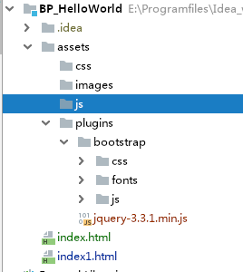
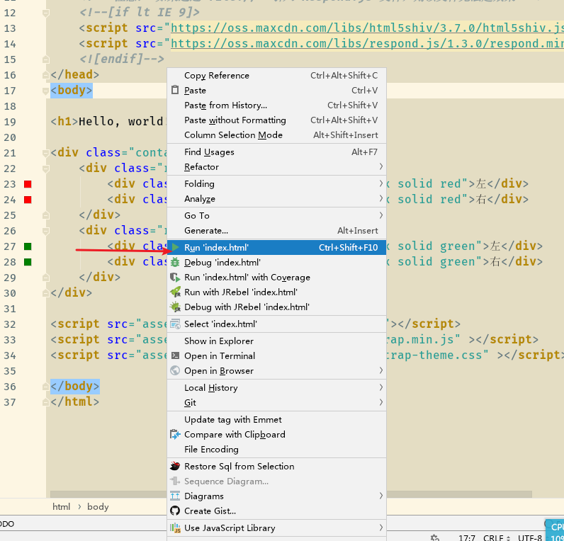
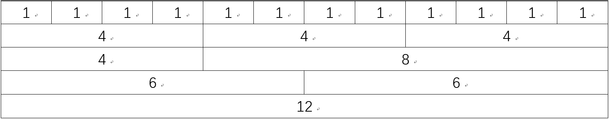

---
title:01-单体应用：04章-BootStrap教程
time:2019年10月14日
---

[toc]

## 〇、视频介绍

视频来源于千锋网，在线观看地址为：https://www.bilibili.com/video/av29299488/?p=1

笔记地址为博主的博客：https://www.funtl.com/。


## 一、BootStrap简介及安装


### 1.2 BootStrap安装

首先下载BootStrap，地址为：https://getbootstrap.com/。由于浏览器的兼容性问题，尽量选取3.X的版本学习（这是因为BootStrap3.X版本支持的最低IE浏览器版本为IE8）。


下载完成以后，我们得到一个压缩包。解压这个压缩包，并放到项目的目录下即可。

> 注意：BootStrap框架中用到了很多jquery的语法，因此需要依赖jquery。


### 1.3 BootStrap入门案例

#### 1.3.1 项目目录结构

本次我们使用IntelliJ IDEA开发前端界面。

在正式开始项目以前，我们需要规范一下项目的包结构：

1. 静态资源文件统一放在*assets*文件夹下；
1. 用到的框架文件需要放在*plugins*文件夹下，这个文件夹再继续分具体哪一个框架；
1. 自定义资源文件放到*images*、*css*、*js*文件夹中；
1. *index.html*文件放到*assets*文件夹下；

最后的目录结构如下图所示：



> 为什么要将index放到根目录下？
>
> - 这是由于使用IDEA直接启动HTML文件的时候，是以根目录（在本例中是BP_HelloWorld目录）为起点的，此时，如果在HTML文件中使用相对路径引入资源文件的话，基路径是BP_HelloWorld目录。为了避免歧义，最好把HTML文件放到根目录下。

#### 1.3.2 编写首页文件

接下来编写index页面：

##### 1.3.2.1 在头部引入css样式

在<head>中加入以下代码：

```html
<link rel="stylesheet" type="text/css" href="assets/plugins/bootstrap/css/bootstrap.min.css"/>
<link rel="stylesheet" type="text/css" href="assets/plugins/bootstrap/css/bootstrap.css"/>

```


##### 1.3.2.2 引入js文件

在<body>中加入以下代码：

```html
<script src="assets/plugins/jquery-3.3.1.min.js"></script>
<script src="assets/plugins/bootstrap/js/bootstrap.min.js" ></script>
<script src="assets/plugins/bootstrap/css/bootstrap-theme.css" ></script>
```

上面第一行是引入BootStrap所依赖的jquery框架，==为了保险起见，最好放在第一行==。


##### 1.3.2.3 修改<meta>

把<meta>标签修改为以下形式：

```html
<meta charset="UTF-8"  name="viewport" content="width=device-width, initial-scale=1.0">
```

上面的`content`含义是自适应屏幕大小。


##### 1.3.2.4 加入IE8和IE9支持

在<head>中加入以下代码：

```html
<!-- HTML5 Shiv 和 Respond.js 用于让 IE8 支持 HTML5元素和媒体查询 -->
    <!-- 注意： 如果通过 file://  引入 Respond.js 文件，则该文件无法起效果 -->
    <!--[if lt IE 9]>
    <script src="https://oss.maxcdn.com/libs/html5shiv/3.7.0/html5shiv.js"></script>
    <script src="https://oss.maxcdn.com/libs/respond.js/1.3.0/respond.min.js"></script>
    <![endif]-->
```

如果不需要兼容IE8和IE9，那么上面的代码可以不添加。

> 上面的代码的含义是：如果当前用户使用的浏览器低于IE9，那么引入下面的if里面的样式。这些样式的作用是：可以让IE8浏览器能够适应媒体查询。
>
> 关于媒体查询支持的最低浏览器版本：
>
> | Chrome | IE   | Firefox | Safari | Opera |
> | ------ | ---- | ------- | ------ | ----- |
> | 21     | 9    | 3.5     | 4.0    | 9     |


最后，加上一个标题用于页面的显示即可：

```html
<h1>Hello, world!</h1>
```

> 完整的HTML页面代码如下所示：
>
> ```html
> <!DOCTYPE html>
> <html lang="en">
> <head>
>     <meta charset="UTF-8"  name="viewport" content="width=device-width, initial-scale=1.0">
>     <title>首页</title>
> 
>     <link rel="stylesheet" type="text/css" href="assets/plugins/bootstrap/css/bootstrap.min.css"/>
>     <link rel="stylesheet" type="text/css" href="assets/plugins/bootstrap/css/bootstrap.css"/>
> 
>     <!-- HTML5 Shiv 和 Respond.js 用于让 IE8 支持 HTML5元素和媒体查询 -->
>     <!-- 注意： 如果通过 file://  引入 Respond.js 文件，则该文件无法起效果 -->
>     <!--[if lt IE 9]>
>     <script src="https://oss.maxcdn.com/libs/html5shiv/3.7.0/html5shiv.js"></script>
>     <script src="https://oss.maxcdn.com/libs/respond.js/1.3.0/respond.min.js"></script>
>     <![endif]-->
> </head>
> <body>
> 
> <h1>Hello, world!</h1>
> 
> <script src="assets/plugins/jquery-3.3.1.min.js"></script>
> <script src="assets/plugins/bootstrap/js/bootstrap.min.js" ></script>
> <script src="assets/plugins/bootstrap/css/bootstrap-theme.css" ></script>
> 
> </body>
> </html>
> ```
>
> 


此时在IDEA中运行项目即可看到效果：



为了验证Bootstrap的css和js是否生效，我们可以打开控制台观察结果：如果引入的语句没有报404错误，那么说明已经正确引入了。


### 1.4 网格系统

#### 1.4.1 概述

Bootstrap 提供了一套响应式、移动设备优先的流式网格系统，随着屏幕或视口（viewport）尺寸的增加，系统会自动分为==最多 12 列==。


#### 1.4.2 什么是网格

 在平面设计中，网格是一种由一系列用于组织内容的相交的直线（垂直的、水平的）组成的结构（通常是二维的）。它广泛应用于打印设计中的设计布局和内容结构。在网页设计中，它是一种用于快速创建一致的布局和有效地使用 HTML 和 CSS 的方法。 

简单地说，网页设计中的网格用于组织内容，让网站易于浏览，并降低用户端的负载。


#### 1.4.3 什么是 Bootstrap 网格系统（Grid System）？

官方描述：

>  Bootstrap 包含了一个响应式的、移动设备优先的、不固定的网格系统，可以随着设备或视口大小的增加而适当地扩展到 12 列。它包含了用于简单的布局选项的预定义类，也包含了用于生成更多语义布局的功能强大的混合类。 

让我们来理解一下上面的语句。Bootstrap 3 是移动设备优先的，在这个意义上，Bootstrap 代码从小屏幕设备（比如移动设备、平板电脑）开始，然后扩展到大屏幕设备（比如笔记本电脑、台式电脑）上的组件和网格。

#### 移动设备优先策略

- 内容
  - 决定什么是最重要的
  - 布局
- 优先设计更小的宽度
  - 基础的 CSS 是移动设备优先，**媒体查询** 是针对于平板电脑、台式电脑
  - 渐进增强
- 随着屏幕大小的增加而添加元素

响应式网格系统随着屏幕或视口（viewport）尺寸的增加，系统会自动分为最多 12 列。




#### Bootstrap 网格系统（Grid System）的工作原理

网格系统通过一系列包含内容的行和列来创建页面布局。下面列出了 Bootstrap 网格系统是如何工作的：

- 行必须放置在 `.container` class 内，以便获得适当的对齐（alignment）和内边距（padding）
- 使用行来创建列的水平组
- 内容应该放置在列内，且唯有列可以是行的直接子元素
- 预定义的网格类，比如 `.row` 和 `.col-xs-4`，可用于快速创建网格布局。LESS 混合类可用于更多语义布局
- 列通过内边距（padding）来创建列内容之间的间隙。该内边距是通过 `.rows` 上的外边距（margin）取负，表示第一列和最后一列的行偏移
- 网格系统是通过指定您想要横跨的十二个可用的列来创建的。例如，要创建三个相等的列，则使用三个 `.col-xs-4`


#### 网格选项

下表总结了 Bootstrap 网格系统如何跨多个设备工作：

|     说明     |    超小设备手机（< 768px）    |  小型设备平板电脑（≥ 768px）  |  中型设备台式电脑（≥ 992px）  | 大型设备台式电脑（≥ 1200px）  |
| :----------: | :---------------------------: | :---------------------------: | :---------------------------: | :---------------------------: |
|   网格行为   |         一直是水平的          | 以折叠开始，断点以上是水平的  | 以折叠开始，断点以上是水平的  | 以折叠开始，断点以上是水平的  |
| 最大容器宽度 |          None (auto)          |             750px             |             970px             |            1170px             |
|  Class 前缀  |          `.col-xs-`           |          `.col-sm-`           |          `.col-md-`           |          `.col-lg-`           |
|   列数量和   |              12               |              12               |              12               |              12               |
|   最大列宽   |             Auto              |             60px              |             78px              |             95px              |
|   间隙宽度   | 30px（一个列的每边分别 15px） | 30px（一个列的每边分别 15px） | 30px（一个列的每边分别 15px） | 30px（一个列的每边分别 15px） |
|    可嵌套    |              Yes              |              Yes              |              Yes              |              Yes              |
|    偏移量    |              Yes              |              Yes              |              Yes              |              Yes              |
|    列排序    |              Yes              |              Yes              |              Yes              |              Yes              |


log4j输出信息时，如果需要拼接多个字符串，那么最好使用占位符模式。


