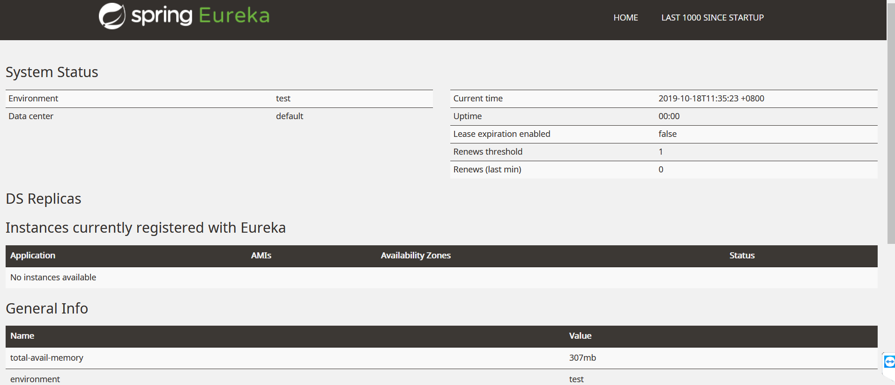
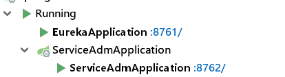
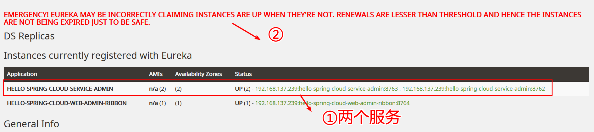
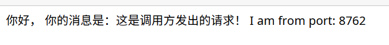
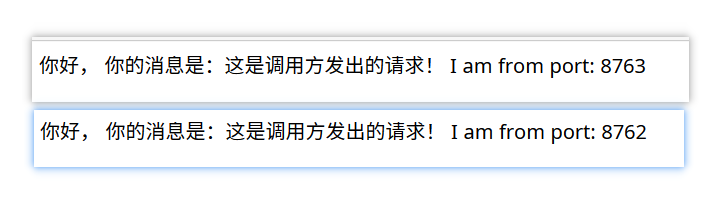
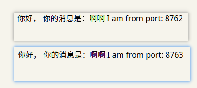
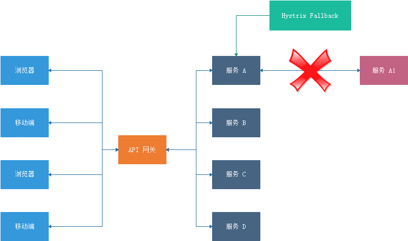
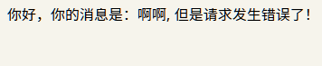
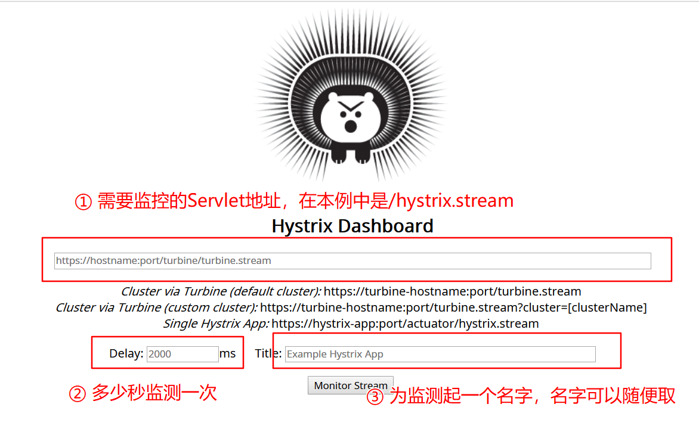
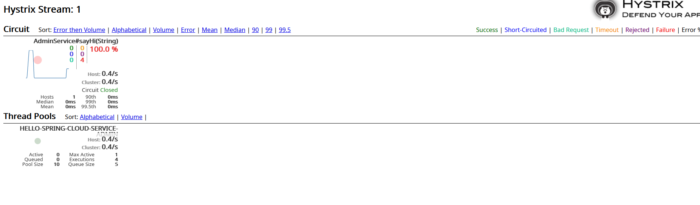

---
title:03-Java微服务架构：05章-SpringCloud
time:2019年10月17日
---

[toc]

## 〇、视频介绍


## 一、SpringCloud简介

SpringCloud是一个相对比较新的微服务框架，2016年才推出1.0的Release版本，但是其更新速度特别快，几乎每1~2个个月就有一次更新。虽然SpringCloud时间最短，但是相比Dubbo等RPC框架，SpringCloud提供的全套的分布式系统解决方案。

SpringCloud为开发者提供了在分布式系统（配置管理，服务发现，熔断，微代理，控制总线，一次性Token，全局锁，Leader选举，分布式Session，集群状态）中快速构建的工具，使用SpringCloud的开发者可以快速地启动服务或构建应用，同时能够快速和云平台资源进行对接。


## 二、入门

### 2.1 创建统一的依赖管理

新建一个项目hello-spring-cloud，并在该项目中添加一个文件夹hello-spring-cloud-dependencies，后者作为统一的依赖管理。在hello-spring-cloud-dependencies中加入一个pom文件，内容如下所示：

```xml
<?xml version="1.0" encoding="UTF-8"?>
<project xmlns="http://maven.apache.org/POM/4.0.0" xmlns:xsi="http://www.w3.org/2001/XMLSchema-instance"
         xsi:schemaLocation="http://maven.apache.org/POM/4.0.0 http://maven.apache.org/xsd/maven-4.0.0.xsd">
    <modelVersion>4.0.0</modelVersion>


    <parent>
        <groupId>org.springframework.boot</groupId>
        <artifactId>spring-boot-starter-parent</artifactId>
        <version>2.1.4.RELEASE</version>
    </parent>

    <!--打包方式使用“pom”方式-->
    <groupId>com.chen</groupId>
    <artifactId>hello-spring-cloud-dependencies</artifactId>
    <version>1.0.0-SNAPSHOT</version>
    <packaging>pom</packaging>

    <name>hello-spring-cloud-dependencies</name>
    <!--<url>http://www.funtl.com</url>-->
    <inceptionYear>2018-Now</inceptionYear>

    <properties>
        <!-- Environment Settings -->
        <java.version>1.8</java.version>
        <project.build.sourceEncoding>UTF-8</project.build.sourceEncoding>
        <project.reporting.outputEncoding>UTF-8</project.reporting.outputEncoding>

        <!-- Spring Settings：SpringCloud的版本号 -->
        <spring-cloud.version>2.0.4.RELEASE</spring-cloud.version>
    </properties>


    <dependencyManagement>
        <dependencies>
            <dependency>
                <groupId>org.springframework.cloud</groupId>
                <artifactId>spring-cloud-dependencies</artifactId>
                <version>${spring-cloud.version}</version>
                <type>pom</type>
                <scope>import</scope>
            </dependency>
        </dependencies>
    </dependencyManagement>


    <build>
        <plugins>
            <!--  Compiler插件：指定jdk版本  -->
            <plugin>
                <groupId>org.apache.maven.plugins</groupId>
                <artifactId>maven-compiler-plugin</artifactId>
                <configuration>
                    <showWarnings>true</showWarnings>
                </configuration>
            </plugin>

            <!-- 打包 jar 文件时，配置 manifest 文件，加入 lib 包的 jar 依赖 -->
            <plugin>
                <groupId>org.apache.maven.plugins</groupId>
                <artifactId>maven-jar-plugin</artifactId>
                <configuration>
                    <archive>
                        <addMavenDescriptor>false</addMavenDescriptor>
                    </archive>
                </configuration>
                <executions>
                    <execution>
                        <configuration>
                            <archive>
                                <manifest>
                                    <!-- Add directory entries -->
                                    <addDefaultImplementationEntries>true</addDefaultImplementationEntries>
                                    <addDefaultSpecificationEntries>true</addDefaultSpecificationEntries>
                                    <addClasspath>true</addClasspath>
                                </manifest>
                            </archive>
                        </configuration>
                    </execution>
                </executions>
            </plugin>

            <!-- resource -->
            <plugin>
                <groupId>org.apache.maven.plugins</groupId>
                <artifactId>maven-resources-plugin</artifactId>
            </plugin>

            <!-- install -->
            <plugin>
                <groupId>org.apache.maven.plugins</groupId>
                <artifactId>maven-install-plugin</artifactId>
            </plugin>

            <!-- clean -->
            <plugin>
                <groupId>org.apache.maven.plugins</groupId>
                <artifactId>maven-clean-plugin</artifactId>
            </plugin>

            <!-- ant -->
            <plugin>
                <groupId>org.apache.maven.plugins</groupId>
                <artifactId>maven-antrun-plugin</artifactId>
            </plugin>

            <!-- dependency -->
            <plugin>
                <groupId>org.apache.maven.plugins</groupId>
                <artifactId>maven-dependency-plugin</artifactId>
            </plugin>
        </plugins>


        <pluginManagement>
            <plugins>
                <!-- Java Document Generate -->
                <plugin>
                    <groupId>org.apache.maven.plugins</groupId>
                    <artifactId>maven-javadoc-plugin</artifactId>
                    <executions>
                        <execution>
                            <phase>prepare-package</phase>
                            <goals>
                                <goal>jar</goal>
                            </goals>
                        </execution>
                    </executions>
                </plugin>

                <!-- YUI Compressor (CSS/JS压缩) -->
                <plugin>
                    <groupId>net.alchim31.maven</groupId>
                    <artifactId>yuicompressor-maven-plugin</artifactId>
                    <version>1.5.1</version>
                    <executions>
                        <execution>
                            <phase>prepare-package</phase>
                            <goals>
                                <goal>compress</goal>
                            </goals>
                        </execution>
                    </executions>
                    <configuration>
                        <encoding>UTF-8</encoding>
                        <jswarn>false</jswarn>
                        <nosuffix>true</nosuffix>
                        <linebreakpos>30000</linebreakpos>
                        <force>true</force>
                        <includes>
                            <include>**/*.js</include>
                            <include>**/*.css</include>
                        </includes>
                        <excludes>
                            <exclude>**/*.min.js</exclude>
                            <exclude>**/*.min.css</exclude>
                        </excludes>
                    </configuration>
                </plugin>
            </plugins>
        </pluginManagement>


        <!-- 资源文件配置 -->
        <resources>
            <resource>
                <directory>src/main/java</directory>
                <excludes>
                    <exclude>**/*.java</exclude>
                </excludes>
            </resource>
            <resource>
                <directory>src/main/resources</directory>
            </resource>
        </resources>
    </build>


<!--  第三方下载库  -->
    <repositories>
        <repository>
            <id>aliyun-repos</id>
            <name>Aliyun Repository</name>
            <url>http://maven.aliyun.com/nexus/content/groups/public</url>
            <releases>
                <enabled>true</enabled>
            </releases>
            <snapshots>
                <enabled>false</enabled>
            </snapshots>
        </repository>

        <repository>
            <id>sonatype-repos</id>
            <name>Sonatype Repository</name>
            <url>https://oss.sonatype.org/content/groups/public</url>
            <releases>
                <enabled>true</enabled>
            </releases>
            <snapshots>
                <enabled>false</enabled>
            </snapshots>
        </repository>

        <repository>
            <id>sonatype-repos-s</id>
            <name>Sonatype Repository</name>
            <url>https://oss.sonatype.org/content/repositories/snapshots</url>
            <releases>
                <enabled>false</enabled>
            </releases>
            <snapshots>
                <enabled>true</enabled>
            </snapshots>
        </repository>

        <!--在使用非Release版本时，SpringCloud可能会引入一些快照版本的包，而这些包只会在Spring的仓库中，不会发布到其它地方，因此
            需要引入Spring仓库的地址-->
        <repository>
            <id>spring-snapshots</id>
            <name>Spring Snapshots</name>
            <url>https://repo.spring.io/snapshot</url>
            <snapshots>
                <enabled>true</enabled>
            </snapshots>
        </repository>
        <repository>
            <id>spring-milestones</id>
            <name>Spring Milestones</name>
            <url>https://repo.spring.io/milestone</url>
            <snapshots>
                <enabled>false</enabled>
            </snapshots>
        </repository>
    </repositories>


</project>
```

关于标签的说明：

- parent：继承了 Spring Boot 的 Parent，表示我们是一个 Spring Boot 工程
- package：`pom`，表示该项目仅当做依赖项目，没有具体的实现代码（用来做项目依赖的）
- `spring-cloud-dependencies`：在 `properties` 配置中预定义了版本号为 `2.0.4.RELEASE` ，表示我们的 Spring Cloud 使用的是 Release 版
- build：配置了项目所需的各种插件（用最新的插件来替换maven默认的插件）
- repositories：配置项目下载依赖时的第三方库
  - 注意：Spring的仓库是一定需要被依赖进来的，具体的原因请查看注释。

> 在项目中，hello-spring-cloud根目录仅仅作为一个目录的形式存在，而不是一个工程（在分模块开发中就是一个工程存在）；而hello-spring-cloud-dependencies则是作为一个一个项目（或者说是一个服务）存在。


### 2.2 服务注册与发现

#### 2.2.1 概述

> 为了发送一个请求，您的代码需要知道服务实例的网络位置（IP地址与端口号），在运行于物理硬件上的传统应用中，服务实例的网络位置是相对静态的……
>
> ……
>
> 然而，在现代基于云的微服务应用中，这是一个更难解决的问题，……
>
> 服务实例具有动态分配的网络位置。此外，由于自动扩缩、故障与升级，整组服务实例会动态变更。因此，您的客户端代码需要使用更精准的服务发现机制。
>
> ——摘自《微服务——从设计到部署》

在这里，我们需要用的组件是 Spring Cloud Netflix 的 Eureka，Eureka 是一个服务注册和发现模块。


#### 2.2.2 搭建Eureka服务注册中心

**首先新建一个文件夹hello-spring-cloud-eureka，我们在这个文件夹内搭建Eureka服务注册中心。**

**接着在编写一个pom文件，文件内容如下：**

```xml
<?xml version="1.0" encoding="UTF-8"?>
<project xmlns="http://maven.apache.org/POM/4.0.0" xmlns:xsi="http://www.w3.org/2001/XMLSchema-instance"
         xsi:schemaLocation="http://maven.apache.org/POM/4.0.0 http://maven.apache.org/xsd/maven-4.0.0.xsd">
    <modelVersion>4.0.0</modelVersion>

    <parent> ①
        <groupId>com.chen</groupId>
        <artifactId>hello-spring-cloud-dependencies</artifactId>
        <version>1.0.0-SNAPSHOT</version>
        <relativePath>../hello-spring-cloud-dependencies/pom.xml</relativePath>
    </parent>

    <artifactId>hello-spring-cloud-eureka</artifactId>
    <packaging>jar</packaging> ②

    <name>hello-spring-cloud-eureka</name>
    <!--<url>http://www.funtl.com</url>-->
    <inceptionYear>2018-Now</inceptionYear>

    <dependencies>
        <!-- Spring Boot Begin -->
        <dependency>
            <groupId>org.springframework.boot</groupId>
            <artifactId>spring-boot-starter-test</artifactId>
            <scope>test</scope>
        </dependency>
        <!-- Spring Boot End -->

        <!-- Spring Cloud Begin -->
        <dependency>
            <groupId>org.springframework.cloud</groupId>
            <artifactId>spring-cloud-starter-netflix-eureka-server</artifactId>
            <version>2.1.0.RELEASE</version> ③
        </dependency>
        <!-- Spring Cloud End -->


    </dependencies>

    <build>
        <plugins>
            <plugin> ④
                <groupId>org.springframework.boot</groupId>
                <artifactId>spring-boot-maven-plugin</artifactId>
                <configuration>
                    <mainClass>com.chen.hello.spring.cloud.eureka.EurekaApplication</mainClass>
                </configuration>
            </plugin>
        </plugins>
    </build>
</project>
```

①：父工程的id选择我们在[创建统一的依赖管理]()中创建的pom文件；

②：由于当前项目需要打包，所以我们选择的打包方式为`jar`；

③：引入SpringCloud版本（在视频教程和比克教程中没有引入版本号，但是在练习过程中如果不引入版本号的话会没有SpringCloud相关的jar包）；

④：指定入口类（视频说是必须指定，没验证）；入口类需要和当前项目的SpringBoot入口类的全限定类名一致；


编写入口类：

按照SpringBoot项目开发时编写入口类的步骤即可。编写完成入口类以后，在类上加上注解@`EnableEurekaServer`

```java
@SpringBootApplication
@EnableEurekaServer
public class EurekaApplication {

    public static void main(String[] args) {
        SpringApplication.run(EurekaApplication.class, args);
    }
}
```

> 关于Maven项目报名结构：
>
> 一般来说，包名结构的“基本包”需要包含项目的名称，例如，在本例中，项目名称是hello-spring-cloud-eureka，我们的“基本包”就设置为`com.chen.hello.spring.cloud.eureka`。接着再在基本包下创建具体和业务强相关的包。


编写application.yml文件

```yml
# 当前微服务的名称
spring:
  application:
    name: hello-spring-cloud-eureka

server:
  port: 8761
  
eureka:
  instance:
    hostname: localhost
  client:
#    如果当前的eureka服务是服务端的话，需要将下面两个属性的值改为false
    register-with-eureka: false
    fetch-registry: false
    service-url:
      defaultZone: http://${eureka.instance.hostname}:${server.port}/eureka/
```

上面配置较低Eureka服务端的端口配置为8761，并且`eureka.client.register-with-eureka`和 `eureka.client.fetch-registry`设置为`false`表示当前的Eureka服务是一个服务端。


启动项目以后，我们访问：`localhost:端口号`即可访问到以下界面：（注意：不用添加`/eureka/`）




### 2.2.3 创建服务提供者

#### 2.2.3.1 概述

当 Client 向 Server 注册时，它会提供一些元数据，例如主机和端口，URL，主页等。Eureka Server 从每个 Client 实例接收心跳消息。 如果心跳超时，则通常将该实例从注册 Server 中删除。


#### 2.2.3.2 创建服务提供者

创建一个新的文件夹hello-spring-cloud-service-adm，并添加pom文件，文件内容如下：

```xml
<?xml version="1.0" encoding="UTF-8"?>
<project xmlns="http://maven.apache.org/POM/4.0.0" xmlns:xsi="http://www.w3.org/2001/XMLSchema-instance"
         xsi:schemaLocation="http://maven.apache.org/POM/4.0.0 http://maven.apache.org/xsd/maven-4.0.0.xsd">
    <modelVersion>4.0.0</modelVersion>

    <parent>
        <groupId>com.chen</groupId>
        <artifactId>hello-spring-cloud-dependencies</artifactId>
        <version>1.0.0-SNAPSHOT</version>
        <relativePath>../hello-spring-cloud-dependencies/pom.xml</relativePath>
    </parent>

    <artifactId>hello-spring-cloud-service-admin</artifactId>
    <packaging>jar</packaging>

    <name>hello-spring-cloud-service-adm</name>
    <!--<url>http://www.funtl.com</url>-->
    <inceptionYear>2018-Now</inceptionYear>

    <dependencies>
        <!-- Spring Boot Begin -->
        <dependency>
            <groupId>org.springframework.boot</groupId>
            <artifactId>spring-boot-starter-test</artifactId>
            <scope>test</scope>
        </dependency>
        <!-- Spring Boot End -->

        <!-- Spring Cloud Begin -->
        <dependency>
            <groupId>org.springframework.cloud</groupId>
            <artifactId>spring-cloud-starter-netflix-eureka-server</artifactId>
            <version>2.1.0.RELEASE</version>
        </dependency>
        <!-- Spring Cloud End -->
    </dependencies>

    <build>
        <plugins>
            <plugin>
                <groupId>org.springframework.boot</groupId>
                <artifactId>spring-boot-maven-plugin</artifactId>
                <configuration>
                    <mainClass>com.chen.hello.spring.cloud.service.adm.ServiceAdmApplication</mainClass>
                </configuration>
            </plugin>
        </plugins>
    </build>
</project>
```

这个配置和Eureka的pom文件配置基本一致。


接着，我们需要编写启动类，并在启动类上添加注解`@EnableEurekaClien`：

```java
@SpringBootApplication
@EnableEurekaClient
public class ServiceAdmApplication {

    public static void main(String[] args) {
        SpringApplication.run(ServiceAdmApplication.class, args);
    }
}
```


编写配置文件*application.yml*：

```yml
spring:
  application:
    name: hello-spring-cloud-service-admin

server:
  port: 8762

eureka:
  client:
    serviceUrl:
      defaultZone: http://localhost:8761/eureka/  
```

可以发现：

1. 服务提供者的eureka配置几乎和注册中心的eureka配置一致，而前者没有`eureka.client.register-with-eureka`和 `eureka.client.fetch-registry`的设置（即是使用默认设置`true`）；
2. `eureka.client.serviceUrl.defaultZone`表示向哪个注册中心注册；


接下来，我们可以在项目中新建一个控制器，用于向页面返回一个字符串：

```java
@RestController
public class AdminController {

    @Value("${server.port}")
    private String port;  ①

    @RequestMapping(value = "/hi", method = RequestMethod.GET)
    public String sayHi(String message) {

        return String.format("你好， 你的消息是：%s I am from port: %s", message, port);
    }
}
```

①：当前微服务所在的端口（伏笔：在实现负载均衡时通过这个值来观察是否实现“负载”）；


启动服务，即可看到当前服务监听了8762端口：




### 2.2.4 创建服务消费者（Ribbon方式）

#### 2.2.4.1  概述

 在微服务架构中，业务都会被拆分成一个独立的服务，服务与服务的通讯是基于 http restful 的。Spring cloud 有两种服务调用方式，一种是 ribbon + restTemplate，另一种是 feign。在这一篇文章首先讲解下基于 ribbon + rest。 


#### 2.2.4.2 负载均衡准备工作

负载均衡需要多个服务提供方（并运行“同样”的代码），因此，我们需要启动两个服务提供方。

> 在IDEA中启动相同SpringBoot项目的多个服务可以参考：

启动完成以后，我们可以在Eureka的管理界面中看到类似以下信息：



②：这个警告的意思是：Eureka需要部署成为集群模式，（否则如果单点故障出现在Eureka服务中，那么这个系统就会奔溃）。


#### 2.2.4.3 创建服务消费者

**创建一个文件夹 hello-spring-cloud-web-admin-ribbon ，创建pom文件并在文件中添加以下内容：**

```xml
<?xml version="1.0" encoding="UTF-8"?>
<project xmlns="http://maven.apache.org/POM/4.0.0" xmlns:xsi="http://www.w3.org/2001/XMLSchema-instance"
         xsi:schemaLocation="http://maven.apache.org/POM/4.0.0 http://maven.apache.org/xsd/maven-4.0.0.xsd">
    <modelVersion>4.0.0</modelVersion>

    <parent>
        <groupId>com.chen</groupId>
        <artifactId>hello-spring-cloud-dependencies</artifactId>
        <version>1.0.0-SNAPSHOT</version>
        <relativePath>../hello-spring-cloud-dependencies/pom.xml</relativePath>
    </parent>

    <artifactId>hello-spring-cloud-web-admin-ribbon</artifactId>
    <packaging>jar</packaging>

    <name>hello-spring-cloud-web-admin-ribbon</name>
    <!--<url>http://www.funtl.com</url>-->
    <inceptionYear>2018-Now</inceptionYear>

    <dependencies>
        <!-- Spring Boot Begin -->
        <dependency>
            <groupId>org.springframework.boot</groupId>
            <artifactId>spring-boot-starter-web</artifactId>
        </dependency>
        <dependency>
            <groupId>org.springframework.boot</groupId>
            <artifactId>spring-boot-starter-tomcat</artifactId>
        </dependency>
        <dependency>
            <groupId>org.springframework.boot</groupId>
            <artifactId>spring-boot-starter-thymeleaf</artifactId>
        </dependency>
        <dependency>
            <groupId>org.springframework.boot</groupId>
            <artifactId>spring-boot-starter-actuator</artifactId>
        </dependency>
        <dependency>
            <groupId>org.springframework.boot</groupId>
            <artifactId>spring-boot-starter-test</artifactId>
            <scope>test</scope>
        </dependency>
        <!-- Spring Boot End -->

        <!-- Spring Cloud Begin -->
        <dependency>
            <groupId>org.springframework.cloud</groupId>
            <artifactId>spring-cloud-starter-netflix-eureka-server</artifactId>
            <version>2.1.0.RELEASE</version>
        </dependency>
        <dependency>
            <groupId>org.springframework.cloud</groupId>
            <artifactId>spring-cloud-starter-netflix-ribbon</artifactId>
            <version>2.1.0.RELEASE</version>
        </dependency>
        <!-- Spring Cloud End -->

        <!-- 解决 thymeleaf 模板引擎一定要执行严格的 html5 格式校验问题 -->
        <dependency>
            <groupId>net.sourceforge.nekohtml</groupId>
            <artifactId>nekohtml</artifactId>
        </dependency>
    </dependencies>

    <build>
        <plugins>
            <plugin>
                <groupId>org.springframework.boot</groupId>
                <artifactId>spring-boot-maven-plugin</artifactId>
                <configuration>
                    <mainClass>com.funtl.hello.spring.cloud.web.admin.ribbon.WebAdminRibbonApplication</mainClass>
                </configuration>
            </plugin>
        </plugins>
    </build>
</project>
```

注意：在上面的内容中，加入了Thymeleaf相关的依赖和配置；（具体作用未知）


**编写启动类，并在启动类中添加注解  `@EnableDiscoveryClient`**  

```java
@SpringBootApplication
@EnableDiscoveryClient
public class WebAdminRibbonApplication {

    public static void main(String[] args) {
        SpringApplication.run(WebAdminRibbonApplication.class, args);
    }
}
```

这个注解的作用是：在Eureka注册中心发现服务提供方；


**编写*application.yml*配置文件：**

```yml
spring:
  application:
    name: hello-spring-cloud-web-admin-ribbon
  thymeleaf:
    cache: false
    mode: LEGACYHTML5
    encoding: UTF-8
    servlet:
      content-type: text/html


server:
  port: 8764
eureka:
  client:
    service-url:
      defaultZone: http://localhost:8761/eureka/

```

上面配置文件添加了和Thymeleaf相关的配置。


**编写模板并开启负载均衡功能：**

```java
@Configuration
public class RestTemplateConfiguration {

    @Bean
    @LoadBalanced   // ①调用服务提供方时，会负载均衡地调用
    public RestTemplate restTemplate() {
        return new RestTemplate();
    }
}
```

①：见注释。


经过上面的配置，我们现在已经可以使用模板`restTemplate`调用服务提供方提供的服务了。接下来的步骤就是按照正常的开发流程开发即可：

（1）新建一个业务类，并在业务类中调用服务提供方提供服务：

```java
@Service
public class AdminService {

    @Resource
    private RestTemplate restTemplate;

    public String hi(String message) {
        return restTemplate
                .getForObject("http://HELLO-SPRING-CLOUD-SERVICE-ADMIN/hi?message=" + message,
                        String.class);  // ①
    }
}
```

①：使用`restTemplate.getForObject`方法进行调用，调用的第一个参数需要填写被调用方的地址，其地址的形式是：$http://Eureka中暴露的服务名称\ /具体api?参数$。第二个参数表示返回值类型的类类型。


（2）新建一个控制器，并在控制器中调用上面业务类中的方法：

```java
@RestController
public class AdminController {

    @Autowired
    private AdminService adminService;

    @RequestMapping(value = "hi", method = RequestMethod.GET)
    public String hi(@RequestParam String message) {
        String hi = adminService.hi(message);
        return hi;
    }
}
```


（3）启动该项目，启动完毕以后，（根据配置文件）该服务监听了8764端口。我们通过`http://localhost:8764/hi?message=某个参数`访问即可看到界面：



不断刷新该界面，可以看到不同时刻访问的端口不相同：



### 2.2.5 创建服务消费者（Feign方式）

#### 2.2.5.1 概述

Feign 是一个声明式的伪 Http 客户端，它使得写 Http 客户端变得更简单。使用 Feign，只需要创建一个接口并注解。它具有可插拔的注解特性，可使用 Feign 注解和 JAX-RS 注解。Feign 支持可插拔的编码器和解码器。Feign 默认集成了 Ribbon，并和 Eureka 结合，默认实现了负载均衡的效果

- Feign 采用的是基于接口的注解
- Feign 整合了 ribbon；


#### 2.2.5.2 创建服务消费者

在创建服务消费者以前，我们也是需要启动多个服务提供者实例。


1. 创建文件夹hello-spring-cloud-web-admin-feign，并在文件夹内添加pom文件：

```xml
<?xml version="1.0" encoding="UTF-8"?>
<project xmlns="http://maven.apache.org/POM/4.0.0" xmlns:xsi="http://www.w3.org/2001/XMLSchema-instance"
         xsi:schemaLocation="http://maven.apache.org/POM/4.0.0 http://maven.apache.org/xsd/maven-4.0.0.xsd">
    <modelVersion>4.0.0</modelVersion>

    <parent>
        <groupId>com.chen</groupId>
        <artifactId>hello-spring-cloud-dependencies</artifactId>
        <version>1.0.0-SNAPSHOT</version>
        <relativePath>../hello-spring-cloud-dependencies/pom.xml</relativePath>
    </parent>

    <artifactId>hello-spring-cloud-web-admin-feign</artifactId>
    <packaging>jar</packaging>

    <name>hello-spring-cloud-web-admin-feign</name>
    <!--<url>http://www.funtl.com</url>-->
    <inceptionYear>2018-Now</inceptionYear>

    <dependencies>
        <!-- Spring Boot Begin -->
        <dependency>
            <groupId>org.springframework.boot</groupId>
            <artifactId>spring-boot-starter-web</artifactId>
        </dependency>
        <dependency>
            <groupId>org.springframework.boot</groupId>
            <artifactId>spring-boot-starter-tomcat</artifactId>
        </dependency>
        <dependency>
            <groupId>org.springframework.boot</groupId>
            <artifactId>spring-boot-starter-thymeleaf</artifactId>
        </dependency>
        <dependency>
            <groupId>org.springframework.boot</groupId>
            <artifactId>spring-boot-starter-actuator</artifactId>
        </dependency>
        <dependency>
            <groupId>org.springframework.boot</groupId>
            <artifactId>spring-boot-starter-test</artifactId>
            <scope>test</scope>
        </dependency>
        <!-- Spring Boot End -->

        <!-- Spring Cloud Begin -->
        <dependency>
            <groupId>org.springframework.cloud</groupId>
            <artifactId>spring-cloud-starter-netflix-eureka-server</artifactId>
            <version>2.1.0.RELEASE</version>
        </dependency>
        <dependency> ①
            <groupId>org.springframework.cloud</groupId>
            <artifactId>spring-cloud-starter-openfeign</artifactId>
            <version>2.1.0.RELEASE</version>
        </dependency>
        <!-- Spring Cloud End -->

        <!-- 解决 thymeleaf 模板引擎一定要执行严格的 html5 格式校验问题 -->
        <dependency>
            <groupId>net.sourceforge.nekohtml</groupId>
            <artifactId>nekohtml</artifactId>
        </dependency>
    </dependencies>

    <build>
        <plugins>
            <plugin>
                <groupId>org.springframework.boot</groupId>
                <artifactId>spring-boot-maven-plugin</artifactId>
                <configuration>
                    <mainClass>com.chen.hello.spring.cloud.web.admin.feign.WebAdminFeignApplication</mainClass>
                </configuration>
            </plugin>
        </plugins>
    </build>
</project>
```

①：添加了feign的依赖；


2. 编写application.yml文件

   ```yml
   spring:
     application:
       name: hello-spring-cloud-web-admin-feign
     thymeleaf:
       cache: false
       mode: LEGACYHTML5
       encoding: utf-8
       servlet:
         content-type: text/html
   
   
   server:
     port: 8765
   eureka:
     client:
       service-url:
         defaultZone: http://localhost:8761/eureka/
   ```

   这个yml中也添加了Thymeleaf相关的内容；


3. 创建启动类，并添加两个注解：`@EnableFeignClients`和`@EnableDiscoveryClient`：

   ```java
   @SpringBootApplication
   @EnableFeignClients
   @EnableDiscoveryClient
   public class WebAdminFeignApplication {
   
       public static void main(String[] args) {
           SpringApplication.run(WebAdminFeignApplication.class, args);
       }
   }
   ```


4. 创建service类，并添加注解：`@FeignClient`

   ```java
   @FeignClient("HELLO-SPRING-CLOUD-SERVICE-ADMIN")
   public interface AdminService {
   
       @RequestMapping(value = "hi", method = RequestMethod.GET)
       public String sayHi(@RequestParam("message") String message);    // 注意，必须带
   }
   ```

   注解`@FeignClien`t中的值指定服务提供方，在本例中`是HELLO-SPRING-CLOUD-SERVICE-ADMIN`

   > 注意：在参数中必须加上`@RequestParam("message")`（`message`指的是服务提供方的入参），否则会出现以下错误：feign.FeignException: status 405 reading AdminService#sayHi(String)异常


5. 创建控制器，并调用service层的方法：

   ```java
   @RestController
   public class AdminController {
   
       @Autowired
       private AdminService adminService;
   
       @RequestMapping(value = "/hi", method = RequestMethod.GET)
       public String hi(String message) {
           String hi = adminService.sayHi(message);
           return hi;
       }
   }
   ```


6. 启动该项目，启动完毕以后，（根据配置文件）该服务监听了8765端口。我们通过`http://localhost:8765/hi?message=某个参数`访问即可看到界面：
   


   不断刷新这个请求，会发现不同时刻访问了不同的服务实例：
   


### 2.2.6 使用熔断器防止服务雪崩

#### 2.2.6.1 概述

在微服务架构中，根据业务来拆分成一个个的服务，服务与服务之间可以通过 `RPC` 相互调用，在 Spring Cloud 中可以用 `RestTemplate + Ribbon` 和 `Feign` 来调用。为了保证其高可用，单个服务通常会集群部署。由于网络原因或者自身的原因，服务并不能保证 100% 可用，==如果单个服务出现问题，调用这个服务就会出现线程阻塞，此时若有大量的请求涌入，`Servlet` 容器的线程资源会被消耗完毕，导致服务瘫痪==。服务与服务之间的依赖性，故障会传播，会对整个微服务系统造成灾难性的严重后果，这就是服务故障的 **“雪崩”** 效应。


Netflix 开源了 Hystrix 组件，实现了熔断器模式，Spring Cloud 对这一组件进行了整合。在微服务架构中，一个请求需要调用多个服务是非常常见的，如下图：


较底层的服务如果出现故障，会导致连锁故障。当对特定的服务的调用的不可用达到一个阀值（Hystrix 是 **5 秒 20 次**） 熔断器将会被打开。



熔断器打开后，为了避免连锁故障，通过 `fallback` 方法可以直接返回一个固定值。


#### 2.2.6.2 在Ribbon中使用熔断器

请查看[在Ribbon中使用熔断器](https://www.funtl.com/zh/spring-cloud-netflix/Spring-Cloud-%E4%BD%BF%E7%94%A8%E7%86%94%E6%96%AD%E5%99%A8%E9%98%B2%E6%AD%A2%E6%9C%8D%E5%8A%A1%E9%9B%AA%E5%B4%A9.html#ribbon-%E4%B8%AD%E4%BD%BF%E7%94%A8%E7%86%94%E6%96%AD%E5%99%A8)；


#### 2.2.6.3 在Feign中使用熔断器

Feign默认自带了熔断器，但是默认是关闭的，我们需要手动开启：

1. 在application.yml中添加继续添加以下配置：

   ```yml
   # 开启熔断器
   feign:
     hystrix:
       enabled: true
   ```


2. 创建熔断器类，并实现对应service的接口：

   ```java
   @Component
   public class AdminServiceHystrix implements AdminService {
       
       @Override
       public String sayHi(String message) {
           String format = String.format("你好，你的消息是：%s, 但是请求发生错误了！", message);
   
           return format;
       }
   }
   ```

   - 一般来说，熔断器实现类都放在service类所在包的子包hystrix包下；
   - 重载的`sayHi`方法就是当接口方法`sayHi`出现错误时，自动调用的方法；


3. 在service接口中注解@FeignClient中指定方法调用失败时自动回调的方法：

   ```java
   @FeignClient(value = "HELLO-SPRING-CLOUD-SERVICE-ADMIN", fallback = AdminServiceHystrix.class)
   public interface AdminService {
     // 省略具体方法
   }
   ```

   fallback属性回调方法所在的类，就是我们上面新创建的`AdminServiceHystrix`；


4. 启动项目，并测试：
   - 为了能够测试到“调用服务提供方方法异常”的情况，我们只需要把服务提供方的服务关闭即可；
   - 关闭以后，我们继续访问`sayHi`方法，发现界面中输出的是：
     

5. 异常情况：在本次例子中，当关闭了服务提供方的服务以后，并在前台发送请求，后台出现了

   ```
   ClassNotFoundException: com.netflix.hystrix.metric.HystrixCommandCompletionS……
   ```

   的异常，此时，我们需要修改引入的`spring-cloud-starter-openfeign`依赖的版本：

   ```xml
   <dependency>
     <groupId>org.springframework.cloud</groupId>
     <artifactId>spring-cloud-starter-openfeign</artifactId>
     <version>2.1.3.RELEASE</version>
   </dependency>
   ```

   再次启动项目即可。


### 2.2.7 熔断监视器

#### 2.2.7.1 概述

在实际项目开发中，“熔断”机制最好只发生在服务器负载过大的情况。如果我们的服务一直被熔断，那么可能是我们的服务出现问题了。此时我们需要一个“熔断器监控”。


#### 2.2.7.2 在项目中加入熔断器监视器

在 Ribbon 和 Feign 项目增加 Hystrix 仪表盘功能，两个项目的改造方式相同


1. 在pom文件中新增以下依赖：

   ```xml
   <dependency>
       <groupId>org.springframework.cloud</groupId>
       <artifactId>spring-cloud-starter-netflix-hystrix-dashboard</artifactId>
       <version>${openfeign.version}</version>
   </dependency>
   ```

   

2. 在启动类中添加注解`@EnableHystrixDashboard`：

   ```java
   @SpringBootApplication
   @EnableFeignClients
   @EnableDiscoveryClient
   @EnableHystrixDashboard
   public class WebAdminFeignApplication {
   
       public static void main(String[] args) {
           SpringApplication.run(WebAdminFeignApplication.class, args);
       }
   }
   ```

   

3. 熔断器需要添加被监控的地址，而熔断器的地址是以Servlet的形式来展示的，因此，我们需要创建一个Servlet：

   ```java
   @Configuration
   public class HystrixDashboardConfiguration {
   
       @Bean
       public ServletRegistrationBean getServlet() {
           HystrixMetricsStreamServlet streamServlet = new HystrixMetricsStreamServlet();
   
           // 我们现在创建了一个 Servlet，在传统项目中这个Servlet需要在web.xml中配置。但是在SpringBoot中并没有web.xml文件，此时我们需要使用
           // SpringBoot提供的 ServletRegistrationBean 来“创建”一个web.xml.
           // 具体实例如下所示：
           ServletRegistrationBean registrationBean = new ServletRegistrationBean(streamServlet);
           registrationBean.setLoadOnStartup(1);
           registrationBean.addUrlMappings("/hystrix.stream");
           registrationBean.setName("HystrixMetricsStreamServlet");
           return registrationBean;
       }
   }
   ```

   > 上面这个Servlet编写在`config`包下


3. 启动项目，并进入`http://localhost:8765/hystrix`（注意：不是`/hystrix.stream`）即可访问到Hystrix-Dashboard界面：
   

   > 注意：我们加入熔断器监视器并启动项目以后，需要先出发熔断，然后再去观察仪表板，此时会发现熔断的统计数据：
   > 


#### 附：Hystrix 说明

##### [#](https://www.funtl.com/zh/spring-cloud-netflix/Spring-Cloud-使用熔断器仪表盘监控.html#什么情况下会触发-fallback-方法)什么情况下会触发 `fallback` 方法

| 名字                 | 描述                                 | 触发fallback |
| -------------------- | ------------------------------------ | ------------ |
| EMIT                 | 值传递                               | NO           |
| SUCCESS              | 执行完成，没有错误                   | NO           |
| FAILURE              | 执行抛出异常                         | YES          |
| TIMEOUT              | 执行开始，但没有在允许的时间内完成   | YES          |
| BAD_REQUEST          | 执行抛出`HystrixBadRequestException` | NO           |
| SHORT_CIRCUITED      | 断路器打开，不尝试执行               | YES          |
| THREAD_POOL_REJECTED | 线程池拒绝，不尝试执行               | YES          |
| SEMAPHORE_REJECTED   | 信号量拒绝，不尝试执行               | YES          |

##### [#](https://www.funtl.com/zh/spring-cloud-netflix/Spring-Cloud-使用熔断器仪表盘监控.html#fallback-方法在什么情况下会抛出异常)`fallback` 方法在什么情况下会抛出异常

| 名字              | 描述                           | 抛异常 |
| ----------------- | ------------------------------ | ------ |
| FALLBACK_EMIT     | Fallback值传递                 | NO     |
| FALLBACK_SUCCESS  | Fallback执行完成，没有错误     | NO     |
| FALLBACK_FAILURE  | Fallback执行抛出出错           | YES    |
| FALLBACK_REJECTED | Fallback信号量拒绝，不尝试执行 | YES    |
| FALLBACK_MISSING  | 没有Fallback实例               | YES    |

##### [#](https://www.funtl.com/zh/spring-cloud-netflix/Spring-Cloud-使用熔断器仪表盘监控.html#hystrix-dashboard-界面监控参数)Hystrix Dashboard 界面监控参数


#### [#](https://www.funtl.com/zh/spring-cloud-netflix/Spring-Cloud-使用熔断器仪表盘监控.html#hystrix-常用配置信息)Hystrix 常用配置信息

##### [#](https://www.funtl.com/zh/spring-cloud-netflix/Spring-Cloud-使用熔断器仪表盘监控.html#超时时间（默认1000ms，单位：ms）)超时时间（默认1000ms，单位：ms）

- `hystrix.command.default.execution.isolation.thread.timeoutInMilliseconds`：在调用方配置，被该调用方的所有方法的超时时间都是该值，优先级低于下边的指定配置
- `hystrix.command.HystrixCommandKey.execution.isolation.thread.timeoutInMilliseconds`：在调用方配置，被该调用方的指定方法（HystrixCommandKey 方法名）的超时时间是该值

##### [#](https://www.funtl.com/zh/spring-cloud-netflix/Spring-Cloud-使用熔断器仪表盘监控.html#线程池核心线程数)线程池核心线程数

- `hystrix.threadpool.default.coreSize`：默认为 10

##### [#](https://www.funtl.com/zh/spring-cloud-netflix/Spring-Cloud-使用熔断器仪表盘监控.html#queue)Queue

- `hystrix.threadpool.default.maxQueueSize`：最大排队长度。默认 -1，使用 `SynchronousQueue`。其他值则使用 `LinkedBlockingQueue`。如果要从 -1 换成其他值则需重启，即该值不能动态调整，若要动态调整，需要使用到下边这个配置
- `hystrix.threadpool.default.queueSizeRejectionThreshold`：排队线程数量阈值，默认为 5，达到时拒绝，如果配置了该选项，队列的大小是该队列

**注意：** 如果 `maxQueueSize=-1` 的话，则该选项不起作用

##### [#](https://www.funtl.com/zh/spring-cloud-netflix/Spring-Cloud-使用熔断器仪表盘监控.html#断路器)断路器

- `hystrix.command.default.circuitBreaker.requestVolumeThreshold`：当在配置时间窗口内达到此数量的失败后，进行短路。默认 20 个（10s 内请求失败数量达到 20 个，断路器开）
- `hystrix.command.default.circuitBreaker.sleepWindowInMilliseconds`：短路多久以后开始尝试是否恢复，默认 5s
- `hystrix.command.default.circuitBreaker.errorThresholdPercentage`：出错百分比阈值，当达到此阈值后，开始短路。默认 50%

##### [#](https://www.funtl.com/zh/spring-cloud-netflix/Spring-Cloud-使用熔断器仪表盘监控.html#fallback)fallback

- `hystrix.command.default.fallback.isolation.semaphore.maxConcurrentRequests`：调用线程允许请求 `HystrixCommand.GetFallback()` 的最大数量，默认 10。超出时将会有异常抛出，注意：该项配置对于 THREAD 隔离模式也起作用

##### [#](https://www.funtl.com/zh/spring-cloud-netflix/Spring-Cloud-使用熔断器仪表盘监控.html#属性配置参数)属性配置参数

- 参数说明：https://github.com/Netflix/Hystrix/wiki/Configuration
- HystrixProperty 参考代码：http://www.programcreek.com/java-api-examples/index.php?source_dir=Hystrix-master/hystrix-contrib/hystrix-javanica/src/test/java/com/netflix/hystrix/contrib/javanica/test/common/configuration/command/BasicCommandPropertiesTest.java


