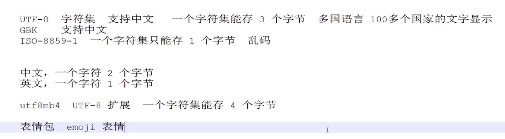
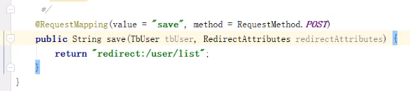

---
title:01-单体应用：my-shop笔记
time:2019年10月23日
---

[toc]

## 一、简介

记录项目my-shop的编码笔记。


## 二、

### 2.1 创建项目

首先创建一个maven项目，项目名称为my-shop。接着在项目下添加webapp目录（用于存放web资源文件）；在webapp目录下，我们创建一个assets目录用于存放静态资源文件；在webapp目录下，创建一个WEB-INF文件夹，里面再创建一个web.xml文件，文件内容如下：

```xml
<?xml version="1.0" encoding="UTF-8"?>
<web-app xmlns="http://java.sun.com/xml/ns/javaee" xmlns:xsi="http://www.w3.org/2001/XMLSchema-instance"
         xsi:schemaLocation="http://java.sun.com/xml/ns/javaee http://java.sun.com/xml/ns/javaee/web-app_3_0.xsd"
         version="3.0">

</web-app>
```


此外，在java目录下，我们先按照三层架构创建好各个层级的包：bean、dao、service、web。


目录结构最后如下所示：


在项目的pom文件中，添加以下依赖：

```xml
<dependency>
  <groupId>javax.servlet</groupId>
  <artifactId>servlet-api</artifactId>
  <version>3.1.0</version>
</dependency>
<dependency>
  <groupId>javax.servlet</groupId>
  <artifactId>jsp-api</artifactId>
  <version>2.0</version>
</dependency>
<!--  lombok插件  -->
<dependency>
  <groupId>org.projectlombok</groupId>
  <artifactId>lombok</artifactId>
  <version>1.16.10</version>
</dependency>
```


至此，项目雏形的搭建完毕。


### 2.2 添加静态资源文件

本次我们使用Bootstrap框架的模板AdminLTE，版本是2.4.3版本。

将该模板压缩包解压到项目之外的一个路径（假设解压后的模板项目名称为$template$），并把解压出来的三个文件夹复制到webapp\assets文件夹下：


### 2.3 为项目添加登录页面

我们打开template目录的首页，并进入到login子模块中：


我们仿照这个登录页面的源码进行修改。假设


我们打开登录页面对应的本地文件的源码，并逐行复制。在粘贴到my-shop项目以前，看看待粘贴的代码的结构以及用途。

> tips：在刚开始使用别人的模板时，最好是一段一段地复制，而不要直接把所有代码复制到自己的项目中去。因为将大段代码分成多次复制，可以在复制的过程中观察源码的结构，熟悉源码的内容，这样在自己项目中的代码出现问题时，更加容易排查。


最后，我们得到的登录页面的源码如下：

```jsp
<!DOCTYPE html>
<html>
<!--head begin-->
<head>
    <meta charset="utf-8">
    <meta http-equiv="X-UA-Compatible" content="IE=edge">
    <title>登录页面</title>
    <!-- Tell the browser to be responsive to screen width -->
    <meta content="width=device-width, initial-scale=1, maximum-scale=1, user-scalable=no" name="viewport">
    <!-- Bootstrap 3.3.7 -->
    <link rel="stylesheet" href="assets/bower_components/bootstrap/dist/css/bootstrap.min.css">
    <!-- Font Awesome -->
    <link rel="stylesheet" href="assets/bower_components/font-awesome/css/font-awesome.min.css">
    <!-- Ionicons -->
    <link rel="stylesheet" href="assets/bower_components/Ionicons/css/ionicons.min.css">
    <!-- Theme style -->
    <link rel="stylesheet" href="assets/dist/css/AdminLTE.min.css">
    <!-- iCheck -->
    <link rel="stylesheet" href="assets/plugins/iCheck/square/blue.css">

    <!-- HTML5 Shim and Respond.js IE8 support of HTML5 elements and media queries -->
    <!-- WARNING: Respond.js doesn't work if you view the page via file:// -->
    <!--[if lt IE 9]>
    <script src="https://oss.maxcdn.com/html5shiv/3.7.3/html5shiv.min.js"></script>
    <script src="https://oss.maxcdn.com/respond/1.4.2/respond.min.js"></script>
    <![endif]-->
</head>
<!--head end-->
<!--body begin-->
<body class="hold-transition login-page">
<!-- jQuery 3 -->
<script src="assets/bower_components/jquery/dist/jquery.min.js"></script>
<!-- Bootstrap 3.3.7 -->
<script src="assets/bower_components/bootstrap/dist/js/bootstrap.min.js"></script>
<!-- iCheck -->
<script src="assets/plugins/iCheck/icheck.min.js"></script>
<script>
    $(function () {
        $('input').iCheck({
            checkboxClass: 'icheckbox_square-blue',
            radioClass: 'iradio_square-blue',
            increaseArea: '20%' /* optional */
        });
    });
</script>

<div class="login-box">
    <div class="login-logo">
        <a href="#"><b>我的</b>商城</a>
    </div>

    <div class="login-box-body">
        <p class="login-box-msg">请输入用户名和密码
        <form action="../../index2.html" method="post">
            <div class="form-group has-feedback">
                <input type="email" class="form-control" placeholder="邮箱">
                <span class="glyphicon glyphicon-envelope form-control-feedback"></span>
            </div>
            <div class="form-group has-feedback">
                <input type="password" class="form-control" placeholder="密码">
                <span class="glyphicon glyphicon-lock form-control-feedback"></span>
            </div>
            <div class="row">
                <div class="col-xs-8">
                    <div class="checkbox icheck">
                        <label>
                            <input type="checkbox"> 记住我
                        </label>
                    </div>
                </div>
                <div class="col-xs-4">
                    <button type="submit" class="btn btn-primary btn-block btn-flat">登录</button>
                </div>
            </div>
        </form>

    </div>
</div>
</body>
<!--body end-->
</html>
```

渲染后的页面如下：


### 2.4 新建实体类`User`以及数据访问层接口类`UserDao`

实体类`User`代码：

```java
import lombok.Data;
import lombok.experimental.Accessors;

/**
 * @Author: ChromeChen
 * @Description:
 * @Date: Created in 20:49 2019-10-23
 * @Modified By:
 */
@Data
@Accessors(chain = true)
public class User {

    private String username;
    private String password;
    private String email;
}
```

注意：`@Accessors(chain = true)`这个注解可以实现链式编程。


数据访问层接口类`UserDao`代码：

```java
import com.chen.my.shop.bean.User;

/**
 * @Author: ChromeChen
 * @Description: 访问后台用户数据库接口
 * @Date: Created in 20:48 2019-10-23
 * @Modified By:
 */
public interface UserDao {

    User getUserByEmailAndPassword(String email, String password);
}
```

> 关于方法命名规范：方法的命名既需要满足语义规范（看到方法名就能猜到方法的用途），也不能过长。所以，方法名的规范应该是两者的平衡。
>
> 此外，在数据访问层接口中，方法名以get开头，说明这个方法返回的是一个对象（而不是数组），


> 当你发现自己的类不需要被继承（或者不想被继承）的时候，可以使用 `final `关键字。


## 三、使用tomcat容器加载Spring配置文件，并得到上下文对象实例

### 3.1 tomcat容器启动时自动加载Spring配置文件

在pom文件中添加以下依赖：

```xml
<dependency>
  <groupId>org.springframework</groupId>
  <artifactId>spring-web</artifactId>
  <version>5.1.8.RELEASE</version>
</dependency>
```

然后在web.xml中添加以下配置信息：

```xml
<context-param>
  <param-name>contextConfigLocation</param-name>
  <param-value>classpath:spring.xml</param-value>
</context-param>
<listener>
  <listener-class>org.springframework.web.context.ContextLoaderListener</listener-class>
</listener>
```

上面的信息表示：当tomcat容器启动时，会去类路径下加载*spring.xml* 文件


### 3.2 获取 bean 实例

首先编写SpringContext模板代码，在这个模板代码中，实现了：①获取Spring上下文对象； ②利用Spring上下文对象获取 bean 实例； 

```java
import org.apache.commons.lang3.Validate;
import org.slf4j.Logger;
import org.slf4j.LoggerFactory;
import org.springframework.beans.BeansException;
import org.springframework.beans.factory.DisposableBean;
import org.springframework.context.ApplicationContext;
import org.springframework.context.ApplicationContextAware;

/**
 * @Author: ChromeChen
 * @Description:
 * @Date: Created in 21:32 2019-10-25
 * @Modified By:
 */
public final class SpringContext implements ApplicationContextAware, DisposableBean {

    private static final Logger logger = LoggerFactory.getLogger(SpringContext.class);

    public static ApplicationContext context = null;


    @Override
    public void setApplicationContext(ApplicationContext applicationContext) throws BeansException {
        SpringContext.context = applicationContext;
    }

    @Override
    public void destroy() throws Exception {
        context = null;
        logger.info("销毁了 ApplicationContext 对象");
    }

    /**
     * 根据 beanId 获取 bean 实例
     * @param beanId
     * @param <T>
     * @return
     */
    public static <T> T getBean(String beanId) {
        Object bean = SpringContext.context.getBean("name");
        return (T) bean;
    }

    /**
     * 根据 clazz 获取 bean 实例
     * @param clazz
     * @param <T>
     * @return
     */
    public static <T> T getBean(Class<T> clazz) {
        return SpringContext.context.getBean(clazz);
    }

    /**
     * 断言 Context 已经注入
     */
    private static void assertContextInjected() {
        Validate.validState(context != null, "applicationContext 属性未注入，请在 spring-context.xml 配置中定义 SpringContext");
    }

    /**
     * 获取存储在静态变量中的 ApplicationContext
     * @return
     */
    public static ApplicationContext getApplicationContext() {
        assertContextInjected();
        return context;
    }
}
```

注意：需要先添加依赖：

```xml
 <!--<editor-fold desc="commons-lang3依赖">-->
<dependency>
  <groupId>org.apache.commons</groupId>
  <artifactId>commons-lang3</artifactId>
  <version>3.5</version>
</dependency>
<!--</editor-fold>-->
```


Spring的配置文件如下所示：

```xml
<?xml version="1.0" encoding="UTF-8"?>
<beans xmlns="http://www.springframework.org/schema/beans"
       xmlns:xsi="http://www.w3.org/2001/XMLSchema-instance"
       xsi:schemaLocation="http://www.springframework.org/schema/beans http://www.springframework.org/schema/beans/spring-beans.xsd">

    <!--SpringContext实例, 一定要配置在首行！！！！！！！！！！-->
    <bean id="springContext" class="com.chen.my.shop.commons.context.SpringContext"/>
    <!--数据接口层实现类-->
    <bean class="com.chen.my.shop.dao.impl.UserDaoImpl" id="userDao"/>
    <!--  业务层的实现类  -->
    <bean class="com.chen.my.shop.service.impl.UserServiceImpl" id="userService"/>
</beans>
```


此时，启动tomcat以后，已经可以将Spring文件加载并获得上下文对象了。


### 3.3 实现“记住我”功能

#### 技术选型

**Cookie**

Cookie 是指存储在用户本地终端上的数据，同时它是与具体的 Web 页面或者站点相关的。Cookie 数据会自动在 Web 浏览器和 Web 服务器之间传输，也就是说 HTTP 请求发送时，会把保存在该请求域名下的所有 Cookie 值发送给 Web 服务器，因此服务器端脚本是可以读、写存储在客户端的 Cookie 的操作。


**LocalStorage**

在 HTML5 中，新加入了一个 localStorage 特性，这个特性主要是用来作为本地存储来使用的，解决了 Cookie 存储空间不足的问题(Cookie 中每条 Cookie 的存储空间为 4k)，localStorage 中一般浏览器支持的是 5M 大小，这个在不同的浏览器中 localStorage 会有所不同。


**SessionStorage**

SessionStorage 与 LocalStorage 的唯一一点区别就是 LocalStorage 属于永久性存储，而 SessionStorage 属于当会话结束的时候，SessionStorage 中的键值对就会被清空。


**UserData、GlobalStorage、Google Gear**

这三种的使用都有一定的局限性，例如

- userData 是 IE 浏览器专属，它的容量可以达到 640K，这种方案可靠，不需要安装额外插件，只不过它仅在IE下有效
- globalStorage 适用于 Firefox 2+ 的浏览器，类似于 IE 的 userData
- google gear 是谷歌开发出的一种本地存储技术，需要安装 Gear 组件
- 

**Flash ShareObject（Flash Cookie）**

这种方式能能解决上面提到的 Cookie 存储的两个弊端，而且能够跨浏览器，应该说是目前最好的本地存储方案。不过，需要在页面中插入一个 Flash，当浏览器没有安装 Flash 控件时就不能用了。所幸的是，没有安装 Flash 的用户极少


本次使用的技术是Cookie。

**附：CookieUtil**

```java
import javax.servlet.http.Cookie;
import javax.servlet.http.HttpServletRequest;
import javax.servlet.http.HttpServletResponse;
import java.io.UnsupportedEncodingException;
import java.net.URLDecoder;
import java.net.URLEncoder;

/**
 * Cookie 工具类
 * <p>Title: CookieUtils</p>
 * <p>Description: </p>
 *
 * @author Lusifer
 * @version 1.0.0
 * @date 2017/12/10 22:00
 */
public final class CookieUtils {

    /**
     * 得到Cookie的值, 不编码
     *
     * @param request
     * @param cookieName
     * @return
     */
    public static String getCookieValue(HttpServletRequest request, String cookieName) {
        return getCookieValue(request, cookieName, false);
    }

    /**
     * 得到Cookie的值,
     *
     * @param request
     * @param cookieName
     * @return
     */
    public static String getCookieValue(HttpServletRequest request, String cookieName, boolean isDecoder) {
        Cookie[] cookieList = request.getCookies();
        if (cookieList == null || cookieName == null) {
            return null;
        }
        String retValue = null;
        try {
            for (int i = 0; i < cookieList.length; i++) {
                if (cookieList[i].getName().equals(cookieName)) {
                    if (isDecoder) {
                        retValue = URLDecoder.decode(cookieList[i].getValue(), "UTF-8");
                    } else {
                        retValue = cookieList[i].getValue();
                    }
                    break;
                }
            }
        } catch (UnsupportedEncodingException e) {
            e.printStackTrace();
        }
        return retValue;
    }

    /**
     * 得到Cookie的值,
     *
     * @param request
     * @param cookieName
     * @return
     */
    public static String getCookieValue(HttpServletRequest request, String cookieName, String encodeString) {
        Cookie[] cookieList = request.getCookies();
        if (cookieList == null || cookieName == null) {
            return null;
        }
        String retValue = null;
        try {
            for (int i = 0; i < cookieList.length; i++) {
                if (cookieList[i].getName().equals(cookieName)) {
                    retValue = URLDecoder.decode(cookieList[i].getValue(), encodeString);
                    break;
                }
            }
        } catch (UnsupportedEncodingException e) {
            e.printStackTrace();
        }
        return retValue;
    }

    /**
     * 设置Cookie的值 不设置生效时间默认浏览器关闭即失效,也不编码
     */
    public static void setCookie(HttpServletRequest request, HttpServletResponse response, String cookieName,
                                 String cookieValue) {
        setCookie(request, response, cookieName, cookieValue, -1);
    }

    /**
     * 设置Cookie的值 在指定时间内生效,但不编码
     */
    public static void setCookie(HttpServletRequest request, HttpServletResponse response, String cookieName,
                                 String cookieValue, int cookieMaxage) {
        setCookie(request, response, cookieName, cookieValue, cookieMaxage, false);
    }

    /**
     * 设置Cookie的值 不设置生效时间,但编码
     */
    public static void setCookie(HttpServletRequest request, HttpServletResponse response, String cookieName,
                                 String cookieValue, boolean isEncode) {
        setCookie(request, response, cookieName, cookieValue, -1, isEncode);
    }

    /**
     * 设置Cookie的值 在指定时间内生效, 编码参数
     */
    public static void setCookie(HttpServletRequest request, HttpServletResponse response, String cookieName,
                                 String cookieValue, int cookieMaxage, boolean isEncode) {
        doSetCookie(request, response, cookieName, cookieValue, cookieMaxage, isEncode);
    }

    /**
     * 设置Cookie的值 在指定时间内生效, 编码参数(指定编码)
     */
    public static void setCookie(HttpServletRequest request, HttpServletResponse response, String cookieName,
                                 String cookieValue, int cookieMaxage, String encodeString) {
        doSetCookie(request, response, cookieName, cookieValue, cookieMaxage, encodeString);
    }

    /**
     * 删除Cookie带cookie域名
     */
    public static void deleteCookie(HttpServletRequest request, HttpServletResponse response,
                                    String cookieName) {
        doSetCookie(request, response, cookieName, "", -1, false);
    }

    /**
     * 设置Cookie的值，并使其在指定时间内生效
     *
     * @param cookieMaxage cookie生效的最大秒数
     */
    private static final void doSetCookie(HttpServletRequest request, HttpServletResponse response,
                                          String cookieName, String cookieValue, int cookieMaxage, boolean isEncode) {
        try {
            if (cookieValue == null) {
                cookieValue = "";
            } else if (isEncode) {
                cookieValue = URLEncoder.encode(cookieValue, "utf-8");
            }
            Cookie cookie = new Cookie(cookieName, cookieValue);
            if (cookieMaxage > 0)
                cookie.setMaxAge(cookieMaxage);
            if (null != request) {// 设置域名的cookie
                String domainName = getDomainName(request);
//                System.out.println(domainName);
                if (!"localhost".equals(domainName)) {
                    cookie.setDomain(domainName);
                }
            }
            cookie.setPath("/");
            response.addCookie(cookie);
        } catch (Exception e) {
            e.printStackTrace();
        }
    }

    /**
     * 设置Cookie的值，并使其在指定时间内生效
     *
     * @param cookieMaxage cookie生效的最大秒数
     */
    private static final void doSetCookie(HttpServletRequest request, HttpServletResponse response,
                                          String cookieName, String cookieValue, int cookieMaxage, String encodeString) {
        try {
            if (cookieValue == null) {
                cookieValue = "";
            } else {
                cookieValue = URLEncoder.encode(cookieValue, encodeString);
            }
            Cookie cookie = new Cookie(cookieName, cookieValue);
            if (cookieMaxage > 0)
                cookie.setMaxAge(cookieMaxage);
            if (null != request) {// 设置域名的cookie
                String domainName = getDomainName(request);
//                System.out.println(domainName);
                if (!"localhost".equals(domainName)) {
                    cookie.setDomain(domainName);
                }
            }
            cookie.setPath("/");
            response.addCookie(cookie);
        } catch (Exception e) {
            e.printStackTrace();
        }
    }

    /**
     * 得到cookie的域名
     */
    private static final String getDomainName(HttpServletRequest request) {
        String domainName = null;

        String serverName = request.getRequestURL().toString();
        if (serverName == null || serverName.equals("")) {
            domainName = "";
        } else {
            serverName = serverName.toLowerCase();
            serverName = serverName.substring(7);
            final int end = serverName.indexOf("/");
            serverName = serverName.substring(0, end);
            final String[] domains = serverName.split("\\.");
            int len = domains.length;
            if (len > 3) {
                // www.xxx.com.cn
                domainName = "." + domains[len - 3] + "." + domains[len - 2] + "." + domains[len - 1];
            } else if (len <= 3 && len > 1) {
                // xxx.com or xxx.cn
                domainName = "." + domains[len - 2] + "." + domains[len - 1];
            } else {
                domainName = serverName;
            }
        }

        if (domainName != null && domainName.indexOf(":") > 0) {
            String[] ary = domainName.split("\\:");
            domainName = ary[0];
        }
        return domainName;
    }

}
```


#### 使用Cookie实现“记住我”功能

暂时不实现。


### 3.4 Maven 模块化开发

#### 3.4.1 概述

在多人协同开发时，特别是规模较大的项目，为了方便日后的代码维护和管理，我们会将每个开发人员的工作细分到==具体的功能和模块==上。随着项目的不断扩大，模块也会越来越多，后续会更加难以维护和扩展，为了应对这种情况后期我们还会采用微服务架构的方式进行开发。

我们把当前的教程分为以下几种形式：

- 统一的依赖管理（dependencies）：用于管理整个工程中的依赖
- 通用的工具类（commons）：工程中用到的工具类统一放置到这个项目中；
- 领域模型（domain）：工程中用到的实体类统一放置到这个项目中；
- 管理后台（admin）：my-shop 系统中管理员后台
- 商城前端（ui）：my-shop 系统中前台购物系统
- 接口模块（api）：


具体的流程如下所示：

#### 3.4.2 创建根工程

创建一个名为 `my-shop` 的工程，`pom.xml` 文件如下：

```xml
<?xml version="1.0" encoding="UTF-8"?>
<project xmlns="http://maven.apache.org/POM/4.0.0"
         xmlns:xsi="http://www.w3.org/2001/XMLSchema-instance"
         xsi:schemaLocation="http://maven.apache.org/POM/4.0.0 http://maven.apache.org/xsd/maven-4.0.0.xsd">
    <modelVersion>4.0.0</modelVersion>

    <groupId>com.chen</groupId>
    <artifactId>my-shop</artifactId>
    <version>1.0-SNAPSHOT</version>
    <packaging>pom</packaging>
    
    <modules>
    
    </modules>
</project>
```


#### 3.4.3 创建统一的依赖管理项目

我们在工程的目录下创建一个 my-shop-dependencies 文件夹，并在这个文件夹中创建依赖管理项目。项目的 pom 文件如下：

```xml
<?xml version="1.0" encoding="UTF-8"?>
<project xmlns="http://maven.apache.org/POM/4.0.0" xmlns:xsi="http://www.w3.org/2001/XMLSchema-instance"
         xsi:schemaLocation="http://maven.apache.org/POM/4.0.0 http://maven.apache.org/xsd/maven-4.0.0.xsd">
    <modelVersion>4.0.0</modelVersion>

    <parent>
        <groupId>com.chen</groupId>
        <artifactId>my-shop</artifactId>
        <version>1.0-SNAPSHOT</version>
        <relativePath>../pom.xml</relativePath>
    </parent>

    <artifactId>my-shop-dependencies</artifactId>
    <packaging>pom</packaging>

    <name>my-shop-dependencies</name>
    <description></description>

    <properties>
        <!-- 环境配置 -->
        <project.build.sourceEncoding>UTF-8</project.build.sourceEncoding>
        <project.reporting.outputEncoding>UTF-8</project.reporting.outputEncoding>
        <java.version>1.8</java.version>

        <!-- 统一的依赖管理 -->
        <commons-lang3.version>3.5</commons-lang3.version>
        <jstl.version>1.2</jstl.version>
        <log4j.version>1.2.17</log4j.version>
        <servlet-api.version>3.1.0</servlet-api.version>
        <slf4j.version>1.7.25</slf4j.version>
        <spring.version>4.3.17.RELEASE</spring.version>
    </properties>

    <dependencyManagement>
        <dependencies>
            <!-- Spring Begin -->
            <dependency>
                <groupId>org.springframework</groupId>
                <artifactId>spring-context</artifactId>
                <version>${spring.version}</version>
            </dependency>
            <dependency>
                <groupId>org.springframework</groupId>
                <artifactId>spring-webmvc</artifactId>
                <version>${spring.version}</version>
            </dependency>
            <!-- Spring End -->

            <!-- Servlet Begin -->
            <dependency>
                <groupId>javax.servlet</groupId>
                <artifactId>javax.servlet-api</artifactId>
                <version>${servlet-api.version}</version>
                <scope>provided</scope>
            </dependency>
            <dependency>
                <groupId>javax.servlet</groupId>
                <artifactId>jstl</artifactId>
                <version>${jstl.version}</version>
            </dependency>
            <!-- Servlet End -->

            <!-- Log Begin -->
            <dependency>
                <groupId>org.slf4j</groupId>
                <artifactId>slf4j-api</artifactId>
                <version>${slf4j.version}</version>
            </dependency>
            <dependency>
                <groupId>org.slf4j</groupId>
                <artifactId>slf4j-log4j12</artifactId>
                <version>${slf4j.version}</version>
            </dependency>
            <dependency>
                <groupId>org.slf4j</groupId>
                <artifactId>jcl-over-slf4j</artifactId>
                <version>${slf4j.version}</version>
            </dependency>
            <dependency>
                <groupId>org.slf4j</groupId>
                <artifactId>jul-to-slf4j</artifactId>
                <version>${slf4j.version}</version>
            </dependency>
            <dependency>
                <groupId>log4j</groupId>
                <artifactId>log4j</artifactId>
                <version>${log4j.version}</version>
            </dependency>
            <!-- Log End -->

            <!-- Commons Begin -->
            <dependency>
                <groupId>org.apache.commons</groupId>
                <artifactId>commons-lang3</artifactId>
                <version>${commons-lang3.version}</version>
            </dependency>
            <!-- Commons End -->
        </dependencies>
    </dependencyManagement>

    <build>
        <plugins>
            <!-- Compiler 插件, 设定 JDK 版本 -->
            <plugin>
                <groupId>org.apache.maven.plugins</groupId>
                <artifactId>maven-compiler-plugin</artifactId>
                <version>3.7.0</version>
                <configuration>
                    <source>${java.version}</source>
                    <target>${java.version}</target>
                    <encoding>${project.build.sourceEncoding}</encoding>
                    <showWarnings>true</showWarnings>
                </configuration>
            </plugin>
        </plugins>

        <!-- 资源文件配置 -->
        <resources>
            <resource>
                <directory>src/main/java</directory>
                <excludes>
                    <exclude>**/*.java</exclude>
                </excludes>
            </resource>
            <resource>
                <directory>src/main/resources</directory>
            </resource>
        </resources>
    </build>
</project>
```

我们分段来查看这个文件：

1. 首先是 <parent> 标签：这个标签中的内容指向了工程的目录；
2. 接着是 <dependencyManagement> 标签：这个标签中可以配置多个 <dependency> 的标签，但是只是一种『声明』的作用，不会真正把 jar 包下载到项目中;
3. <build> 标签的作用是在将项目打包成为工程的时候，所涉及的一些“动作”：在上面的例子中，我们可以看到有两个额外添加的功能：① 指定 jdk 版本为 1.8； ② 将类路径（以及子路径）中的资源文件全部打包；


#### 3.4.4 创建


#### 3.5.x 回顾

我们回顾上面整个步骤，可以发现，经过


> 思考：在“复制粘贴”代码的顺序
>
> -**场景：**
>
> 假设现在有一个旧项目，这个旧项目的很多代码需要迁移到新的项目中去；新项目和旧项目中存在很多相似的地方，但是也存在不少相异之处；我们需要把旧项目中的代码按照新项目的项目架构（或者其他规则）迁移到新项目中去。那么，==应该如何才能更快、更有效、更省力地完成代码的迁移呢==？我们现有的工具是一个集成开发环境，在这个环境中含有代码的语法提示等功能。
>
> 
>
> 通过上面的描述，大概可以抽象出这样一个问题：在一个集成开发环境中，如何合理安排顺序可以使得把旧代码迁移到新代码的过程中更加有效、不容易出错？
>
> 
>
> 目前想到的一个方式就是按照“入口顺序”：比如说在一个旧项目中，总会有若干个==“入口文件”==，具体距离就是 SSM 项目中的 web.xml 。另外还有一些就是 ==“字典索引”==类的文件，例如在 Spring 文件引入了子 Spring 文件。这个父 Spring 文件就是“字典索引”文件。
>
> 我们在移动项目的过程中，先把==“入口文件”以及“字典索引文件”==移动到新项目中，然后利用集成开发环境的语法提示功能来进行修正错误。错误有的时候是因为缺少文件而导致的，而这个文件又会依赖其他的文件，因此，继续利用语法提示功能将缺少的文件补入到新项目中。
>
> 
>
> 此外，可能旧文件到新文件可能需要转化规则，我们需要先构想转化规则，再实际去移动文件。转化的规则越直观越好。例如
>
> 最后，一个很重要的步骤就是“检查”——在移动完成一个小阶段以后，就要检查是不是有什么错漏或者冗余。如果发现了错漏或冗余，就要及时改正。
>


## 四、Mybatis 

### 4.1 Mybatis 简介

参考网站 https://funtl.com/zh/mybatis/#%E6%9C%AC%E8%8A%82%E8%A7%86%E9%A2%91


### 4.2 Spring 整合 Druid 

1. 添加依赖：先往 my-shop-dependencies 项目中引入，再在其他实际项目中引入；




### 4.3 Spring 整合 Mybatis

记得检查扫描的 dao 文件所在的路径是否正确。


### 4.4 Mybatis 实现 CRUD 功能

1. 如果一张表中有几十个字段，如何快速构造一个 insert 语句？


### 4.5 实现首页布局

1. 依据自己想要的功能，逐步逐步从模板 html 中复制对应的代码片段；
2. 当复制完成代码片段以后，将界面显示的东西改为业务的字段；
3. 用户列表页面；
4. 封装通用的 JSP 模板；


### 4.6 实现“用户查询列表”功能

1. 新建一个 JSP 页面，指定菜单中的某个子菜单的链接跳转到这个页面；
2. 在 BootStrap 模板中找一个表格，表格中先显示固定内容，然后再使用 EL 表达式把数据库中的内容展示上去；
3. 调整页面布局，多添加 “查看”、“编辑”、“删除”三个功能按钮；
4. 再添加“导入”、“导出”、“新增”、“删除全部”四个按钮；


### 4.7 完成新增/编辑功能

前端方面：“查看”、“新增”、“编辑”公用同一个页面；页面的标题通过 JSP 来区分。

控制器：一个方法跳转到 form 页面；“新增”、“编辑”两个功能复用同一个方法：save

- 如果 save 成功：重定向到 用户列表界面；
  
- 如果 save 失败，再转发到当前的页面；

业务层：通过 ID 是否为 null 来判断是“新增”还是“编辑”；

接着统一封装返回值。

使用表单标签完成数据回显功能（目前不需要，如果要的话，可以观看视频“使用 Spring MVC 表单标签简化表单开发”）。


> 注意：在需要自己编写前端以及后端的时候，先写完后端的所有校验，再写前端的校验。


**业务逻辑层：**

通过


**前端校验：**

前端校验我们使用 jquery validation 实现。

首先需要在 footer 里面引入三个 js 文件：自定义、原来的以及本地化的。

在指定哪个字段是必填的，接着再利用 js 编写初始化的过程


- js 编写过程：

  - 首先确定样式：从 BootStrap 中复制样式并使得样式生效；

  - 接着对比新样式和原来样式，知道新样式多出来的部分：

    ```js
    <form:input path="username" class="form-control required" placeholder="用户名" />
    
    $(function () {
        $("#inputForm").validate({
            errorElement: 'span',
            errorClass: 'help-block',
    
            errorPlacement: function (error, element) {
                element.parent().parent().attr("class", "form-group has-error");
                error.insertAfter(element);
            }
        });
    });
    ```

  - 然后编写一个“初始化函数”，函数体直接打印一句话即可。

  - 接着编写自定义的 样式属性、拼接对应的


### 4.8 完成“搜索功能”

我们使用 『动态 SQL 』实现条件拼接；

数据访问层需要 3 个参数，而业务层只需要 1 个参数（keyword）


完成以后，我们发现：在搜索的时候，只能实现单一条件的查询，现在需要实现『联合查询』；


### 5.1 重构代码——提取统一的数据访问层和业务接口

#### 5.1.1 原因

在数据访问层中，很多方法都是相同的 → 很快就会触犯『重构原则』：写且只写一次；

- 继承：提取公共的属性和行为；

此时，我们可以逐个检查 DAO 中的各个方法，发现：“根据 Email 查询”是不需要的；另外，如果类型无法确定，那么我们就使用“泛型”；

> Tips：
>
> 1. “删除”，比“新增”要容易；
> 2. 先“选择一个试错”，如果发现没有什么异常了，那么继续扩大尝试的范围；


#### 5.1.3 深度封装业务层接口

1. 树形结构通常不需要做批量删除；


1. 由于树型结构 DAO 层通常不需要“批量删除”、“分页查询”，但是同时又存在着几个和普通 DAO 相同的接口，此时，我们需要为树形结构单独创建一个 DAO 类以及 Service 类；

2. 接着，我们可以发现：在不同实现类中，有若干个方法的写法都是相同的：都是直接调用 DAO 的对应方法；此时，为了让实现类的方法只写一遍，我们可以写一个**<u>统一的实现类</u>**，这个实现类是一个抽象类；

3. 在编写抽象类的时候，我们就按照“普通的 Service”来编写，同时将那些不能确定的方法设置为 abstract 即可；（自动注入 DAO 等）这时，我们需要管理好泛型；

   - 这里可能涉及到抽象类的 DAO 的注入问题，可以先尝试使用“直接注入”，如果不行，那就通过“泛型注入”；

     既要实现 抽象类，又要实现接口；

4. 分页：由于现有参数是和业务有关联的，所以我们可以“弱化”业务性：也就是说，用一个通用的名称即可；


