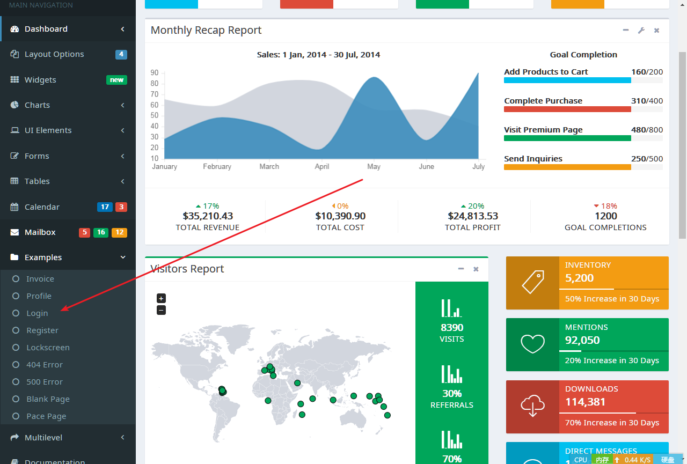
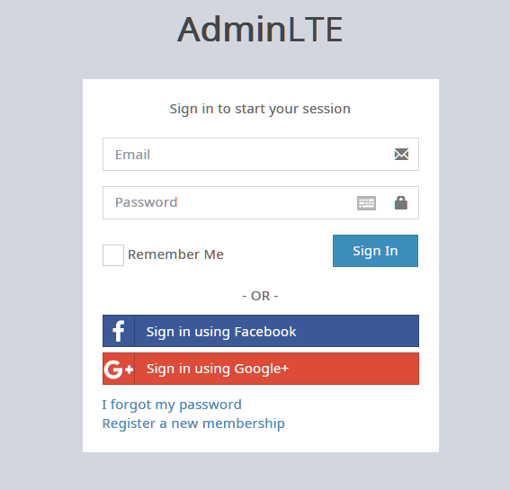
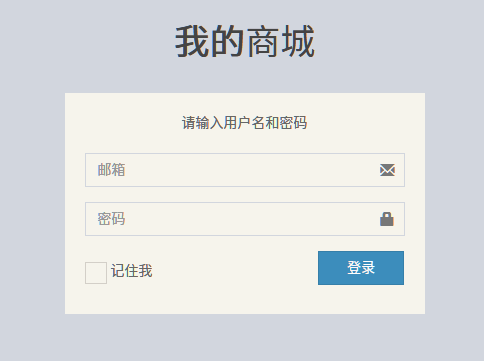

---
title:01-单体应用：my-shop笔记
time:2019年10月23日
---

[toc]

## 一、简介

记录项目my-shop的编码笔记。


## 二、

### 2.1 创建项目

首先创建一个maven项目，项目名称为my-shop。接着在项目下添加webapp目录（用于存放web资源文件）；在webapp目录下，我们创建一个assets目录用于存放静态资源文件；在webapp目录下，创建一个WEB-INF文件夹，里面再创建一个web.xml文件，文件内容如下：

```xml
<?xml version="1.0" encoding="UTF-8"?>
<web-app xmlns="http://java.sun.com/xml/ns/javaee" xmlns:xsi="http://www.w3.org/2001/XMLSchema-instance"
         xsi:schemaLocation="http://java.sun.com/xml/ns/javaee http://java.sun.com/xml/ns/javaee/web-app_3_0.xsd"
         version="3.0">

</web-app>
```


此外，在java目录下，我们先按照三层架构创建好各个层级的包：bean、dao、service、web。


目录结构最后如下所示：


在项目的pom文件中，添加以下依赖：

```xml
<dependency>
  <groupId>javax.servlet</groupId>
  <artifactId>servlet-api</artifactId>
  <version>3.1.0</version>
</dependency>
<dependency>
  <groupId>javax.servlet</groupId>
  <artifactId>jsp-api</artifactId>
  <version>2.0</version>
</dependency>
<!--  lombok插件  -->
<dependency>
  <groupId>org.projectlombok</groupId>
  <artifactId>lombok</artifactId>
  <version>1.16.10</version>
</dependency>
```


至此，项目雏形的搭建完毕。


### 2.2 添加静态资源文件

本次我们使用Bootstrap框架的模板AdminLTE，版本是2.4.3版本。

将该模板压缩包解压到项目之外的一个路径（假设解压后的模板项目名称为$template$），并把解压出来的三个文件夹复制到webapp\assets文件夹下：


### 2.3 为项目添加登录页面

我们打开template目录的首页，并进入到login子模块中：





我们仿照这个登录页面的源码进行修改。假设


我们打开登录页面对应的本地文件的源码，并逐行复制。在粘贴到my-shop项目以前，看看待粘贴的代码的结构以及用途。

> tips：在刚开始使用别人的模板时，最好是一段一段地复制，而不要直接把所有代码复制到自己的项目中去。因为将大段代码分成多次复制，可以在复制的过程中观察源码的结构，熟悉源码的内容，这样在自己项目中的代码出现问题时，更加容易排查。


最后，我们得到的登录页面的源码如下：

```jsp
<!DOCTYPE html>
<html>
<!--head begin-->
<head>
    <meta charset="utf-8">
    <meta http-equiv="X-UA-Compatible" content="IE=edge">
    <title>登录页面</title>
    <!-- Tell the browser to be responsive to screen width -->
    <meta content="width=device-width, initial-scale=1, maximum-scale=1, user-scalable=no" name="viewport">
    <!-- Bootstrap 3.3.7 -->
    <link rel="stylesheet" href="assets/bower_components/bootstrap/dist/css/bootstrap.min.css">
    <!-- Font Awesome -->
    <link rel="stylesheet" href="assets/bower_components/font-awesome/css/font-awesome.min.css">
    <!-- Ionicons -->
    <link rel="stylesheet" href="assets/bower_components/Ionicons/css/ionicons.min.css">
    <!-- Theme style -->
    <link rel="stylesheet" href="assets/dist/css/AdminLTE.min.css">
    <!-- iCheck -->
    <link rel="stylesheet" href="assets/plugins/iCheck/square/blue.css">

    <!-- HTML5 Shim and Respond.js IE8 support of HTML5 elements and media queries -->
    <!-- WARNING: Respond.js doesn't work if you view the page via file:// -->
    <!--[if lt IE 9]>
    <script src="https://oss.maxcdn.com/html5shiv/3.7.3/html5shiv.min.js"></script>
    <script src="https://oss.maxcdn.com/respond/1.4.2/respond.min.js"></script>
    <![endif]-->
</head>
<!--head end-->
<!--body begin-->
<body class="hold-transition login-page">
<!-- jQuery 3 -->
<script src="assets/bower_components/jquery/dist/jquery.min.js"></script>
<!-- Bootstrap 3.3.7 -->
<script src="assets/bower_components/bootstrap/dist/js/bootstrap.min.js"></script>
<!-- iCheck -->
<script src="assets/plugins/iCheck/icheck.min.js"></script>
<script>
    $(function () {
        $('input').iCheck({
            checkboxClass: 'icheckbox_square-blue',
            radioClass: 'iradio_square-blue',
            increaseArea: '20%' /* optional */
        });
    });
</script>

<div class="login-box">
    <div class="login-logo">
        <a href="#"><b>我的</b>商城</a>
    </div>

    <div class="login-box-body">
        <p class="login-box-msg">请输入用户名和密码
        <form action="../../index2.html" method="post">
            <div class="form-group has-feedback">
                <input type="email" class="form-control" placeholder="邮箱">
                <span class="glyphicon glyphicon-envelope form-control-feedback"></span>
            </div>
            <div class="form-group has-feedback">
                <input type="password" class="form-control" placeholder="密码">
                <span class="glyphicon glyphicon-lock form-control-feedback"></span>
            </div>
            <div class="row">
                <div class="col-xs-8">
                    <div class="checkbox icheck">
                        <label>
                            <input type="checkbox"> 记住我
                        </label>
                    </div>
                </div>
                <div class="col-xs-4">
                    <button type="submit" class="btn btn-primary btn-block btn-flat">登录</button>
                </div>
            </div>
        </form>

    </div>
</div>
</body>
<!--body end-->
</html>
```

渲染后的页面如下：




### 2.4 新建实体类`User`以及数据访问层接口类`UserDao`

实体类`User`代码：

```java
import lombok.Data;
import lombok.experimental.Accessors;

/**
 * @Author: ChromeChen
 * @Description:
 * @Date: Created in 20:49 2019-10-23
 * @Modified By:
 */
@Data
@Accessors(chain = true)
public class User {

    private String username;
    private String password;
    private String email;
}
```

注意：`@Accessors(chain = true)`这个注解可以实现链式编程。


数据访问层接口类`UserDao`代码：

```java
import com.chen.my.shop.bean.User;

/**
 * @Author: ChromeChen
 * @Description: 访问后台用户数据库接口
 * @Date: Created in 20:48 2019-10-23
 * @Modified By:
 */
public interface UserDao {

    User getUserByEmailAndPassword(String email, String password);
}
```

> 关于方法命名规范：方法的命名既需要满足语义规范（看到方法名就能猜到方法的用途），也不能过长。所以，方法名的规范应该是两者的平衡。
>
> 此外，在数据访问层接口中，方法名以get开头，说明这个方法返回的是一个对象（而不是数组），


