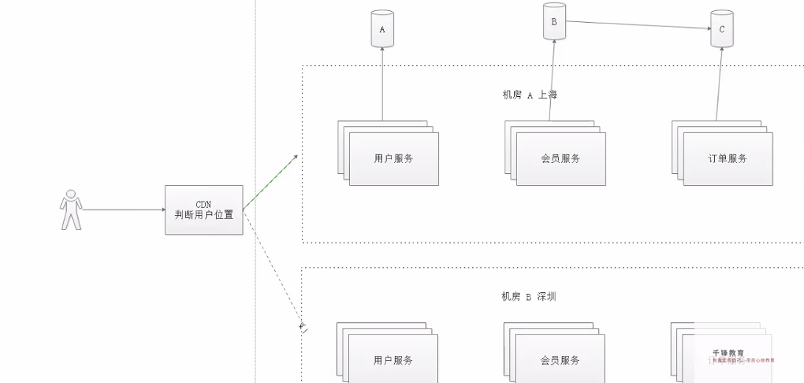
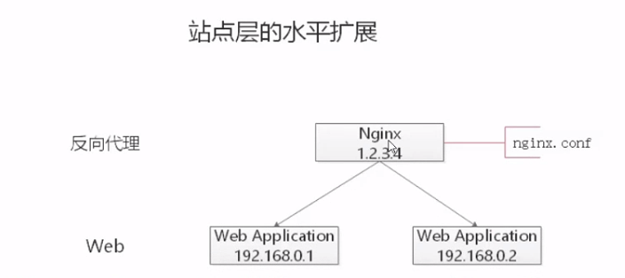
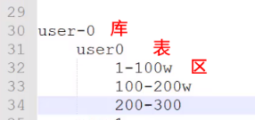
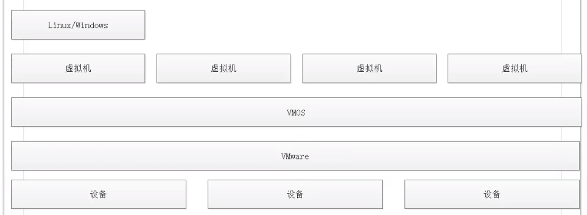

[toc]

## 三、CAP 定理与 BASE 理论

### 3.1 CAP 定理

2000 年 7 月，加州大学伯克利分校的 Eric Brewer 教授在 ACM PODC 会议上提出了 CAP 猜想。

CAP 理论认为：一个分布式系统最多只能同时满足一致性（Cobnsistency）、可用性（Availability）和分区容错性（Partition tolerance）这三项中的两项。

- 一致性：指的是（all nodes see the same data at the same time），即更新操作成功并返回客户端完成以后，所有节点在同一时间的数据完全一致；
- 可用性：可用性指（Reads and writes always succeed），即服务一直可用，而且是正常响应时间；
- 分区容错性：（the system continues to operate despite arbitraty message loss or failure of part of the system），即分布式系统在遇到某节点或网络分区故障的时候，仍能够对外一共满足一致性和可用性的服务。

由于有 CAP 定理的约束，所以在实际系统中，往往都只能保证两个特性：

1. 当一个系统保证了“”一致性“和”分区容错性“的时候，这个系统被称为 CP 系统（一般是金融级系统）；
2. 当一个系统保证了“可用性”和“分区容错性”的时候，这个系统被称之为 AP 系统；

> CDN 网络：内容分发网络，可以将你当前的请求分发到“离你最近”的网络。。

### 3.2 CAP 权衡

通过 CAP 理论，我们知道无法同时满足一致性。可用性和分区容错性这三个特性，那么需要舍弃哪一个呢？

对于大多数大型互联网应用的场景，主机众多，部署分散，而且现在的集群规模越来越大，所以其节点故障。网络故障是常态，而且要保证服务可用性达到 N 个 9，即保证 P 和 A，舍弃 C （退而求其次保证最终一致性）。虽然某些地方会影响到客户体验，但没达到造成用户流失的严重程度。

对于涉及到钱财这样不能有一丝让步的场景，C 必须保证。网络发生故障时，宁可停止服务。这就是保证了 CA，而舍弃 P。

### 3.3 BASE 理论

eBay 玩够是 Dan Pritchett 源于大规模分布式系统的实践总结在 ACM 上发表文章提出 BASE 理论，BASE 理论是对 CAP 理论的延伸，核心思想是：即使无法做到强一致性（Strong Consistency，因为 CAP 中的一致性就是强一致性），但应用可以采用适合的方式达到最终一致性（Eventual Consitency）。

- 基本可用（Basically Available）：分布式系统在出现故障的时候，允许损失部分可用性，即保障核心可用。电商大促销的时候，为了应对访问量激增，部分用户坑会被引导到降级页面，服务层也可能只提供降级服务，这就是损失部分可用性的体现。
- 软状态（Soft State）：允许系统存在中间状态，而该中间状态不会影响系统整体可用性。分布式存储中一般一份数据至少会有三个副本，**<u>允许不同节点副本同步的延时就是软状态的体现</u>**。
- 最终一致性（Eventual Consistency）：系统中的所有数据副本经过一段时间以后，最终能够达到一致的状态。

1. 异地多活：同样逻辑的数据库，在不同的地理区域进行备份；
   缺点：同一张逻辑表进行合并的时候，如果采用了主键自增的策略，会导致“主键冲突”；
2. 异地双活：同样逻辑的数据库，在两个地理区域进行备份；
   通过自增 2 个步长，即可解决“主键冲突”的问题；
   缺点：无法继续增加多一个异地备份的同时，保证主键不重复；

通过上面的分析，在异地多活的系统中，我们需要解决不同库中的主键冲突的问题，同时还需要保证其扩展性。此时，亟需提出一个==分布式 ID==的解决方案。

> TIPS：字符串 ID 会影响性能，为了保证性能，尽量使用“”数字“类型；

### 3.4 ACID 与 BASE 的区别与联系

ACID 是传统单少帅常用的设计理念，追求强一致性模型。BASE 支持的是大型分布式系统，提出通过牺牲强一致性获得高可用性。

ACID 和 BASE 代表了两种截然相反的设计哲学，在分布式系统设计的场景中，系统组件对一致性要求是不同的，因此 ACID 和 BASE 又会结合使用。

## 四、如何应对高并发

目前互联网的主流架构：

客户端访问域名 → DNS 解析域名 → 进入到反向代理中 → 进入 Web 层 → 进入到服务层 → 访问数据库（数据库采用的是“读写分离”模式，两个数据库之间的同步需要一定的时间）

### 4.1 反向代理层的水平扩展

反向代理层的水平扩展，是通过 ==DNS 轮询==来实现的：DNS Server 对于一个域名配置了多个解析 IP，每次 DNS 解析请求来访问 DNS Server时，会轮询返回这些 IP 地址。

当 Nginx 成为瓶颈的时候，只要增加服务器的数量，新增 Nginx 服务器的部署，增加一个外网 IP，就能扩展反向代理层的性能，做到理论上的无限高并发。

### 4.2 站点应用层的水平扩展

站点应用层的水平扩展，是通过 Nginx 来实现的。通过修改 nginx.conf，可以设置多个 Web 后端。

当 Web 后端成为瓶颈的时候，只要增加服务器的数量，新增 Web 服务的部署，了 Nginx 配置中配置上新的 Web 后端，就能扩展站点层的性能，做到理论上的无限高并发。

### 4.3 服务层的水平扩展

和『站点应用层』的水平扩展几乎类似

### 4.4 数据层的水平扩展

在数据量很大的情况下，数据层（缓存，数据库）涉及数据的水平扩展，将原本存储在一台服务器上的数据（缓存）水平拆分到不同的服务器上去，已达到扩充系统性能的目的。

拆分方式分为两种：

1. 范围拆分：将某个区间范围放到数据库 A 中，将另外一个区间的数据放到数据库 B 中。
2. 哈希拆分；

#### 4.4.1 范围拆分

每一个数据库服务，存储一定范围的数据：

- $user_0$库，储存 uid 范围为：1-1kw;
- $user_1$库，存储 uid 范围 1kw-2kw；

这种方式的优点是：

- 规则简单，Service 只需要判断一下 uid 范围就能路由到对应的存储服务中；
- 闪烁均衡性较好；
- 比较容易扩展，可以随时添加一个 uid[2kw,3kw]的数据服务；

但是缺点也是比较明显的：

- 请求的负载不一定均衡，一般来说，新注册的用户会比老用户更加活跃，大范围的服务请求压力会更大；

#### 4.4.2 哈希拆分

每一个数据库，存储某个 key 值 hash 后的部分数据，例如：

- $user_0$库，存储 uid 为偶数的数据；
- $user_1 $库，存储 uid 为奇数的数据；

这种拆分方式的优点是：

1. 规则简单，Service 只需要对 uid 进行 hash 以后就能路由到对应的存储服务；
2. 数据均衡性较好；
3. 请求均匀性较好；

缺点是：

1. 不容易扩展，扩展一个数据服务，hash 方法改变的时候，可能需要进行数据迁移；

#### 4.4.3 水平拆分与主从同步

通过水平拆分来扩充系统性能，与主从同步读写分离来扩充数据库性能的方式，是有本质的区别的；

通过水平拆分扩展数据库性能：

1. 每个服务器上存储的数据量是总量的 1/n ，所以单击的性能也会有所提升；
2. n 个服务器上的数据没有交集，所有服务器上闪烁的并集就是数据的全集；
3. 数据水平拆分到 n 个服务器上，理论上读性能扩充了 n 倍，写性能也扩充了 n 倍（其实远不止 n 倍，因为单击的数量变味了原来的 1/n）；

通过主从同步读写分离扩展数据库性能

1. 每个服务器上存储的数据量和总量都是相同的；
2. n 个服务器上的数据都一样，都是全集；
3. 理论上读性能扩充了 n 倍，写仍然是单点，写性能不变；

> 分库分表表分区：
> 

虚拟化操作系统

> 1. 三个方法可以解决生活中大多数的问题：
>    - 重启；
>    - 多喝热水；
>    - 不行就算了；
> 2. 做事情要三思而后行：
>    - 这件事情能不能别人做；
>    - 这件事情能不能明天做；
>    - 这件事情能不能不做；

