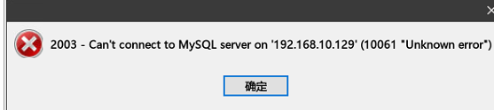
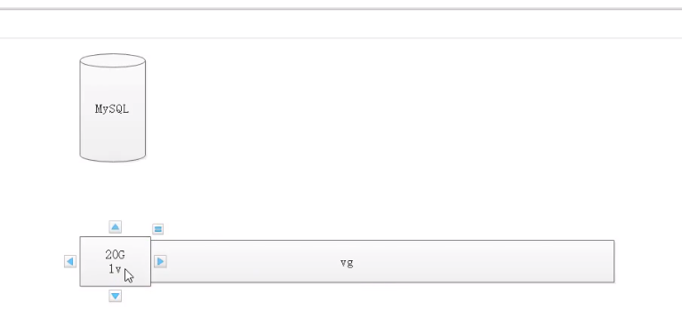

[toc]

## 一、Linux 简介


Linux 是内核，基于这个内核有一系列的操作系统。

本次选型的操作系统是 Ubuntu。


Linux 的安装：请看视频教程[008 Linux-简介]()中 09:24~最后。

## 二、Linux 远程控制

### 2.1 概述

传统的网络服务程序，FTP、POP、Telnet 本质上都是不安全的，因为它们在网络上通过明文传送口令和数据，这些数据非常容易被截获。SSH 叫做 Secure Shell，通过 SSH，可以把传输数据进行加密，预防攻击，传输的数据进行了压缩，可以加快传输速度。


### 2.2 OpenSSH

SSH 是芬兰一家公司开发，但是受到版权和加密算法限制，现在很短风都使用 OpenSSH，OpenSSH 是 SSh 的替代软件，，是免费的。OpenSSH 由客户端和服务器组成。

- **基于口令的安全验证**：知道服务器的账号密码即可远程登录，口令和数据在传输过程中都会被加密；
- **基于密钥的安全验证**：此时需要在创建一对密钥，把公有密钥放到远程服务器上自己的宿主目录中，而私有密钥则由自己保存；


> Windows 能够用到什么水平，Linux 就应该能够用到什么水平——
>
> 两者都是操作系统，只要了解原理，那这两个系统就应该可以用到相同的水平；


### 2.3 Linux 目录管理

Linux 目录管理如下表所示：

|  目录   |                             说明                             |
| :-----: | :----------------------------------------------------------: |
| **bin** | 存放二进制可执行文件（例如：命令 ls，cat, mkdir 对应的二进制文件）等 |
|  boot   |               存放用于系统引导时使用的各种文件               |
|   dev   |                     用于存放系统配置文件                     |
| **etc** |                   存放所有用户文件的根目录                   |
|  home   |     存放跟文件系统中的程序运行所需要的共享库以及内核模块     |
|   lib   |              系统管理员安装临时文件系统的安装点              |
|   mnt   |              额外安装的可选应用程序包所放的位置              |
|   opt   |               虚拟文件系统，存放当前内存的映射               |
|  proc   |                         超级用户目录                         |
|  root   |           存放二进制可执行文件，只有root 才能访问            |
|  sbin   |                     用于存放各种临时文件                     |
|   tmp   |                     用于存放各种临时文件                     |
| **usr** | 用于存放系统应用程序，比较重要的目录 /usr/local 本地管理员软件安装目录 |
| **var** |               用于存放运行时需要改变数据的文件               |

重点只需要关注加粗的四个目录即可。

- 不成文的规定：自己手动安装的应用程序必须安装在 /usr/local目录中；

> 当安装软件的时候，往往都会存在三种类型的文件：① 二进制可执行文建； ② 配置文件； ③ 数据文件（例如，MySQL 中的 my.ini command.exe data 就分别对应了这三种类型的文件。）


### 2.4 操作文件目录

常见命令：

| 命令  |                说明                |                      语法                       | 参数  |              参数说明              |
| :---: | :--------------------------------: | :---------------------------------------------: | :---: | :--------------------------------: |
|  ls   |         显示文件和目录列表         |             ls [-alrtAFR] [name...]             |       |                                    |
|       |                                    |                                                 |  -l   |         列出文件的详细信息         |
|       |                                    |                                                 |  -a   | 列出当前目录所有文件，包含隐藏文件 |
| mkdir |              创建目录              |               mkdir [-p] dirName                |       |                                    |
|       |                                    |                                                 |  -p   |   父目录不存在情况下先生成父目录   |
|  cd   |              切换目录              |                  cd [dirName]                   |       |                                    |
| touch |           生成一个空文件           |                                                 |       |                                    |
| echo  |         生成一个带内容文件         |      echo abcd > 1.txt，echo 1234 >> 1.txt      |       |                                    |
|  cat  |          显示文本文件内容          | cat [-AbeEnstTuv] [--help] [--version] fileName |       |                                    |
|  cp   |           复制文件或目录           |            cp [options] source dest             |       |                                    |
|  rm   |              删除文件              |              rm [options] name...               |       |                                    |
|       |                                    |                                                 |  -f   |         强制删除文件或目录         |
|       |                                    |                                                 |  -r   |     同时删除该目录下的所有文件     |
|  mv   |           移动文件或目录           |            mv [options] source dest             |       |                                    |
| find  |     在文件系统中查找指定的文件     |                                                 |       |                                    |
|       |                                    |                                                 | -name |               文件名               |
| grep  | 在指定的文本文件中查找指定的字符串 |                                                 |       |                                    |
| tree  |     用于以树状图列出目录的内容     |                                                 |       |                                    |
|  pwd  |          显示当前工作目录          |                                                 |       |                                    |
|  ln   |             建立软链接             |                                                 |       |                                    |
| more  |        分页显示文本文件内容        |                                                 |       |                                    |
| head  |          显示文件开头内容          |                                                 |       |                                    |
| tail  |          显示文件结尾内容          |                                                 |       |                                    |
|       |                                    |                                                 |  -f   |              跟踪输出              |

> 命令都是熟能生巧的过程，只有通过多练习这一条路。在练习的时候，先看命令的中文意思，然后再根据中文回忆对应的命令以及参数，这时更加容易记住。


默认所有手动安装的软件都是放在 /usr/local 目录下


安装软件，最重要的就是三个：

1. 配置文件；/etc
2. 数据文件；/var
3. 可执行文件；/bin


## 三、 Linux 系统管理

### 3.1 系统管理命令

|   命令   |                       解析                       |
| :------: | :----------------------------------------------: |
|   stat   | 显示指定文件的相关信息，比 ls 命令显示内容更丰富 |
|   who    |                显示在线登录的用户                |
| hostname |                   显示主机名称                   |
|  uname   |                   显示系统信息                   |
|   top    |         显示当前系统中耗费资源最多的进程         |
|    ps    |                显示瞬时的进程状态                |
|    du    | 显示指定的文件（目录）已经被使用的磁盘空间的总量 |
|    df    |          显示文件系统磁盘空间的使用情况          |
|   free   |         显示当前内存和交换空间的使用情况         |
| ifconfig |                 显示网络接口信息                 |
|   ping   |           测试网络的连通性（心跳检测）           |
| netstat  |                显示网络的状态信息                |
|  clear   |                       清屏                       |
|   kill   |                   杀死一个进程                   |


> 使用 netstat 可以用来显示网络的状态信息（例如哪个端口号是否已经启动了），使用这个命令我们可以检测当前系统是否中了木马。
>
> Windows 窗口 → （专业术语称之为“句柄”） → 监听句柄，识别键盘输入 → 盗号


### 3.2 Linux 压缩/解压命令

| 命令 |                    语法                     | 参数 |            参数说明             |
| :--: | :-----------------------------------------: | :--: | :-----------------------------: |
| tar  | tar [-cxzjvf] 压缩打包文档的名称 欲打包目录 |      |                                 |
|      |                                             |  -c  |   建立一个归档文件的参数指令    |
|      |                                             |  -x  |   解开一个归档文件的参数指令    |
|      |                                             |  -z  |      是否需要用 gzip 压缩       |
|      |                                             |  -j  |      是否需要用 bzip2 压缩      |
|      |                                             |  -v  |      压缩的过程中显示文件       |
|      |                                             |  -f  | 使用档名，在 f 之后要立即接档名 |
|      |                                             | -tf  |     查看归档文件里面的文件      |

- 案例
  - 压缩：`tar -zcvf test.tar.gz test\`
  - 解压：`tar -zxvf test.tar.gz`


| 命令 |                语法                | 参数 |                           参数说明                           |
| :--: | :--------------------------------: | :--: | :----------------------------------------------------------: |
| gzip | gzip [选项] 压缩（解压缩）的文件名 |      |                                                              |
|      |                                    |  -d  |                            解压缩                            |
|      |                                    |  -l  | 对每个压缩文件，显示压缩文件的大小，未压缩文件的大小，压缩比，未压缩文件的名字 |
|      |                                    |  -v  |         对每一个压缩和解压的文件，显示文件名和压缩比         |
|      |                                    | -num | 用指定的数字num调整压缩的速度，-1或--fast表示最快压缩方法（低压缩比），-9或--best表示最慢压缩方法（高压缩比）。系统缺省值为6 |

> 压缩文件后缀为 gz


| 命令  |     语法     | 参数 |                           参数说明                           |
| :---: | :----------: | :--: | :----------------------------------------------------------: |
| bzip2 | bzip2 [-cdz] |      |                                                              |
|       |              |  -d  |                            解压缩                            |
|       |              |  -z  |                           压缩参数                           |
|       |              | -num | 用指定的数字num调整压缩的速度，-1或--fast表示最快压缩方法（低压缩比），-9或--best表示最慢压缩方法（高压缩比）。系统缺省值为6 |

> 压缩文件后缀为 bz2

## 四、Linux Vim 编辑器

### 4.1 概述

Vim 是从 Vi 发展出来的一个文本编辑器，代码不全、编译及错误跳转等方便编程的功能特别丰富。在程序员人群中广泛使用。


### 4.2 运行模式

- 编辑模式：等待编辑命令输入；
- 插入模式：编辑模式下，输入 `i` 进入插入模式，进入以后，就可以输入文本信息了；
- 命令模式：在编辑模式下，输入 `:`  进入命令模式；


### 4.3 命令模式

- `:q `：直接退出 vi；
- `:wq `： 保存后退出 vi，（当被编辑的文件不存在时，可以自动新建文件）；
- `:q! `： 强制退出；
- `:w file` ： 将当前内容保存成某个文件；
- `/ `： 查找字符串；
- `:set number` ： 在编辑文件中显示行号；
- `:set nonumber `： 不显示行号；
- `:set paste `： 原样粘贴；


## 五、Linux 用户和组管理

### 5.1 概述

Linux 操作系统时一个多用户操作系统，它允许多用户同时登陆到系统中并使用资源。系统会根据账户来区分每个用户的文件、进程、任务和工作环境，使得每个用户的工作都不受干扰。


### 5.2 使用 Root 用户


注销当前用户：<kbd>Ctrl + D</kbd>。注销功能会按照用户的登陆顺序的倒序进行退出（**栈**结构）。


默认情况下，root 用户不允许远程连接，需要修改配置才能进行远程连接。具体操作步骤如下：

1. 使用管理员用户登陆 Ubuntu 系统；

2. 允许root用户远程登录：修改ssh服务配置文件：

   ```shell
   sudo vi /etc/ssh/sshd_config
   ```

   调整`PermitRootLogin`参数值为`yes`

3. 修改 root 用户密码：

   ```shell
   chen@ubuntu:~$ su
   Password:
   root@ubuntu:/home/chen# passwd root
   Enter new UNIX password:
   Retype new UNIX password:
   passwd: password updated successfully
   root@ubuntu:/home/chen#
   
   ```

4. 重启 ssh 服务：

   ```shell
   service sshd restart  # 或者
   /etc/initd.d/sshd restart
   ```

最后使用远程客户端、以 root 用户连接即可。

### 5.3 用户账户说明

- **普通用户**：普通用户在系统上的任务时进行普通操作；
- **超级管理员**：管理员在系统上的任务时对普通用户和整个系统进行管理。对系统具有绝对的控制权，能够对系统进行一切操作。root 用户能够在系统中拥有最高权限。
  默认情况下，Ubuntu 用户的 root 用户是不能登录的；
- **安装时创建的系统用户**：此用户创建时被添加到 admin 组中，在 Ubuntu 中，admin 组中的用户默认是可以使用 `sudo `命令来执行『只有管理员才能执行的命令』。如果不使用 `sudo `，此时就相当于一个普通用户；

### 5.4 组账户说明

- **私有组**：当创建一个用户时没有指定该用户属于哪一个组，Linux 就会建立一个与用户同名的私有组，此私有组只含有该用户；
- **标准组**：当创建一个用户时就可以选定一个标准组，如果一个用户同时属于多个组时，登陆后所属的组为主组，其他的为附加组；

​	

## 六、Linux 文件权限管理

### 6.1 概述

`ls` 命令不带参数时只显示文件名称，通过添加参数 `al`（完整命令为：`ls -al`）则可以显示文件或目录的权限信息；

`ls -l `文件名，显示信息包括：① 文件类型（d` `为目录，-` `为普通文件，`l `为链接文件）； ② 文件权限； ③ 文件的用户； ④ 文件的所属组； ⑤ 文件的大小； ⑥ 文件的创建时间； ⑦ 文件的名称；）


下面使用一个例子详细讲解：

`-rw-r--r-- 1 root root    0 Jul 16 11:43 1.txt`

- 我们先看第一部分：``-rw-r--r--`：
  划分方法为：① `-` ； ② `rw-`； ③ `r--`； ④` r--`；

  - 第一个字符代表的是文件类型：（1）- 表示普通文件；
  - 第 ② 部分表示：用户权限； 值 rwx 分别表示“可读可写可执行”；- 表示没有该权限；
  - 第 ③ 部分表示：用户所在组权限；
  - 第 ④ 部分表示：其他用户权限；

  上面的一部分所表示的内容是：这个一个文件，这个文件是**可读可写不可执行**的类型；对于当前用户组来说是**只读类型**；对于其他用户组来说是**只读类型**；

- `1` ：连接数；

- `root` ： 文档所属组用户；

- `root` ： 文档所属组；

- `0 `： 文档大小；

- `Jul 16 11:43 `： 文档最后被修改日期；

- `1.txt` ： 文档名称；


执行 sh 文件的方法：通过『相对路径』或『绝对路径』来执行。


### 6.2 更改操作权限

#### 6.2.1 chown 命令

这个命令时 change owner 的缩写，主要作用是：改变文件或者目录所有者（『所有者』包括：用户和用户组）。

具体用法如下：

1. `chown [-R] 用户名称 文件或目录`；
2. `chown [-R] 用户名称 用户组名称 文件或目录`；

> `-R` 进行递归式权限更改：将该目录下的所有文件、子目录都进行更新。

#### 6.2.2 chmod命令

改变访问权限。具体用法如下：

1. `chmod [who] [+ | - | =] [mode] 文件名`

例子：

```sehlll

```


### 6.3 数字设定法

数字设定法中，数字所表示的含义：

- 0 表示没有任何权限
- 1 表示有可执行的权限；
- 2 表示有可写的权限；
- 4 表示有可读的权限；

例子：

```shell
chmod 755 a0.txt
表示：改变 a0.txt 文件的权限：当前用户具有『可读可写可执行』的权限；当前用户组具有『可读、可执行』权限； 其他用户组具有『可读可执行』的权限。
```


## 七、Linux 包管理

### 7.1 概述

APT（Advanced Packaging Tool）是 Debian/Ubuntu 类 Linux 系统中的软件包管理程序，使用它可以找到对应的软件包，而且安装、卸载、更新都方便快捷。同时，使用 APT 可以对 Ubuntu 进行升级。

APT 的源文件为 /etc/apt 目录下的 sources.list 文件。

### 7.2 修改数据源

我们可以修改 Ubuntu 的数据源为国内的数据源，操作步骤如下：

1. 查看系统版本 ：

   ```shell
   root@ubuntu:~# lsb_release -a
   No LSB modules are available.
   Distributor ID: Ubuntu
   Description:    Ubuntu 18.04.2 LTS
   Release:        18.04
   Codename:       bionic
   ```

   > **注意：** Codename 为 `bionic`，该名称为我们 Ubuntu 系统的名称，修改数据源需要用到该名称

2. 修改数据源：（注意：版本号必须匹配）

   ```shell
   vi /etc/apt/sources.list
   ```

   删除全部内容并修改为

   ```
   deb http://mirrors.aliyun.com/ubuntu/ bionic main restricted universe multiverse
   deb http://mirrors.aliyun.com/ubuntu/ bionic-security main restricted universe multiverse
   deb http://mirrors.aliyun.com/ubuntu/ bionic-updates main restricted universe multiverse
   deb http://mirrors.aliyun.com/ubuntu/ bionic-backports main restricted universe multiverse
   ```

   更新数据源

   ```
   apt-get update
   ```

### 7.3 常用 APT 命令

- 安装软件包：`apt-get install <Package Name>`
- 删除软件包：`apt-get remove <Package Name>`
- 更新软件包列表：`apt-get update`
- 升级有可用更新的系统(**慎用**)：`apt-get upgrade`
- 搜索：`apt-cache search <Package Name>`
- 获取包信息：`apt-cache show <Package Name>`
- 删除包及配置文件：`apt-get remove <Package Name> --purge`
- 了解使用依赖：`apt-cache depends <Package Name>`
- 查看被哪些包依赖：`apt-cache rdepends <Package Name>`
- 安装相关的编译环境：`apt-get build-dep <Package Name>`
- 下载源代码：`apt-get source <Package Name>`
- 清理无用的包：`apt-get clean && apt-get autoclean`
- 检查是否有损坏的依赖：`apt-get check`


## 八、Linux 部署应用程序（Tomcat）

### 8.1 在 Linux 上安装 Java 环境

**解压并移动到指定的目录**：

1. 解压：` tar -zxvf jdk-8u152-linux-x64.tar.gz`
2. 创建目录：在` /usr/local` 目录下：` mkdir java`；
3. 移动文件：`mv jdk1.8.0_152/ java/`
4. 设置所有者为当前用户： `chown -R root:root /usr/local/java/`；

**配置环境变量**：

1. 配置系统环境变量：

   ```shell
   vi /etc/environment
   添加：
   export JAVA_HOME=/usr/local/java/jdk1.8.0_152
   export JRE_HOME=/usr/local/java/jdk1.8.0_152/jre
   export CLASSPATH=$CLASSPATH:$JAVA_HOME/lib:$JAVA_HOME/jre/lib
   ```

2. 配置用户环境变量：

   ```shell
   vi /etc/profile
   添加：
   JAVA_HOME=/usr/local/java/jdk1.8.0_152
   PATH=$PATH:$HOME/bin:$JAVA_HOME/bin
   export JAVA_HOME
   export PATH
   ```

3. 刷新用户环境变量：

   ```shell
   source /etc/profile
   ```

4. 查看是否成功：

   ```shell
   java -version
   当出现以下的文字时，说明已经添加到环境变量成功：
   
   root@ubuntu:/usr/local/java/jdk1.8.0_152# java -version
   java version "1.8.0_152"
   Java(TM) SE Runtime Environment (build 1.8.0_152-b16)
   Java HotSpot(TM) 64-Bit Server VM (build 25.152-b16, mixed mode)
   
   ```

### **配置 tomcat**：

直接解压并进入到解压目录后的 `bin `目录，启动即可。


### 8.3 安装 MySQL

运行命令：

```shell
 apt-get update
apt-get install mysql-server
```

即可安装 MySQL 数据库

安装完成以后，查看 MySQL 服务是否启动：

```shell
 systemctl status mysql
 如果显示：
 ● mysql.service - MySQL Community Server
   Loaded: loaded (/lib/systemd/system/mysql.service; enabled; vendor preset: enabled)
   Active: active (running) since Sat 2020-07-18 08:38:12 UTC; 2min 58s ago
 Main PID: 75036 (mysqld)
    Tasks: 27 (limit: 4633)
   CGroup: /system.slice/mysql.service
           └─75036 /usr/sbin/mysqld --daemonize --pid-file=/run/mysqld/mysqld.pid

Jul 18 08:38:12 ubuntu systemd[1]: Starting MySQL Community Server...
Jul 18 08:38:12 ubuntu systemd[1]: Started MySQL Community Server.

```

可以看到 MySQL 的状态是：『running』，此时服务是启动的。


**登陆到 MySQL 中：**

```shell
root@ubuntu:/usr/local/apache-tomcat-8.5.23# mysql -u root -p
Enter password:
Welcome to the MySQL monitor.  Commands end with ; or \g.
Your MySQL connection id is 2
Server version: 5.7.30-0ubuntu0.18.04.1 (Ubuntu)

Copyright (c) 2000, 2020, Oracle and/or its affiliates. All rights reserved.

Oracle is a registered trademark of Oracle Corporation and/or its
affiliates. Other names may be trademarks of their respective
owners.

Type 'help;' or '\h' for help. Type '\c' to clear the current input statement.

mysql>

```

此时表示已经进入到 MySQL 中


### 8.4 登陆 MySQL 

#### 8.4.1 使用 Navicat 连接 MySQL

在上面的基础上，我们使用 Navicat 连接到虚拟机的 MySQL 服务时，发现出现以下的问题：



我们根据错误码“10061” 寻找答案：https://blog.csdn.net/zhoucheng05_13/article/details/78589025

修改配置文件：

```shell
vim /etc/mysql/mysql.conf.d/mysqld.cnf
将 『bind-address = 127.0.0.1』 注释掉即可
```

重启 MySQL 服务：

```shell
systemctl restart mysql
```


此时，使用 Navicat 连接 MySQL ，发现出现另外一个错误“1130”：


根据错误码“1130” 发现，该错误是由于   **出现这种情况是因为mysql服务器出于安全考虑，默认只允许本地登录数据库服务器，如果不常用我们还是关了这个功能的好。**

登陆到 MySQL 数据库中，并使用 mysql 库：

```mysql
mysql>update user set host='%' where host='localhost' and user='root';
mysql>flush privileges;
```


接着使用 Navicat 连接 MySQL，此时发现仍然登陆不上，错误代码为：“1698”。这个是因为： **root的plugin被修改成了auth_socket，用密码登陆的plugin应该是mysql_native_password**。

我们查询对应的数据：

```mysql
mysql> select user, plugin from mysql.user;
+-----------+-----------------------+
| user      | plugin                |
+-----------+-----------------------+
| root      | auth_socket           |
| mysql.sys | mysql_native_password |
| dev       | mysql_native_password |
+-----------+-----------------------+
3 rows in set (0.01 sec)
```

可以发现：root 用户使用的登陆方式是『auth_socket』，因此需要修改 root 用户的登陆方式。

```mysql
mysql> update mysql.user set authentication_string=PASSWORD('newPwd'), plugin='mysql_native_password' where user='root';
Query OK, 1 row affected, 1 warning (0.00 sec)
Rows matched: 1  Changed: 1  Warnings: 1

mysql> flush privileges;
Query OK, 0 rows affected (0.00 sec)
```

再次使用 Navicat 连接 MySQL，发现连接成功了！


### 8.5 部署应用程序

一般的部署步骤：将项目打成 war 包 → 将 war 包放到服务器的 tomcat 目录下 → 重启 tomcat 服务。

实际的部署步骤：将项目打成 war 包 → 在本地将 war 包解压 → 将解压目录替换服务器的 tomcat 的对应目录。

> 因为 tomcat 在解压 war 包以后，会先把原来的项目先删除，再把 war 包中的项目替换原来的。此时（在部署的过程中），如果有文件正在上传，并且这个文件存放到了原来的项目路径下，那么该文件就会丢失。


## 九、Linux 磁盘扩容

### 9.1 基本概念

- 物理卷：可以在上面建立卷组的媒介，也可以是硬盘本身或者回环文件。物理卷包括一个特殊的 header，其余部分被切割为一块块物理区域；
- 卷组：将一组物理卷收集成为一个管理单元；
- 逻辑卷：虚拟分区，由物理区域组成；
- 物理区域：硬盘可供指派给逻辑卷的最小单位（通常为 4MB）；


如果没有选择“支持磁盘扩容技术”，当 MySQL 数据库往磁盘 A 写数据的时候，再增加一个磁盘 B，MySQL 是无法往磁盘 B 写数据的（因为这是物理上隔离的两个磁盘）。

当选择了“支持磁盘扩容技术”以后，MySQL 直接挂载在 vg 上，vg 是一个逻辑上的概念，利用 vg，可以通过一定的算法向真正的磁盘进行写操作。可以这么理解：vg 实现了磁盘地址映射。



为虚拟机多分配了一个磁盘以后，接下来需要将该磁盘挂载到系统中。

步骤如下：

查看所有的分区：

```shell
root@ubuntu:~# fdisk -l |grep '/dev'
Disk /dev/loop0: 91 MiB, 95408128 bytes, 186344 sectors
Disk /dev/loop1: 97 MiB, 101695488 bytes, 198624 sectors
# 可以看到，我们多加了一块磁盘以后，命令显示的信息多了一块磁盘：sdb
Disk /dev/sdb: 40 GiB, 42949672960 bytes, 83886080 sectors
Disk /dev/sda: 20 GiB, 21474836480 bytes, 41943040 sectors
/dev/sda1     2048     4095     2048   1M BIOS boot
/dev/sda2     4096  2101247  2097152   1G Linux filesystem
/dev/sda3  2101248 41940991 39839744  19G Linux filesystem
Disk /dev/mapper/ubuntu--vg-ubuntu--lv: 19 GiB, 20396900352 bytes, 39837696 sectors

```

创建 sdb 分区

```shell
root@ubuntu:~# fdisk /dev/sdb

Welcome to fdisk (util-linux 2.31.1).
Changes will remain in memory only, until you decide to write them.
Be careful before using the write command.

Device does not contain a recognized partition table.
Created a new DOS disklabel with disk identifier 0x07c52bc1.

Command (m for help):

```

输入上面的命令以后，系统被阻塞了，需要输入命令

```shell
Command (m for help): n
Partition type
   p   primary (0 primary, 0 extended, 4 free)
   e   extended (container for logical partitions)
Select (default p):

Using default response p.
Partition number (1-4, default 1): 1
First sector (2048-83886079, default 2048):
Last sector, +sectors or +size{K,M,G,T,P} (2048-83886079, default 83886079):

Created a new partition 1 of type 'Linux' and of size 40 GiB.
# 按下 w 写入到系统中
Command (m for help): w
The partition table has been altered.
Calling ioctl() to re-read partition table.

```

我们输入了 n ，然后根据提示语创建分区，最后按下 w 写入到系统中。

此时我们再输入：

```shell
root@ubuntu:~# fdisk -l |grep '/dev'
Disk /dev/loop0: 91 MiB, 95408128 bytes, 186344 sectors
Disk /dev/loop1: 97 MiB, 101695488 bytes, 198624 sectors
Disk /dev/sdb: 40 GiB, 42949672960 bytes, 83886080 sectors
# 可以发现：系统的分区多了一个 sdb1
/dev/sdb1        2048 83886079 83884032  40G 83 Linux
Disk /dev/sda: 20 GiB, 21474836480 bytes, 41943040 sectors
/dev/sda1     2048     4095     2048   1M BIOS boot
/dev/sda2     4096  2101247  2097152   1G Linux filesystem
/dev/sda3  2101248 41940991 39839744  19G Linux filesystem
Disk /dev/mapper/ubuntu--vg-ubuntu--lv: 19 GiB, 20396900352 bytes, 39837696 sectors

```

格式化 sdb1：

```shell
root@ubuntu:~# mkfs -t ext4 /dev/sdb1
mke2fs 1.44.1 (24-Mar-2018)
Creating filesystem with 10485504 4k blocks and 2621440 inodes
Filesystem UUID: 914d970b-7204-424e-a606-656bbf16ddbd
Superblock backups stored on blocks:
        32768, 98304, 163840, 229376, 294912, 819200, 884736, 1605632, 2654208,
        4096000, 7962624

Allocating group tables: done
Writing inode tables: done
Creating journal (65536 blocks): done
Writing superblocks and filesystem accounting information: done

```

此时，我们可以创建逻辑卷（PV）了：

```shell
root@ubuntu:~# pvcreate /dev/sdb1
WARNING: ext4 signature detected on /dev/sdb1 at offset 1080. Wipe it? [y/n]: y
  Wiping ext4 signature on /dev/sdb1.
  Physical volume "/dev/sdb1" successfully created.

```

创建完成以后，再查看卷组：

```shell
root@ubuntu:~# pvscan
  PV /dev/sda3   VG ubuntu-vg       lvm2 [<19.00 GiB / 0    free]
  PV /dev/sdb1                      lvm2 [<40.00 GiB]
  Total: 2 [<59.00 GiB] / in use: 1 [<19.00 GiB] / in no VG: 1 [<40.00 GiB]

```

可以发现：sdb1 已经被挂载到 pv 中去了。


### 扩容 VG

查看 VG

```shell
root@ubuntu:~# vgdisplay
  --- Volume group ---
  VG Name               ubuntu-vg
  System ID
  Format                lvm2
  Metadata Areas        1
  Metadata Sequence No  2
  VG Access             read/write
  VG Status             resizable
  MAX LV                0
  Cur LV                1
  Open LV               1
  Max PV                0
  Cur PV                1
  Act PV                1
  # 可以看到：现在的 VG 容量是 19.00G
  VG Size               <19.00 GiB
  PE Size               4.00 MiB
  Total PE              4863
  Alloc PE / Size       4863 / <19.00 GiB
  Free  PE / Size       0 / 0
  VG UUID               GxiPlo-9c18-Sv6S-C928-reuq-x3XD-FBZdsP
```

扩容 VG

```shell
root@ubuntu:~# vgextend  ubuntu-vg /dev/sdb1
  Volume group "ubuntu-vg" successfully extended

```

上面的  ubuntu-vg 就是根据上一条命令的 VG Name 的值得到的；

再次查看 VG：

```shell
root@ubuntu:~# vgdisplay
  --- Volume group ---
  VG Name               ubuntu-vg
  System ID
  Format                lvm2
  Metadata Areas        2
  Metadata Sequence No  3
  VG Access             read/write
  VG Status             resizable
  MAX LV                0
  Cur LV                1
  Open LV               1
  Max PV                0
  Cur PV                2
  Act PV                2
  # 现在可以看到，VG 的容量已经增加了
  VG Size               58.99 GiB
  PE Size               4.00 MiB
  Total PE              15102
  Alloc PE / Size       4863 / <19.00 GiB
  Free  PE / Size       10239 / <40.00 GiB
  VG UUID               GxiPlo-9c18-Sv6S-C928-reuq-x3XD-FBZdsP

```


### 扩容 LV

查看 LV

```shell
lvdisplay

# 输出如下
--- Logical volume ---
# 我们需要用到 LV Path
LV Path                /dev/ubuntu-vg/ubuntu-lv
LV Name                ubuntu-lv
VG Name                ubuntu-vg
LV UUID                e2fKkR-oZeH-WV2A-ltCi-P76v-N9yv-aUtIg1
LV Write Access        read/write
LV Creation host, time ubuntu-server, 2019-05-14 03:13:57 +0800
LV Status              available
# open                 1
LV Size                <19.00 GiB
Current LE             4863
Segments               1
Allocation             inherit
Read ahead sectors     auto
- currently set to     256
Block device           253:0
```

扩容 LV：

```shell
# 按固定大小追加
lvextend -L +10G /dev/ubuntu-vg/ubuntu-lv

# 按百分比追加
lvextend -l +100%FREE /dev/ubuntu-vg/ubuntu-lv

# 输出如下
Size of logical volume ubuntu-vg/ubuntu-lv changed from <19.00 GiB (4863 extents) to 38.99 GiB (9982 extents).
Logical volume ubuntu-vg/ubuntu-lv successfully resized.
```

刷新分区：

```shell
resize2fs /dev/ubuntu-vg/ubuntu-lv

# 输出如下
Filesystem at /dev/ubuntu-vg/ubuntu-lv is mounted on /; on-line resizing required
old_desc_blocks = 3, new_desc_blocks = 5
The filesystem on /dev/ubuntu-vg/ubuntu-lv is now 10221568 (4k) blocks long.
```


> **注意：** 不要卸载扩容的磁盘，可能出现丢失数据或是系统无法启动


**总结：**上面的操作主要分为以下几步：① 挂载新磁盘； ② 格式化新磁盘，并为磁盘分区（sdb1）； ③ 扩容 PV； ④ 扩容 VG； ⑤扩容 LV；


多看看这部分视频