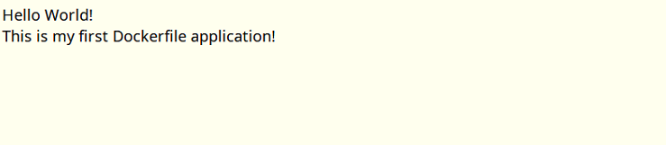
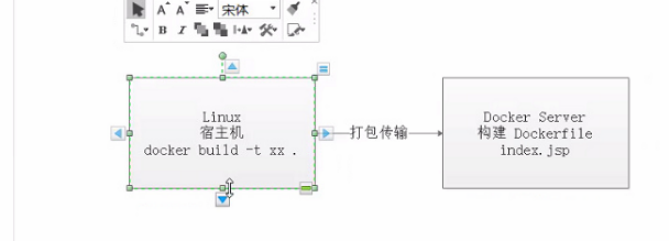
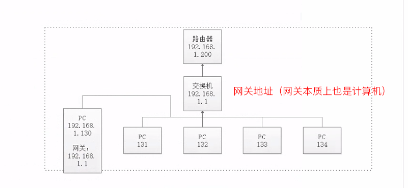
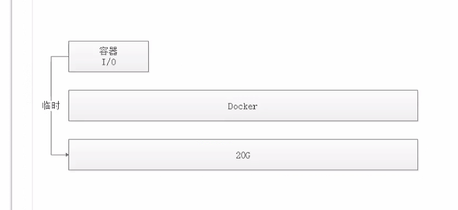
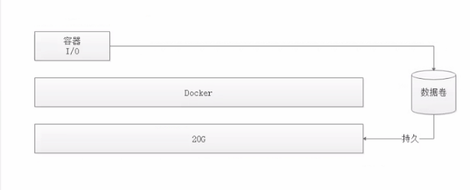

[toc]

## 一、Docker 简介

参考[什么事 Docker](http://qfdmy.com/#/courses/lesson/1240364147406635009/1242876928685064193)。

总结：Docker 是新一代的虚拟化技术，相比以往的虚拟化技术更加轻便。使用 GO 语言编写。

## 二、为什么要使用 Docker

作为一种新兴的虚拟化方式，Docker 跟传统的虚拟化方式相比具有众多的优势。

### 2.1 更高效的利用系统资源

由于容器不需要进行硬件虚拟以及运行完整操作系统等**额外开销**，Docker 对系统资源的利用率更高。无论是应用执行速度、内存损耗或者文件存储速度，都要比传统虚拟机技术更高效。因此，相比虚拟机技术，一个相同配置的主机，往往可以运行更多数量的应用。

### 2.2 更快速的启动时间

传统的虚拟机技术启动应用服务往往需要数分钟，而 Docker 容器应用，由于直接运行于宿主内核，无需启动完整的操作系统，因此可以做到秒级、甚至毫秒级的启动时间。大大的节约了开发、测试、部署的时间。

### 2.3 一致的运行环境

开发过程中一个常见的问题是环境一致性问题。由于开发环境、测试环境、生产环境不一致，导致有些 bug 并未在开发过程中被发现。而 Docker 的镜像提供了除内核外完整的运行时环境，确保了应用运行环境一致性，从而不会再出现 **「这段代码在我机器上没问题啊」** 这类问题。

### 2.4 持续交付和部署

对开发和运维（[DevOps](https://zh.wikipedia.org/wiki/DevOps)）人员来说，最希望的就是一次创建或配置，可以在任意地方正常运行。

使用 Docker 可以通过定制应用镜像来实现持续集成、持续交付、部署。开发人员可以通过 `Dockerfile` 来进行镜像构建，并结合 [持续集成(Continuous Integration)](https://en.wikipedia.org/wiki/Continuous_integration) 系统进行集成测试，而运维人员则可以直接在生产环境中快速部署该镜像，甚至结合 [持续部署(Continuous Delivery/Deployment)](https://en.wikipedia.org/wiki/Continuous_delivery) 系统进行自动部署。

而且使用 `Dockerfile` 使镜像构建透明化，不仅仅开发团队可以理解应用运行环境，也方便运维团队理解应用运行所需条件，帮助更好的生产环境中部署该镜像。

### 2.5 更轻松的迁移

由于 Docker 确保了执行环境的一致性，使得应用的迁移更加容易。Docker 可以在很多平台上运行，无论是物理机、虚拟机、公有云、私有云，甚至是笔记本，其运行结果是一致的。因此用户可以很轻易的将在一个平台上运行的应用，迁移到另一个平台上，而不用担心运行环境的变化导致应用无法正常运行的情况。

### 2.6 更轻松的维护和扩展

Docker 使用的分层存储以及镜像的技术，使得应用重复部分的复用更为容易，也使得应用的维护更新更加简单，基于基础镜像进一步扩展镜像也变得非常简单。此外，Docker 团队同各个开源项目团队一起维护了一大批高质量的 [官方镜像](https://hub.docker.com/search/?q=&source=verified&type=image)，既可以直接在生产环境使用，又可以作为基础进一步定制，大大的降低了应用服务的镜像制作成本。

### 2.7 对比传统虚拟机总结

| 特性       | 容器               | 虚拟机      |
| :--------- | :----------------- | :---------- |
| 启动       | 秒级               | 分钟级      |
| 硬盘使用   | 一般为 `MB`        | 一般为 `GB` |
| 性能       | 接近原生           | 弱于        |
| 系统支持量 | 单机支持上千个容器 | 一般几十个  |

## 三、在 Ubuntu 中安装 Docker

### 3.1 安装 Docker

**卸载旧版本**

```shell
apt-get remove docker docker-engine docker.io containerd runc

```

使用 APT 进行安装：

```shell
apt install docker.io

```

查看是否安装成功：

```shell
docker version

# 输出如下
Client:
 Version:           19.03.6
 API version:       1.40
 Go version:        go1.12.17
 Git commit:        369ce74a3c
 Built:             Fri Feb 28 23:45:43 2020
 OS/Arch:           linux/amd64
 Experimental:      false

Server:
 Engine:
  Version:          19.03.6
  API version:      1.40 (minimum version 1.12)
  Go version:       go1.12.17
  Git commit:       369ce74a3c
  Built:            Wed Feb 19 01:06:16 2020
  OS/Arch:          linux/amd64
  Experimental:     false
 containerd:
  Version:          1.2.6-0ubuntu1~18.04.2
  GitCommit:        
 runc:
  Version:          spec: 1.0.1-dev
  GitCommit:        
 docker-init:
  Version:          0.18.0
  GitCommit:
```

可以看到：通过上一条命令，我们安装了两个端：服务端和客户端。

### 3.2 配置 Docker 镜像加速器

Docker 本质上就是一个虚拟的操作系统，其下载『软件』的时候需要从某个服务器中下载。Docker 默认的服务器是搭建在国外的，在国内访问速度很慢。此时，我们可以修改 Docker 的镜像源下载地址：

```shell
tee /etc/docker/daemon.json <<-'EOF'
{
  "registry-mirrors": ["https://k7da99jp.mirror.aliyuncs.com"]
}
EOF

```

然后重启 Docker：

```shell
# 重启 Docker
systemctl daemon-reload
systemctl restart docker
```

最后查看是否安装成功：

```shell
root@ubuntu:~# docker info
Client:
 Debug Mode: false

Server:
 Containers: 1
  Running: 1
  Paused: 0
  Stopped: 0
 Images: 1
 Server Version: 19.03.6
 Storage Driver: overlay2
  Backing Filesystem: extfs
  Supports d_type: true
  Native Overlay Diff: true
 Logging Driver: json-file
 Cgroup Driver: cgroupfs
 Plugins:
  Volume: local
  Network: bridge host ipvlan macvlan null overlay
  Log: awslogs fluentd gcplogs gelf journald json-file local logentries splunk syslog
 Swarm: inactive
 Runtimes: runc
 Default Runtime: runc
 Init Binary: docker-init
 containerd version:
 runc version:
 init version:
 Security Options:
  apparmor
  seccomp
   Profile: default
 Kernel Version: 4.15.0-111-generic
 Operating System: Ubuntu 18.04.2 LTS
 OSType: linux
 Architecture: x86_64
 CPUs: 4
 Total Memory: 3.83GiB
 Name: ubuntu
 ID: TQWH:GTUC:YVY3:AVNJ:6BFX:AXQD:4WHJ:QISV:J63E:XJI7:JO3D:PERM
 Docker Root Dir: /var/lib/docker
 Debug Mode: false
 Registry: https://index.docker.io/v1/
 Labels:
 Experimental: false
 Insecure Registries:
  127.0.0.0/8
 Registry Mirrors:
 # 可以看到：这个镜像地址被修改了
  https://k7da99jp.mirror.aliyuncs.com/
 Live Restore Enabled: false

WARNING: No swap limit support

```


### 3.3 运行第一个镜像（Nginx 为例）

```shell
 # 拉取镜像
 docker pull nginx
 # 启动镜像
 docker run --name nginx-container -p 80:80 -d nginx
```

然后访问：$虚拟机 IP:80$ 即可访问到 Nginx 页面。


## 四、Docker 架构

### 4.1 Docker 引擎

Docker 引擎是一个包含了一下主要组件的客户端服务器应用程序。

- 一种服务器，它是一种称为『守护进程』并长时间运行的程序；
- REST API 用于指定程序可以用来与守护进程并且长时间运行的程序；
- 一个有命令行界面（CLI）工具的客户端；


### 4.2 Docker 架构

- Docker 使用『客户端-服务器』架构模式，使用远程 API 来管理和创建 Docker 容器；
- Docker 容器通过 Docker 镜像来创建；
- 容器与镜像的关系类似于『面向对象编程』中的“对象与类”；

| Docker | 面向对象 |
| :----: | :------: |
|  容器  |   对象   |
|  镜像  |    类    |


> 1. 使用 `docker pull` 命令时，Docker daemon 首先会在本地的镜像库中查找是否存在对应的镜像，如果不存在，那么会通过『镜像服务器地址』去服务器中下载对应的镜像。这个过程就和 maven 如出一辙。
> 2. 使用 `docker run` 命令时，Docker daemon 会根据镜像创建一个~多个实例，这些实例被称之为『容器』。

|      标题       |                             说明                             |
| :-------------: | :----------------------------------------------------------: |
|  镜像(Images)   |          Docker 镜像是用于创建 Docker 容器的模板。           |
| 容器(Container) |               容器是独立运行的一个或一组应用。               |
| 客户端(Client)  | Docker 客户端通过命令行或者其他工具使用 Docker API (https://docs.docker.com/reference/api/docker_remote_api) 与 Docker 的守护进程通信。 |
|   主机(Host)    |    一个物理或者虚拟的机器用于执行 Docker 守护进程和容器。    |
| 仓库(Registry)  | Docker 仓库用来保存镜像，可以理解为代码控制中的代码仓库。Docker Hub([https://hub.docker.com](https://hub.docker.com/)) 提供了庞大的镜像集合供使用。 |
| Docker Machine  | Docker Machine是一个简化Docker安装的命令行工具，通过一个简单的命令行即可在相应的平台上安装Docker，比如VirtualBox、 Digital Ocean、Microsoft Azure。 |


## 五、Docker 镜像相关操作

可以使用 `docker pull` 命令来从仓库获取所需要的镜像。

基本用法：

```shell
docker pull 镜像名字
```

更多资料请查看：[Docker 获取镜像](http://qfdmy.com/#/courses/lesson/1240364147406635009/1242881271492591618)。


使用 `docker images` 显示本地已有的镜像。

更多资料请查看：[Docker 列出镜像](http://qfdmy.com/#/courses/lesson/1240364147406635009/1242881658178060289)。

## 六、Docker 容器相关操作

运行 Docker 容器

```shell
docker run 镜像名称
# 一般使用的较为完整的命令是
docker run -p 8081:8080 --name tomcat01 -d tomcat
```

下面来解释一下第二段命令的意思：

1. `-p 8081:8080` 表示：启动容器时，会把宿主机的 8081 端口映射到 容器的 8080 端口；也就是说：我们通过$宿主机IP:8081$可以访问到启动的容器的 8080 端口；
2. `--name tomcat01` 表示：创建的这个容器的名称是 tomcat01；
3. `-d` 表示：通过守护态来运行；
4. `tomcat` 表示：使用哪一个镜像；


停止 Docker 容器

```shell
docker stop 容器名称/容器 ID
```

删除容器

```shell
docker rm  容器名称/容器 ID
```

使用交互式工具进入 Docker 容器：

```shell
runoob@runoob:~$ docker exec -it 容器名称 /bin/sh
```


> 默认端口：
>
> - http 协议使用的是 80 端口；
> - https 协议使用的是 443 端口；
> - ssh 使用的是 22 端口；
> - ftp 使用 21 端口；
> - MySQL 使用 3306 端口；
> - Windows 远程连接使用 3389 端口；

（022 集 03:00 分钟）


## 七、使用 DockerFile 定制镜像


我们去到`/usr/local/` 目录下，**创建对应的文件夹**：

```shell
cd /usr/local/
mkdir -p docker/tomcat-test
```

接着，在该文件夹中**创建 Dockerfile 文件**：

```shell
 cd docker/tomcat-test/
 touch Dockerfile
```

我们**编辑 Dockerfile 文件，编写以下内容**：

```dockerfile
FROM tomcat
RUN mkdir -p /usr/local/tomcat/webapps/ROOT
COPY index.jsp /usr/local/tomcat/webapps/ROOT

```

- `FROM` 关键字表示：准备要创建的镜像将会继承于哪一个镜像（面向对象三点特性的『继承』）；
- `RUN `关键字后面可以直接跟 sh 命令脚本；
- `COPY `表示将某个文件复制到某个目录中去；

接下来我们创建一个名为 `index.jsp` 的文件，并在文件中编写以下内容：

```jsp
Hello World! <br/>
This is my first Dockerfile application!

```

此时，文件夹的目录结构为：

```
root@ubuntu:/usr/local/docker/tomcat-test# tree
.
├── Dockerfile
└── index.jsp

0 directories, 2 files

```

我们**运行命令：**

```shell
 docker build -t my-tomcat .
 # 上面的 my-tomcat 表示：即将要创建的镜像的名称为 my-tomcat
 # 输出如下：
 Sending build context to Docker daemon  3.072kB
Step 1/3 : FROM tomcat
 ---> df72227b40e1
Step 2/3 : RUN mkdir -p /usr/local/tomcat/webapps/ROOT
 ---> Using cache
 ---> 7cbfc9c6316b
Step 3/3 : COPY index.jsp /usr/local/tomcat/webapps/ROOT
 ---> c955ef82f3ac

```

此时，我们可以查看是否创建成功镜像：

```shell
root@ubuntu:/usr/local/docker/tomcat-test# docker images
REPOSITORY          TAG                 IMAGE ID            CREATED             SIZE
my-tomcat           latest              c955ef82f3ac        11 minutes ago      647MB
tomcat              latest              df72227b40e1        2 days ago          647MB
nginx               latest              0901fa9da894        8 days ago          132MB

```

可以发现：上面多了一个名为 my-tomcat 的镜像；

**启动新创建的镜像**：

```shell
 docker run -p 8082:8080 --name my-tomcat01 -d my-tomcat
```

**访问虚拟机的网页**，即可看到以下页面：



#### 总结

从上面的步骤中我们可以发现：使用 Dockerfile 定制镜像时，有一个关键点：编写 Dockerfile 文件。而编写 Dockerfile 文件时，使用的语法基本和 shell 命令一致，因此直接对照着 shell 命令参考即可。


## 八、镜像构建上下文

我们来观察下面一条命令：

```shell
docker build -t my-tomcat .
```

可以看到，在命令的最后，有一个`.`，这个表示当前目录，而 Dockerfile 文件就位于当前目录。实际上这个路径的意思是：**指定上下文路径**。


`docker build` 命令的工作原理如下：

Docker 在运行时分为 Docker 引擎（也就是服务端守护进程）和客户端工具。Docker 的引擎提供了一组 REST API，被称之为 DockerRemote API。而 docker 命令实际上是在 Docker 引擎中执行的。

当我们执行命令 `docker build `的时候，其实并非在本地构建，而是在 Docker 引擎中构建的，此时就需要解决一个问题：Docker 引擎如何获得带构建的文件呢？此时我们需要引入上下文的概念。当构建的时候，用户会指定构建镜像的上下文路径，当 `docker build `命令得知这个路径以后，会将该路径上的所有文件打包，然后传输到 Docker 引擎中去；当 Docker 引擎接收到这个上下文包以后，展开就会获得构建镜像所需要的一切文件。



简单来说，`.`的用途有两个：

1. 指定在当前目录寻找 Dockerfile 文件；
2. 指定当前构建的上下文路径；


> 你需要打包什么文件，这些文件就需要放到 Docker 的上下文环境当中


## 九、Dockerfile 指令

参考地址：[Dockerfile指令汇总及解析](https://segmentfault.com/a/1190000007087471)。

### 9.1 概述

Dockerfile 是由一系列命令和参数构成的脚本，这些命令应用于基础镜像并最终创建一个新的镜像。它们简化了从头到尾的流程并极大的简化了部署工作。Dockerfile 从 `FROM `命令开始，紧接着跟随者各种方法，命令和参数。其产出为一个新的可以用于创建容器的镜像。  当你在使用 Docker构建镜像的时候，每一个命令都会在前一个命令的基础上形成一个新层。这些基础镜像可以用于创建新的容器。本篇文章将手把手教您如何从基础镜像，一步一步，一层一层的从 Dockerfile 构建容器的过程。

**示例：**

```dockerfile
# Version 1.0 
FORM ubuntu:14.04 
MAINTAINER Mao "hongtu1993@sina.cn" 
RUN apt-get update && apt-get install -y nginx 
RUN echo 'Hello,I am work' > /usr/share/nginx/html/index.html 
EXPOSE 80 80
```


### 9.2 命令讲解

下面介绍常用的命令：

**FROM**

该命令定义了基础的镜像。类似于面向对象编程中被继承的『父类』。这个命令必须放在**首位**！

**ADD**

该命令的基本作用是从源系统的文件系统上复制文件到目标容器的文件系统。如果源是一个URL，那该URL的内容将被下载并复制到容器中。

**RUN**

该命令是相当于运行 shell 脚本，可以用来补充 Docker 中没有提供现成关键语法的动作。

```dockerfile
# RUN [command]  
RUN apt-get update
```

**CMD**

该命令可以用来执行一段 shell 脚本。但是只能使用一次；

**ENTRYPOINT**

该命令和 CMD 命令基本一致，也可以用来执行 shell 脚本，而且只能使用一次。

**ENV**

该命令用于设置环境变量。这些变量以”key=value”的形式存在，并可以在容器内被脚本或者程序调用。

**VOLUME**

VOLUME命令用于让你的容器访问宿主机上的目录。

```dockerfile
# VOLUME ["/dir_1", "/dir_2" ..]  
VOLUME ["/my_files"]
```

**EXPOSE**

该指令用来告诉 Docker 当前容器在运行时会监听哪些端口。

```dockerfile
# EXPOSE [port] 
# private and public mapping 
EXPOSE 80:8080  
# private only 
EXPOSE 80
```

**WORKDIR**


## 十、Docker Compose

### 10.1 概述

Compose 项目是 Docker 官方的开源项目，负责实现对 Docker 容器集群的快速编排。

其代码目前在 https://github.com/docker/compose 上开源。

Compose 定位是 「定义和运行多个 Docker 容器的应用（Defining and running multi-container Docker applications）」，其前身是开源项目 Fig。

我们知道使用一个 Dockerfile 模板文件，可以让用户很方便的定义一个单独的应用容器。然而，在日常工作中，经常会碰到需要多个容器相互配合来完成某项任务的情况。例如要实现一个 Web 项目，除了 Web 服务容器本身，往往还需要再加上后端的数据库服务容器，甚至还包括负载均衡容器等。

Compose 恰好满足了这样的需求。它允许用户通过一个单独的 **docker-compose.yml** 模板文件（YAML 格式）来定义一组相关联的应用容器为一个项目（Project）。Compose 中有两个重要的概念：

- 服务 (Service)：一个应用的容器，实际上可以包括若干运行相同镜像的容器实例。
- 项目 (Project)：由一组关联的应用容器组成的一个完整业务单元，在 docker-compose.yml 文件中定义。

Compose 的默认管理对象是项目，通过子命令对项目中的一组容器进行便捷地生命周期管理。Compose 项目由 Python 编写，实现上调用了 Docker 服务提供的 API 来对容器进行管理。因此，只要所操作的平台支持 Docker API，就可以在其上利用 Compose 来进行编排管理。


### 10.2 YAML 文件

#### 10.2.1 概述

YAML 是专门用来写配置文件的语言，非常简洁和强大，远比 JSON 格式方便。YAML 语言的设计目标，就是方便人类读写。它实质上是一种通用的数据串行化格式。它的基本语法规则如下：

- **大小写敏感**
- **使用缩进表示层级关系**
- **缩进时不允许使用 TAB 键，只允许使用空格。**
- **缩进的空格数目不重要，只要相同层级的元素左侧对齐即可**

`#` 表示注释，从这个字符一直到行尾，都会被解析器忽略。YAML 支持的数据结构有三种：

- **对象：** 键值对的集合，又称为映射（mapping）/ 哈希（hashes） / 字典（dictionary）
- **数组：** 一组按次序排列的值，又称为序列（sequence） / 列表（list）
- **纯量（scalars）：** 单个的、不可再分的值


#### 10.2.2 YAML 对象

对象的一组键值对，使用冒号结构表示

```
animal: pets
```

#### 10.2.3 YAML 数组

一组连词线开头的行，构成一个数组

```
- Cat
- Dog
- Goldfish
```

数据结构的子成员是一个数组，则可以在该项下面缩进一个空格

```
- Array
- Cat
- Dog
- Goldfish
```

#### 10.2.4 YAML 复合结构

对象和数组可以结合使用，形成复合结构

```
languages:
 - Ruby
 - Perl
 - Python 
websites:
 YAML: yaml.org 
 Ruby: ruby-lang.org 
 Python: python.org 
 Perl: use.perl.org
```

#### 10.2.5 YAML 纯量

纯量是最基本的、不可再分的值。以下数据类型都属于 JavaScript 的纯量

- 字符串
- 布尔值
- 整数
- 浮点数
- Null
- 时间
- 日期

### 10.3 Docker Compose 安装

首先去到[Docker Compose Release](https://github.com/docker/compose/releases)网站中下载 Docker Compose 的二进制安装包

- 将二进制安装包放到指定目录中：

  ```shell
  mkdir /usr/local/bin/docker_compose
  # 移动二进制可执行文件到指定目录中
  mv docker-compose-Linux-x86_64 /usr/local/bin/docker_compose/docker-compose
  # 添加可执行权限
  chmod +x /usr/local/bin/docker_compose/docker-compose
  ```

- 将刚刚创建的目录放到变量中：

  ```shell
  vim /etc/profile
  # 添加以下几行：
  
  # 添加 Docker-Compose 环境变量
  DOCKER_COMPOSE_HOME=/usr/local/bin/docker_compose
  PATH=$PATH:$DOCKER_COMPOSE_HOME
  export DOCKER_COMPOSE_HOME
  export PATH
  
  ```

- 刷新环境变量：

  ```shell
  source /etc/profile
  ```

- 验证是否安装成功：

  ```shell
  root@ubuntu:/usr/local/bin# docker-compose --version
  # 当输出以下内容时，表示成功
  docker-compose version 1.26.2, build eefe0d31
  ```

注意：docker-compose 可执行文件的所在目录，不能和『docker-compose 』同名！否则可能会出现问题。

> ```shell
> curl -L https://github.com/docker/compose/releases/download/1.24.0/docker-compose-`uname -s`-`uname -m` > /usr/local/bin/docker_compose
> # 添加『可执行权限』
> chmod +x /usr/local/bin/docker-compose
> ```

### 10.4 Docker Compose 的使用


> 
>
> 子网掩码：用来规范计算机 IP 的范围：
>
> 多看看【026集 03:00 ~ 13:00】


## 十一、Docker 数据卷（volume）

### 11.1 

由于 Docker 本质上就是一个虚拟机，因此，Docker 容器也需要被分配相对应的磁盘空间进行读写。在默认情况下，Docker 容器会写到宿主机的磁盘中，但是这种『写』是『临时写』，也就是说，当 Docker 容器被删除以后，数据就会丢失。




Docker 提供了一种『数据卷』的功能，可以实现容器的持久化功能：



