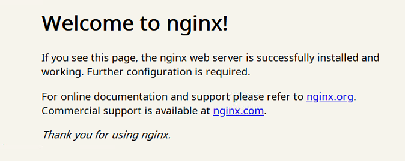

[toc]

## 一、Docker 简介

参考[什么事 Docker](http://qfdmy.com/#/courses/lesson/1240364147406635009/1242876928685064193)。

总结：Docker 是新一代的虚拟化技术，相比以往的虚拟化技术更加轻便。使用 GO 语言编写。

## 二、为什么要使用 Docker

作为一种新兴的虚拟化方式，Docker 跟传统的虚拟化方式相比具有众多的优势。

### 2.1 更高效的利用系统资源

由于容器不需要进行硬件虚拟以及运行完整操作系统等**额外开销**，Docker 对系统资源的利用率更高。无论是应用执行速度、内存损耗或者文件存储速度，都要比传统虚拟机技术更高效。因此，相比虚拟机技术，一个相同配置的主机，往往可以运行更多数量的应用。

### 2.2 更快速的启动时间

传统的虚拟机技术启动应用服务往往需要数分钟，而 Docker 容器应用，由于直接运行于宿主内核，无需启动完整的操作系统，因此可以做到秒级、甚至毫秒级的启动时间。大大的节约了开发、测试、部署的时间。

### 2.3 一致的运行环境

开发过程中一个常见的问题是环境一致性问题。由于开发环境、测试环境、生产环境不一致，导致有些 bug 并未在开发过程中被发现。而 Docker 的镜像提供了除内核外完整的运行时环境，确保了应用运行环境一致性，从而不会再出现 **「这段代码在我机器上没问题啊」** 这类问题。

### 2.4 持续交付和部署

对开发和运维（[DevOps](https://zh.wikipedia.org/wiki/DevOps)）人员来说，最希望的就是一次创建或配置，可以在任意地方正常运行。

使用 Docker 可以通过定制应用镜像来实现持续集成、持续交付、部署。开发人员可以通过 `Dockerfile` 来进行镜像构建，并结合 [持续集成(Continuous Integration)](https://en.wikipedia.org/wiki/Continuous_integration) 系统进行集成测试，而运维人员则可以直接在生产环境中快速部署该镜像，甚至结合 [持续部署(Continuous Delivery/Deployment)](https://en.wikipedia.org/wiki/Continuous_delivery) 系统进行自动部署。

而且使用 `Dockerfile` 使镜像构建透明化，不仅仅开发团队可以理解应用运行环境，也方便运维团队理解应用运行所需条件，帮助更好的生产环境中部署该镜像。

### 2.5 更轻松的迁移

由于 Docker 确保了执行环境的一致性，使得应用的迁移更加容易。Docker 可以在很多平台上运行，无论是物理机、虚拟机、公有云、私有云，甚至是笔记本，其运行结果是一致的。因此用户可以很轻易的将在一个平台上运行的应用，迁移到另一个平台上，而不用担心运行环境的变化导致应用无法正常运行的情况。

### 2.6 更轻松的维护和扩展

Docker 使用的分层存储以及镜像的技术，使得应用重复部分的复用更为容易，也使得应用的维护更新更加简单，基于基础镜像进一步扩展镜像也变得非常简单。此外，Docker 团队同各个开源项目团队一起维护了一大批高质量的 [官方镜像](https://hub.docker.com/search/?q=&source=verified&type=image)，既可以直接在生产环境使用，又可以作为基础进一步定制，大大的降低了应用服务的镜像制作成本。

### 2.7 对比传统虚拟机总结

| 特性       | 容器               | 虚拟机      |
| :--------- | :----------------- | :---------- |
| 启动       | 秒级               | 分钟级      |
| 硬盘使用   | 一般为 `MB`        | 一般为 `GB` |
| 性能       | 接近原生           | 弱于        |
| 系统支持量 | 单机支持上千个容器 | 一般几十个  |

## 三、在 Ubuntu 中安装 Docker

### 3.1 安装 Docker

**卸载旧版本**

```shell
apt-get remove docker docker-engine docker.io containerd runc

```

使用 APT 进行安装：

```shell
apt install docker.io

```

查看是否安装成功：

```shell
docker version

# 输出如下
Client:
 Version:           19.03.6
 API version:       1.40
 Go version:        go1.12.17
 Git commit:        369ce74a3c
 Built:             Fri Feb 28 23:45:43 2020
 OS/Arch:           linux/amd64
 Experimental:      false

Server:
 Engine:
  Version:          19.03.6
  API version:      1.40 (minimum version 1.12)
  Go version:       go1.12.17
  Git commit:       369ce74a3c
  Built:            Wed Feb 19 01:06:16 2020
  OS/Arch:          linux/amd64
  Experimental:     false
 containerd:
  Version:          1.2.6-0ubuntu1~18.04.2
  GitCommit:        
 runc:
  Version:          spec: 1.0.1-dev
  GitCommit:        
 docker-init:
  Version:          0.18.0
  GitCommit:
```

可以看到：通过上一条命令，我们安装了两个端：服务端和客户端。

### 3.2 配置 Docker 镜像加速器

Docker 本质上就是一个虚拟的操作系统，其下载『软件』的时候需要从某个服务器中下载。Docker 默认的服务器是搭建在国外的，在国内访问速度很慢。此时，我们可以修改 Docker 的镜像源下载地址：

```shell
tee /etc/docker/daemon.json <<-'EOF'
{
  "registry-mirrors": ["https://k7da99jp.mirror.aliyuncs.com"]
}
EOF

```

然后重启 Docker：

```shell
# 重启 Docker
systemctl daemon-reload
systemctl restart docker
```

最后查看是否安装成功：

```shell
root@ubuntu:~# docker info
Client:
 Debug Mode: false

Server:
 Containers: 1
  Running: 1
  Paused: 0
  Stopped: 0
 Images: 1
 Server Version: 19.03.6
 Storage Driver: overlay2
  Backing Filesystem: extfs
  Supports d_type: true
  Native Overlay Diff: true
 Logging Driver: json-file
 Cgroup Driver: cgroupfs
 Plugins:
  Volume: local
  Network: bridge host ipvlan macvlan null overlay
  Log: awslogs fluentd gcplogs gelf journald json-file local logentries splunk syslog
 Swarm: inactive
 Runtimes: runc
 Default Runtime: runc
 Init Binary: docker-init
 containerd version:
 runc version:
 init version:
 Security Options:
  apparmor
  seccomp
   Profile: default
 Kernel Version: 4.15.0-111-generic
 Operating System: Ubuntu 18.04.2 LTS
 OSType: linux
 Architecture: x86_64
 CPUs: 4
 Total Memory: 3.83GiB
 Name: ubuntu
 ID: TQWH:GTUC:YVY3:AVNJ:6BFX:AXQD:4WHJ:QISV:J63E:XJI7:JO3D:PERM
 Docker Root Dir: /var/lib/docker
 Debug Mode: false
 Registry: https://index.docker.io/v1/
 Labels:
 Experimental: false
 Insecure Registries:
  127.0.0.0/8
 Registry Mirrors:
 # 可以看到：这个镜像地址被修改了
  https://k7da99jp.mirror.aliyuncs.com/
 Live Restore Enabled: false

WARNING: No swap limit support

```


### 3.3 运行第一个镜像（Nginx 为例）

```shell
 # 拉取镜像
 docker pull nginx
 # 启动镜像
 docker run --name nginx-container -p 80:80 -d nginx
```

然后访问：$虚拟机 IP:80$ 即可访问到 Nginx 页面。



## 四、Docker 架构

### 4.1 Docker 引擎

Docker 引擎是一个包含了一下主要组件的客户端服务器应用程序。

- 一种服务器，它是一种称为『守护进程』并长时间运行的程序；
- REST API 用于指定程序可以用来与守护进程并且长时间运行的程序；
- 一个有命令行界面（CLI）工具的客户端；


### 4.2 Docker 架构

- Docker 使用『客户端-服务器』架构模式，使用远程 API 来管理和创建 Docker 容器；
- Docker 容器通过 Docker 镜像来创建；
- 容器与镜像的关系类似于『面向对象编程』中的“对象与类”；

| Docker | 面向对象 |
| :----: | :------: |
|  容器  |   对象   |
|  镜像  |    类    |


> 1. 使用 `docker pull` 命令时，Docker daemon 首先会在本地的镜像库中查找是否存在对应的镜像，如果不存在，那么会通过『镜像服务器地址』去服务器中下载对应的镜像。这个过程就和 maven 如出一辙。
> 2. 使用 `docker run` 命令时，Docker daemon 会根据镜像创建一个~多个实例，这些实例被称之为『容器』。

|      标题       |                             说明                             |
| :-------------: | :----------------------------------------------------------: |
|  镜像(Images)   |          Docker 镜像是用于创建 Docker 容器的模板。           |
| 容器(Container) |               容器是独立运行的一个或一组应用。               |
| 客户端(Client)  | Docker 客户端通过命令行或者其他工具使用 Docker API (https://docs.docker.com/reference/api/docker_remote_api) 与 Docker 的守护进程通信。 |
|   主机(Host)    |    一个物理或者虚拟的机器用于执行 Docker 守护进程和容器。    |
| 仓库(Registry)  | Docker 仓库用来保存镜像，可以理解为代码控制中的代码仓库。Docker Hub([https://hub.docker.com](https://hub.docker.com/)) 提供了庞大的镜像集合供使用。 |
| Docker Machine  | Docker Machine是一个简化Docker安装的命令行工具，通过一个简单的命令行即可在相应的平台上安装Docker，比如VirtualBox、 Digital Ocean、Microsoft Azure。 |


