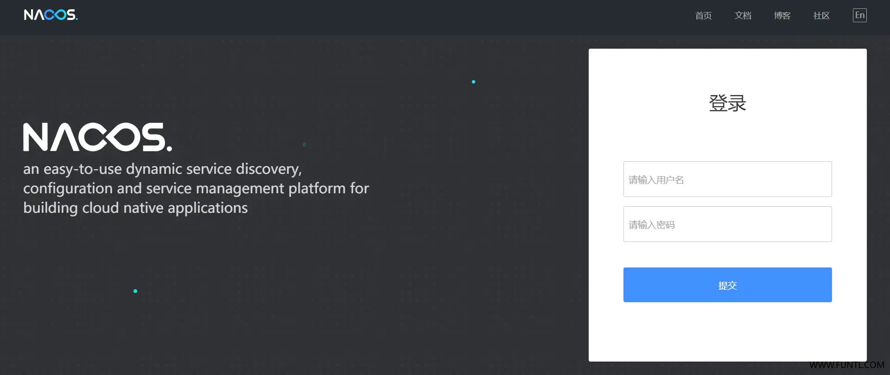
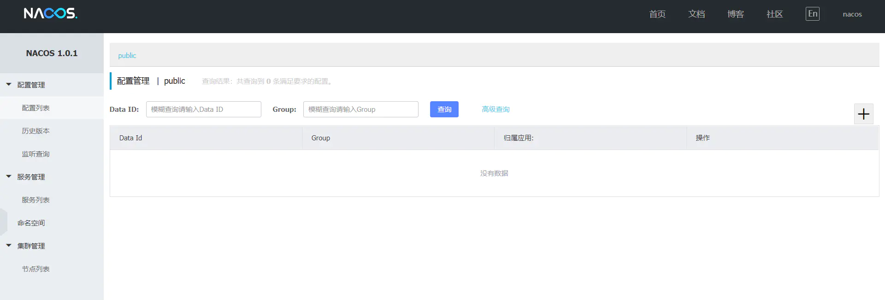
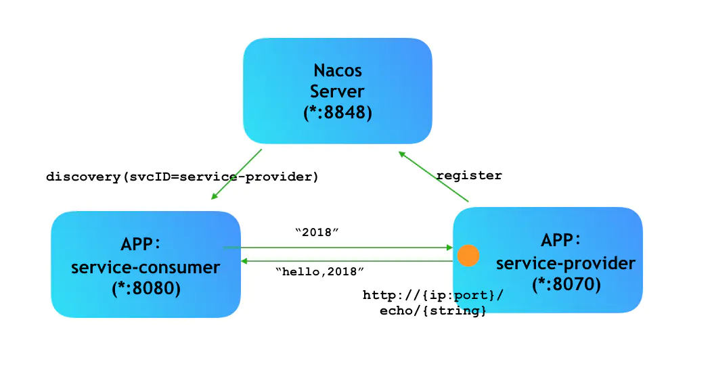
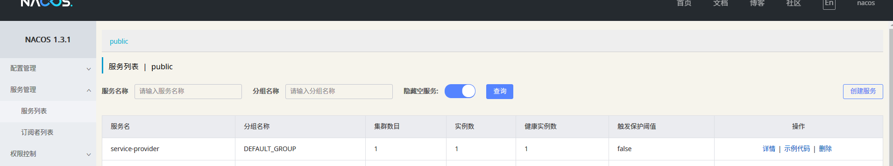
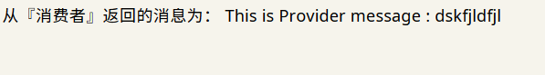

[toc]

## 一、Spring Alibaba Nacos 简介


## 二、Alibaba Nacos 安装部署

### 2.1 后台部署

下载复制项目到服务器机器中：

```shell
git clone https://github.com/nacos-group/nacos-docker.git
cd nacos-docker
```

使用单机模式启动：

```shell
docker-compose -f example/standalone-mysql-8.yaml up -d
```

在启动过程中可以查看日志：

```shell
docker-compose -f example/standalone-mysql-8.yaml logs -f
```

> 注意：在最新版本中，*standalone*有两个 yaml 文件，粗略浏览，发现两个文件的数据库版本不相同。我们可以使用 docker-compose 指令启动任意一个。

### 2.2 进入 Nacos 控制台

Nacos 控制台如下：$IP 地址/端口号$/nacos

我们可以使用 docker ps 查看端口号：

```shell
root@ubuntu:/usr/local/docker/nacos/nacos-docker# docker ps
CONTAINER ID        IMAGE                      COMMAND                  CREATED             STATUS              PORTS                                            NAMES
31b715976ec4        nacos/nacos-server:1.3.1   "bin/docker-startup.…"   8 minutes ago       Up 8 minutes        0.0.0.0:8848->8848/tcp, 0.0.0.0:9555->9555/tcp   nacos-standalone-mysql
2681a2d17f67        nacos/nacos-mysql:8.0.16   "docker-entrypoint.s…"   8 minutes ago       Up 8 minutes        0.0.0.0:3306->3306/tcp, 33060/tcp                mysql
```

可以看到，nacos 的控制台端口为 8848。

输入对应的 IP 地址和端口号以后，出现以下界面：



- **账号：** nacos
- **密码：** nacos

登陆以后：




## 三、服务注册与发现

本节通过一个简单的例子来讲解 nacos 如何实现服务注册与发现。

### 3.1 概述



如图：

1. 两个 APP 分别注册到 Nacos 中去，此时 Nacos 的 IP 列表池中保存了这两个 APP 的 IP 地址以及端口；
2. 当客户端访问$ APP_{consumer} $的时候， $APP_{consumer} $会通过 Nacos 来寻找到对应的 $APP_{provider} $的地址，并返回给  $APP_{consumer} $。此后， $APP_{consumer}$ 就可以通过这个地址调用到对应的服务了（**一般情况下，只有$  APP_{consumer} $ 可以把客户端直接访问，而且访问方式是 REST，而 $APP_{provider}$ 则是无法通过客户端直接访问的**）

### 3.2 创建服务提供者 Provider

pom 文件如下：

```xml
<?xml version="1.0" encoding="UTF-8"?>
<project xmlns="http://maven.apache.org/POM/4.0.0" xmlns:xsi="http://www.w3.org/2001/XMLSchema-instance"
         xsi:schemaLocation="http://maven.apache.org/POM/4.0.0 http://maven.apache.org/xsd/maven-4.0.0.xsd">
    <modelVersion>4.0.0</modelVersion>

    <parent>
        <groupId>com.chen</groupId>
        <artifactId>00-hello-spring-cloud-alibaba-dependencies</artifactId>
        <version>1.0-SNAPSHOT</version>
        <!--<relativePath>../pom.xml</relativePath>-->
    </parent>

    <artifactId>01-hello-spring-cloud-alibaba-provider</artifactId>
    <packaging>jar</packaging>
    <url>http://www.funtl.com</url>
    <inceptionYear>2018-Now</inceptionYear>

    <licenses>
        <license>
            <name>Apache 2.0</name>
            <url>https://www.apache.org/licenses/LICENSE-2.0.txt</url>
        </license>
    </licenses>

    <developers>
        <developer>
            <id>liwemin</id>
            <name>Lusifer Lee</name>
            <email>lee.lusifer@gmail.com</email>
        </developer>
    </developers>

    <dependencies>

        <dependency>
            <groupId>org.springframework.boot</groupId>
            <artifactId>spring-boot-starter-actuator</artifactId>
        </dependency>
        <dependency>
            <groupId>org.springframework.boot</groupId>
            <artifactId>spring-boot-starter-test</artifactId>
            <scope>test</scope>
        </dependency>

        <dependency>
            <groupId>com.alibaba.cloud</groupId>
            <artifactId>spring-cloud-alibaba-nacos-discovery</artifactId>
        </dependency>
        <dependency>
            <groupId>org.springframework.boot</groupId>
            <artifactId>spring-boot-starter-web</artifactId>
            <version>${spring-cloud-alibaba.verion}</version>
        </dependency>
    </dependencies>

    <build>
        <plugins>
            <plugin>
                <groupId>org.springframework.boot</groupId>
                <artifactId>spring-boot-maven-plugin</artifactId>
                <configuration>
                    <mainClass>com.funtl.spring.cloud.alibaba.provider.ProviderApplication</mainClass>
                </configuration>
            </plugin>
        </plugins>
    </build>
</project>
```

配置文件如下所示：

```yml
spring:
  application:
    name: service-provider
  cloud:
    nacos:
      discovery:
        server-addr: 192.168.150.129:8848

server:
  port: 8070
```

这里的 `spring.cloud.nacos.discovery.server-addr`填写的值是当前 Nacos 服务端的地址。

启动类如下所示：

```java
@SpringBootApplication
@EnableDiscoveryClient	// ① 加上这个注解，可以被 Nacos 发现
public class ProviderApplication {

    public static void main(String[] args) {
        SpringApplication.run(ProviderApplication.class, args);
    }
}
```

启动成功以后，我们访问 Nacos UI 界面，可以看到以下的信息：



### 3.3 服务消费者 consumer

pom 文件如下：

```xml
<?xml version="1.0" encoding="UTF-8"?>
<project xmlns="http://maven.apache.org/POM/4.0.0"
         xmlns:xsi="http://www.w3.org/2001/XMLSchema-instance"
         xsi:schemaLocation="http://maven.apache.org/POM/4.0.0 http://maven.apache.org/xsd/maven-4.0.0.xsd">
    <parent>
        <artifactId>00-hello-spring-cloud-alibaba-dependencies</artifactId>
        <groupId>com.chen</groupId>
        <version>1.0-SNAPSHOT</version>
    </parent>
    <modelVersion>4.0.0</modelVersion>

    <artifactId>03-hello-spring-cloud-alibaba-consumer</artifactId>

    <licenses>
        <license>
            <name>Apache 2.0</name>
            <url>https://www.apache.org/licenses/LICENSE-2.0.txt</url>
        </license>
    </licenses>

    <developers>
        <developer>
            <id>liwemin</id>
            <name>Lusifer Lee</name>
            <email>lee.lusifer@gmail.com</email>
        </developer>
    </developers>

    <dependencies>

        <dependency>
            <groupId>org.springframework.boot</groupId>
            <artifactId>spring-boot-starter-web</artifactId>
        </dependency>
        <dependency>
            <groupId>org.springframework.boot</groupId>
            <artifactId>spring-boot-starter-actuator</artifactId>
        </dependency>
        <dependency>
            <groupId>org.springframework.boot</groupId>
            <artifactId>spring-boot-starter-test</artifactId>
            <scope>test</scope>
        </dependency>

        <dependency>
            <groupId>com.alibaba.cloud</groupId>
            <artifactId>spring-cloud-starter-alibaba-nacos-discovery</artifactId>
        </dependency>

    </dependencies>

    <build>
        <plugins>
            <plugin>
                <groupId>org.springframework.boot</groupId>
                <artifactId>spring-boot-maven-plugin</artifactId>
                <configuration>
                    <mainClass>com.funtl.spring.cloud.alibaba.consumer.ConsumerApplication</mainClass>
                </configuration>
            </plugin>
        </plugins>
    </build>

</project>
```

配置文件如下所示：

```yml
spring:
  application:
    name: service-consumer
  cloud:
    nacos:
      discovery:
        server-addr: 192.168.150.129:8848

server:
  # 服务端口
  port: 8080

management:
  # 端点检查（健康检查）
  endpoints:
    web:
      exposure:
        include: "*"
```

启动类如下所示：

```java
@SpringBootApplication
@EnableDiscoveryClient
public class ConsumerApplication {

    public static void main(String[] args) {
        SpringApplication.run(ConsumerApplication.class, args);
    }
}
```

> 总结：
>
> 1. 如果想要使用 nacos 的服务注册与发现功能，需要在 pom 文件中加入 spring-cloud-starter-alibaba-nacos-discovery 的依赖；
> 2. 通过两个例子可以发现：无论是『服务消费者』还是『服务提供者』，注册到 Nacos 的基本配置都是一致的，需要： ① 加入依赖； ② yml 配置文件制定 Nacos 的地址； ③ 在启动类中加入注解 @EnableDiscoveryClient

### 3.4 提供方与消费方通信

我们首先在提供方中创建一个控制器 $C_1$，在 $C_1 $中只需要直接输出一个简单的字符串即可：

```java
@RequestMapping(value = "/echo/{string}", method = {RequestMethod.GET})
public String echo(@PathVariable String string) {

    return "This is Provider message : " + string;
}
```

接着在消费方创建一个控制器 $C_2$，然后在该控制器中调用 $C_1 $的接口即可：

```java
@RequestMapping(value = "/echo/{str}", method = {RequestMethod.GET})
public String echo(@PathVariable String str) {
    // 使用服务名请求服务提供者
    return restTemplate.getForObject("http://service-provider/echo/" + str + "从『服务消费者』转到『服务提供者』……", String.class);
}
```

> 这里我们使用了 RestTemplate 来实现调用，调用的代码有以下的特点：
>
> 1. 协议为 HTTP 协议，更具体地说，是 REST调用；
> 2. 直接通过服务名 *service-provider* 进行调用，而不是通过 IP 地址和端口；

> 上面的代码中，我们还缺少了 `RestTemplate  `的配置以及注入。
>
> 1. RestTemplate  配置类：该类的目的是创建一个名为 `restTemplate `的 Bean：
>
>    ```java
>    @Configuration
>    public class ConsumerConfiguration {
>    
>        @Bean
>        @LoadBalanced
>        public RestTemplate restTemplate() {
>            return new RestTemplate();
>        }
>    }
>    ```
>
> 2. 注入到控制器 $C_2 $中：
>
>    ```java
>    private final RestTemplate restTemplate;
>    
>    @Autowired
>    public AbcController(RestTemplate restTemplate) {
>        this.restTemplate = restTemplate;
>    }
>    ```
>
>    在上面的过程中，我们使用了关键字 `private final ` 以保证线程安全。更加具体的原因，请查看：[【Spring】浅谈spring为什么推荐使用构造器注入](https://www.cnblogs.com/joemsu/p/7688307.html)。


编写完成以下的代码以后，我们访问消费者的接口，会得到以下的提示语：


说明我们通过 `RestTemplate `实现了服务名调用。


## 四、 使用 Feign 通信

### 4.1 什么是 Feign

Feign 是一个声明式的伪 HTTP 客户端，它使得写 HTTP 客户端变得更简单。使用 Feign，只需要创建一个接口并注解。它具有可插拔的注解特性，可使用 Feign 注解和 JAX-RS 注解。Feign 支持可插拔的编码器和解码器。Feign 默认集成了 Ribbon，Nacos 也很好的兼容了 Feign，默认实现了负载均衡的效果

- Feign 采用的是基于接口的注解
- Feign 整合了 Ribbon


### 4.2 步骤

使用 Feign 需要在调用方中添加依赖，然后通过注解声明调用哪一个请求即可。

**添加依赖：**

```xml
<dependency>
    <groupId>org.springframework.cloud</groupId>
    <artifactId>spring-cloud-starter-openfeign</artifactId>
</dependency>
```


**开在启动类中开启 Feign 功能**

通过 `@EnableFeignClients` 注解开启 Feign 功能：


**创建业务类，声明调用**

我们当前项目中创建一个接口，在接口中加入声明式调用即可：

```java

/**
 * @Author: ChromeChen
 * @Description: 该接口用于 Feign 声明式调用
 * @Date: Created in 14:17 2020/8/7 0007
 * @Modified By:
 */
@FeignClient(value = "service-provider")	// ① 
public interface EchoService {

    @GetMapping(value = "/echo/{string}")	// ②
    String echo(@PathVariable("string") String string);
}

```

①：调用哪一个服务；

②：调用的具体方法；


**测试是否成功：**

我们启动服务提供者以及服务消费者两个项目，然后通过访问消费者的请求，可以得到从提供者返回的消息：


