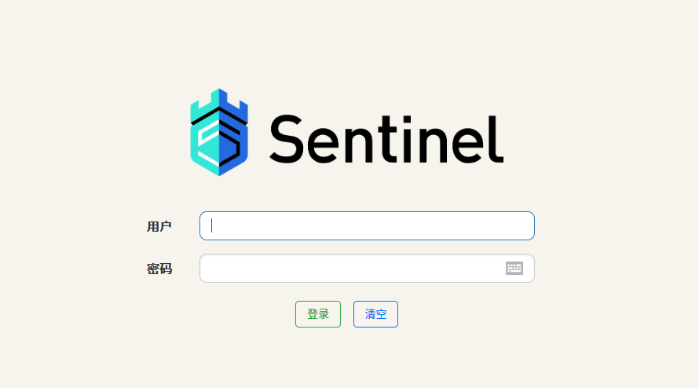

[toc]

## 一、Sentinel 介绍

### 1.1 什么是『服务雪崩』

在微服务架构中，根据业务来拆分成一个个的服务，服务与服务之间可以通过 `HTTP/RPC` 相互调用，在 Spring Cloud 中可以用 `RestTemplate + LoadBalanceClient` 和 `Feign` 来调用。为了保证其高可用，单个服务通常会集群部署。由于网络原因或者自身的原因，服务并不能保证 100% 可用，如果单个服务出现问题，调用这个服务就会出现线程阻塞，此时若有大量的请求涌入，`Servlet`容器的线程资源会被消耗完毕，导致服务瘫痪。服务与服务之间的依赖性，故障会传播，会对整个微服务系统造成灾难性的严重后果，这就是服务故障的 **“雪崩”** 效应。为了解决这个问题，业界提出了 **熔断器模型**。

阿里巴巴开源了 Sentinel 组件，实现了熔断器模式，Spring Cloud 对这一组件进行了整合。在微服务架构中，一个请求需要调用多个服务是非常常见的


较底层的服务如果出现故障，会导致连锁故障。当对特定的服务的调用的不可用达到一个阀值熔断器将会被打开


熔断器打开后，为了避免连锁故障，通过 `fallback` 方法可以直接返回一个固定值

### 1.2 什么是 Sentinel

随着微服务的流行，服务和服务之间的稳定性变得越来越重要。Sentinel 以流量为切入点，从流量控制、熔断降级、系统负载保护等多个维度保护服务的稳定性。

> 根据这段描述，我们可以推断出：Sentinel 组件就是为了解决“服务挂了怎么办”这个问题的嗅觉解决方案。

### 1.3 Sentinel 的特征

- **丰富的应用场景：** Sentinel 承接了阿里巴巴近 10 年的双十一大促流量的核心场景，例如秒杀（即突发流量控制在系统容量可以承受的范围）、消息削峰填谷（*使用『消息队列』实现消息的削峰填谷*）（对于突然到来的大量请求，您可以配置流控规则，以稳定的速度逐步处理这些请求，从而避免流量突刺造成系统负载过高）、集群流量控制、实时熔断下游不可用应用等
- **完备的实时监控：** Sentinel 同时提供实时的监控功能。您可以在控制台中看到接入应用的单台机器秒级数据，甚至 500 台以下规模的集群的汇总运行情况
- **广泛的开源生态：** Sentinel 提供开箱即用的与其它开源框架 / 库的整合模块，例如与 Spring Cloud、Dubbo、gRPC 的整合。您只需要引入相应的依赖并进行简单的配置即可快速地接入 Sentinel
- **完善的 SPI 扩展点：** Sentinel 提供简单易用、完善的 SPI 扩展接口。您可以通过实现扩展接口来快速地定制逻辑。例如定制规则管理、适配动态数据源等

### 1.4 Sentinel 的主要特性


### 1.5 Sentinel 的开源生态


### 1.6 Sentinel 的组成

- **核心库（Java 客户端）：** 不依赖任何框架 / 库，能够运行于所有 Java 运行时环境，同时对 Dubbo / Spring Cloud 等框架也有较好的支持
- **控制台（Dashboard）：** 基于 Spring Boot 开发，打包后可以直接运行，不需要额外的 Tomcat 等应用容器


## 二、启动 Sentinel 控制台

### 2.1 概述

Sentinel 提供一个轻量级的开源控制台，它提供机器发现以及健康情况管理、监控（单机和集群）、规则管理和推送的功能。另外，鉴权在生产环境中也是必不可少的。Sentinel 控制台最少应该包含如下功能：

1. **查看机器列表以及健康情况**：手机 Sentinel 客户端发送的心跳包，用于判断机器是否在线；
2. **监控（单机和集群聚合）**：通过 Sentinel 客户端暴露的监控 API，定期拉取并聚合应用监控信息，最终可以实现秒级的实时监控；
3. **规则管理和推送**：统一管理推送规则；
4. **鉴权**：生产环境中鉴权非常重要，开发者可以根据自己的实际情况进行定制；

### 2.2 获取

您可以从 [官方 GitHub Release 页面](https://github.com/alibaba/Sentinel/releases) 页面下载最新版本的控制台 JAR 包。

### 2.3 启动

> **注意：** 启动 Sentinel 控制台需要 JDK 版本为 1.8 及以上版本

```
java -Dserver.port=8888 -Dcsp.sentinel.dashboard.server=localhost:8080 -Dproject.name=sentinel-dashboa rd -jar sentinel-dashboard-1.7.2.jar
```

成功启动以后，我们访问 Sentinel 控制台

> 其中 `-Dserver.port=8080` 用于指定 Sentinel 控制台端口为 `8080`
>
> > **注意：** 从 Sentinel 1.6.0 起，Sentinel 控制台引入基本的 **登录** 功能，**默认用户名和密码都是 sentinel**
>
> ##### 鉴权
>
> 用户可以通过如下参数进行配置
>
> - `-Dsentinel.dashboard.auth.username=sentinel` 用于指定控制台的登录用户名为 sentinel
> - `-Dsentinel.dashboard.auth.password=123456` 用于指定控制台的登录密码为 123456；如果省略这两个参数，默认用户和密码均为 sentinel
> - `-Dserver.servlet.session.timeout=7200` 用于指定 Spring Boot 服务端 session 的过期时间，如 7200 表示 7200 秒；60m 表示 60 分钟，默认为 30 分钟

### 2.4 验证是否成功启动

访问 localhost:8888，如果观察到以下界面说明启动成功：



- 账户名：sentinel
- 密码：sentinel

## 三、Alibaba Sentinel 客户端的接入

熔断器模式，是在『服务消费者』调用『服务提供者』的接口时，出现异常，然后返回一个指定的消息的过程。所以（按照图示来说），我们应该在『服务消费者』处添加相关的配置。

### 3.1 添加依赖

在『服务消费者』项目中添加以下依赖：

```xml
<dependency>
    <groupId>com.alibaba.cloud</groupId>
    <artifactId>spring-cloud-starter-alibaba-sentinel</artifactId>
</dependency>
```

### 3.2 修改配置文件

修改配置文件如下所示：

```yaml
spring:
  application:
    name: service-consumer
  cloud:
    nacos:
      discovery:
        server-addr: 192.168.150.129:8848
      config:
        server-addr: 192.168.150.129:8848
    sentinel:	# ①
      transport:
        dashboard: localhost:8888

server:
  # 服务端口
  port: 8080

management:
  # 端点检查（健康检查）
  endpoints:
    web:
      exposure:
        include: "*"

  # 开启 Feign 对 Sentinel 的支持 ②
feign:
  sentinel:
    enabled: true
```

① ② 处是和 Sentinel 相关的配置

### 3.3 配置服务熔断类

当这个“服务熔断类”的作用就是提供了一个消息（在出现服务熔断的时候返回）。

```java
package com.chen.spring.cloud.alibaba.consumer.service.fallback;

import com.chen.spring.cloud.alibaba.consumer.service.EchoService;
import org.springframework.stereotype.Component;

/**
 * @Author: ChromeChen
 * @Description:
 * @Date: Created in 14:59 2020/8/13 0013
 * @Modified By:
 */
@Component
public class EchoServiceFallback implements EchoService {

    @Override
    public String echo(String string) {
        return "echo 方法被熔断！";
    }

    @Override
    public String lb() {
        return "lb 方法被熔断！";
    }
}

```

服务熔断类需要继承 Feign 接口，然后重写里面的所有方法。

### 3.4 修改 Feign 接口

在 Feign 接口的注解 `@FeignClient`中添加对应的熔断类

```java
@FeignClient(value = "service-provider", fallback = EchoServiceFallback.class)	// ①
public interface EchoService {

    @GetMapping(value = "/echo/{string}")
    String echo(@PathVariable("string") String string);

    @GetMapping("/echo/lb")
    String lb();
}
```

### 3.5 测试

测试：

1. 当熔断时，是否能够返回对应的消息；
2. 当正常访问时是否能够正常的信息； 

我们首先启动『服务消费者』，然后访问对应的控制器接口，可以得到以下的输出：


然后启动『服务提供者』，再次访问相同的接口，发现得到正常的输出：


由此，熔断器成功生效。


