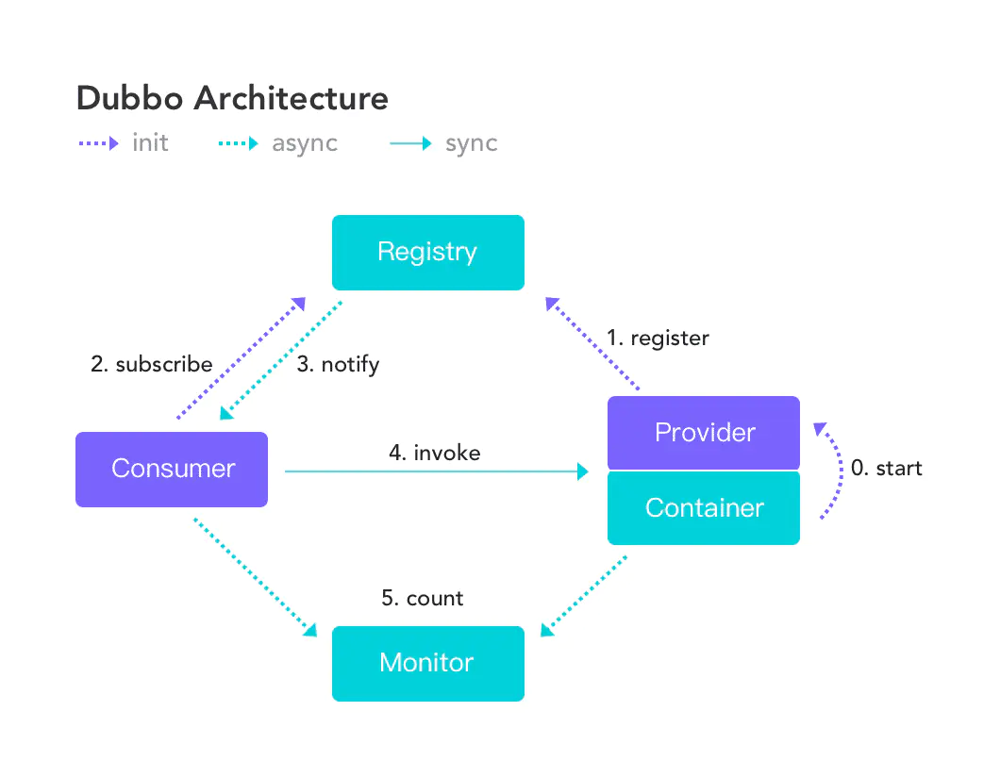
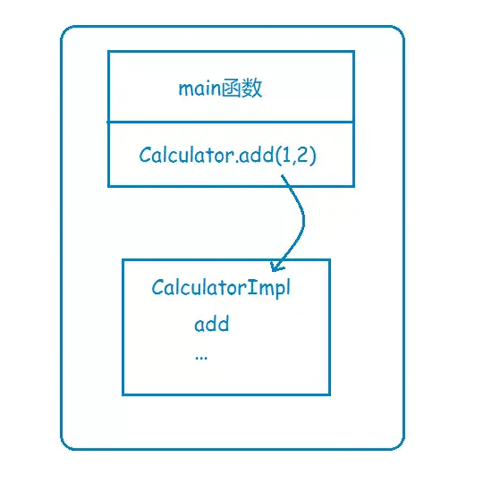
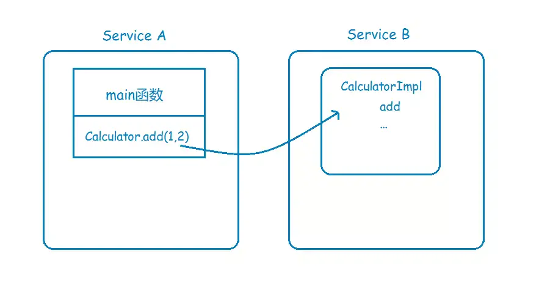
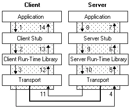
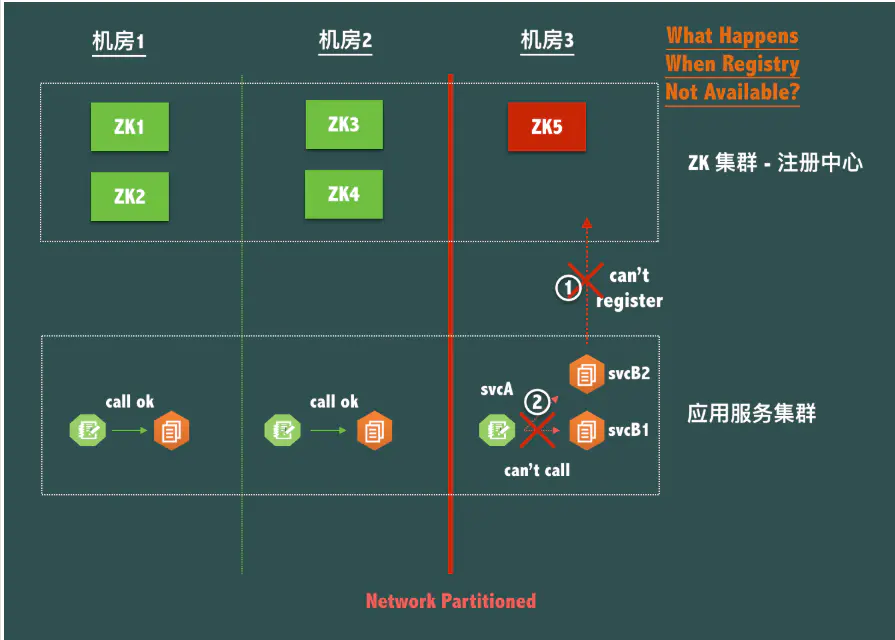
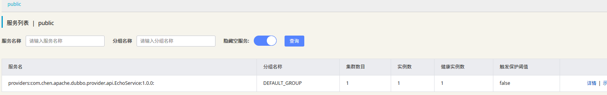
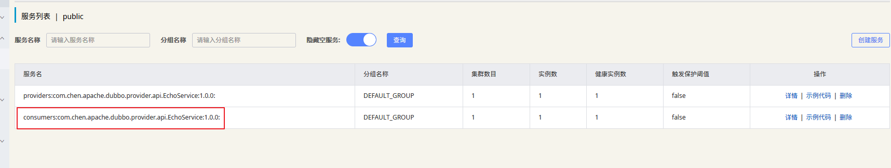
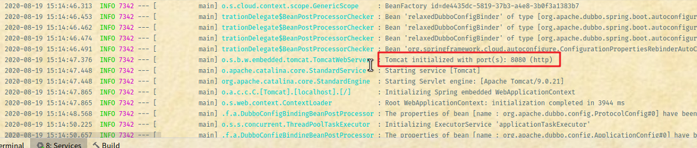
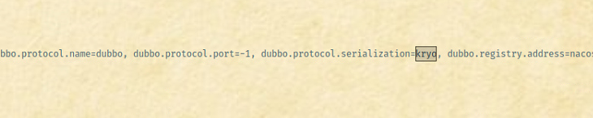

[toc]

## 一、Apache Dubbo 简介

### 1.1 什么是 Dubbo

Apache Dubbo (incubating) |ˈdʌbəʊ| 是一款高性能、轻量级的开源 Java RPC 分布式服务框架，它提供了三大核心能力：面向接口的远程方法调用，智能容错和负载均衡，以及服务自动注册和发现。她最大的特点是按照分层的方式来架构，使用这种方式可以使各个层之间解耦合（或者最大限度地松耦合）。从服务模型的角度来看，Dubbo 采用的是一种非常简单的模型，要么是提供方提供服务，要么是消费方消费服务，所以基于这一点可以抽象出服务提供方（Provider）和服务消费方（Consumer）两个角色。

> **备注：** 2019 年 5 月 21 日 Apache 软件基金会发表博文，宣布 Dubbo 在 2019 年 5 月 20 日 这天正式毕业，成为 Apache 的顶级项目。

- [官方网站](http://dubbo.apache.org/zh-cn)
- [官方 GitHub](https://github.com/apache/incubator-dubbo)

> 通过上面的介绍，我们可以知道 Dubbo 是一款分布式框架，只要是分布式系统，就必须解决四个问题（① 这么多服务，客户端如何访问（使用网关）； ② 服务之间如何通信； ③ 服务的治理； ④ 服务挂了怎么办），从而就可以理解『三大核心能力』的对应关系了。


### 1.2 Dubbo 架构



节点角色说明

|   节点    |                角色说明                |
| :-------: | :------------------------------------: |
| Provider  |          暴露服务的服务提供方          |
| Consumer  |        调用远程服务的服务消费方        |
| Registry  |        服务注册与发现的注册中心        |
|  Monitor  | 统计服务的调用次数和调用时间的监控中心 |
| Container |              服务运行容器              |

调用关系说明

- 服务容器负责启动，加载，运行服务提供者
- 服务提供者在启动时，向注册中心注册自己提供的服务
- 服务消费者在启动时，向注册中心订阅自己所需的服务
- 注册中心返回服务提供者地址列表给消费者，如果有变更，注册中心将基于长连接推送变更数据给消费者
- 服务消费者，从提供者地址列表中，基于软负载均衡算法，选一台提供者进行调用，如果调用失败，再选另一台调用
- 服务消费者和提供者，在内存中累计调用次数和调用时间，定时每分钟发送一次统计数据到监控中心

### 1.3 Dubbo 的功能特点

- **面向接口代理的高性能 RPC 调用：** 提供高性能的基于代理的远程调用能力，服务以接口为粒度，为开发者屏蔽远程调用底层细节
- **智能负载均衡：** 内置多种负载均衡策略，智能感知下游节点健康状况，显著减少调用延迟，提高系统吞吐量
- **服务自动注册与发现：** 支持多种注册中心服务，服务实例上下线实时感知
- **高度可扩展能力：** 遵循微内核 + 插件的设计原则，所有核心能力如 Protocol、Transport、Serialization 被设计为扩展点，平等对待内置实现和第三方实现
- **运行期流量调度：** 内置条件、脚本等路由策略，通过配置不同的路由规则，轻松实现灰度发布，同机房优先等功能
- **可视化的服务治理与运维：** 提供丰富服务治理、运维工具：随时查询服务元数据、服务健康状态及调用统计，实时下发路由策略、调整配置参数

### 1.4 扩展阅读

#### 什么是 RPC

分布式是促使 RPC 诞生的领域，**RPC 是一种编程模型，并没有规定你具体要怎样实现**，无论使用 HTTP 或是 RMI 都是可以的。

假设你有一个计算器接口，Calculator，以及它的实现类 CalculatorImpl，那么在系统还是 **单体应用** 时，你要调用 Calculator 的 add 方法来执行一个加运算，直接 new 一个 CalculatorImpl，然后调用 add 方法就行了，这其实就是非常普通的 **本地函数调用**，因为在 **同一个地址空间**，或者说在同一块内存，所以通过方法栈和参数栈就可以实现。



现在，基于高性能和高可靠等因素的考虑，你决定将系统改造为分布式应用，将很多可以共享的功能都单独拎出来，比如上面说到的计算器，你单独把它放到一个服务里头，让别的服务去调用它。



这下问题来了，服务 A 里头并没有 CalculatorImpl 这个类，那它要怎样调用服务 B 的 CalculatorImpl 的 add 方法呢？

**RPC 要解决的两个问题**

- 解决分布式系统中，服务之间的调用问题
- 远程调用时，要能够像本地调用一样方便，让调用者感知不到远程调用的逻辑

#### 如何实现一个 RPC

实际情况下，**RPC 很少用到 HTTP 协议来进行数据传输**，毕竟我只是想传输一下数据而已，何必动用到一个文本传输的应用层协议呢，我为什么不直接使用**二进制传输**？比如直接用 Java 的 Socket 协议进行传输？

不管你用何种协议进行数据传输，一个完整的 RPC 过程，都可以用下面这张图来描述



以左边的 Client 端为例，Application 就是 RPC 的调用方，Client Stub 就是我们上面说到的代理对象，也就是那个看起来像是 Calculator 的实现类，其实内部是通过 RPC 方式来进行远程调用的代理对象，至于 Client Run-time Library，则是实现远程调用的工具包，比如 JDK 的 Socket，最后通过底层网络实现实现数据的传输。

这个过程中最重要的就是 **序列化** 和 **反序列化** 了，因为数据传输的数据包必须是二进制的，你直接丢一个 Java 对象过去，人家可不认识，你必须把 Java 对象序列化为二进制格式，传给 Server 端，Server 端接收到之后，再反序列化为 Java 对象。

#### RPC vs Restful

**RPC 是面向过程**，**Restful 是面向资源**，并且使用了 HTTP 动词。从这个维度上看，Restful 风格的 URL 在表述的精简性、可读性上都要更好。

#### 阿里为何放弃 Zookeeper

**CAP**

有个思考，从 CAP 角度考虑，服务注册中心是 CP 系统还是 AP 系统呢？

- 服务注册中心是为了服务间调用服务的，那么绝对不允许因为服务注册中心出现了问题而导致服务间的调用出问题
- 假如有 node1，node2，node3 集群节点。保存着可用服务列表 ip1，ip2，ip3，试想如果此时不一致，比如 node1 只保存了ip1，ip2，此时服务读取 node1 的节点，那么会造成什么影响？

调用 node1 的服务，顶多就是负载均衡时不会有流量打到 ip3，然后等 node1 同步回 ip3 后，又一致了，这对服务其实没什么太大影响。所以，推测出服务注册中心应该是个 AP 系统。

**Zookeeper 是个 CP 系统，强一致性**

- 场景1，当 master 挂了，此时 Zookeeper 集群需要重新选举，而此时服务需要来读取可用服务，是不可用的。影响到了服务的可用性当然你可以说服务本地有缓存可用列表。然而下面这种方式就更无法处理了。
- 场景2，分区可用。试想，有 3 个机房，如果其中机房 3 和机房 1，2 网络断了，那么机房 3 的注册中心就不能注册新的机器了，这显然也不合理从健康检查角度来看



Zookeeper 是通过 TCP 的心跳判断服务是否可用，但 TCP 的活性并不代表服务是可用的，如：连接池已满，DB 挂了等

**理想的注册中心**

- 服务自动注册发现。最好有新的服务注册上去时还能推送到调用端
- 能对注册上来的机器方便的进行管理，能手动删除（发送信号让服务优雅下线）、恢复机器
- 服务的健康检查，能真正的检测到服务是否可用
- 可以看到是否有其他调用服务正在订阅注册上来的服务
- 能够带上些除了 IP 外的其它信息


## 二、项目工程创建以及测试

和上个例子一样，Dubbo 工程也是按照『父工程 + 依赖工程』来创建项目。

> 关于『父工程 + 依赖工程』的具体语法：
>
> 1. 普通的父子工程：在$ pom_{parent} $中的` <modules> `中添加子节点；在$ pom_{son_{i}}$ 的` <parent>` 中指定 父坐标；
> 2. 依赖关系的父子工程：普通父子工程 + 在$ pom_{parent} $中的` <dependencyManagement>` 中指定依赖版本的坐标；

### 2.1 创建父工程项目

父工程项目作为根目录，在根目录中的 pom.xml 文件中添加以下信息：

```xml
<?xml version="1.0" encoding="UTF-8"?>
<project xmlns="http://maven.apache.org/POM/4.0.0" xmlns:xsi="http://www.w3.org/2001/XMLSchema-instance"
         xsi:schemaLocation="http://maven.apache.org/POM/4.0.0 http://maven.apache.org/xsd/maven-4.0.0.xsd">
    <modelVersion>4.0.0</modelVersion>

    <parent>
        <groupId>org.springframework.boot</groupId>
        <artifactId>spring-boot-starter-parent</artifactId>
        <version>2.1.6.RELEASE</version>
        <relativePath/>
    </parent>

    <groupId>com.chen</groupId>
    <artifactId>hello-apache-dubbo</artifactId>
    <version>0.0.1-SNAPSHOT</version>
    <packaging>pom</packaging>
    <url>http://www.funtl.com</url>

    <modules>
        <module>hello-apache-dubbo-dependencies</module>
        <module>hello-apache-dubbo-provider</module>
        <module>hello-apache-dubbo-consumer</module>
    </modules>

    <properties>
        <java.version>1.8</java.version>
        <maven.compiler.source>${java.version}</maven.compiler.source>
        <maven.compiler.target>${java.version}</maven.compiler.target>
        <project.build.sourceEncoding>UTF-8</project.build.sourceEncoding>
        <project.reporting.outputEncoding>UTF-8</project.reporting.outputEncoding>
    </properties>

    <licenses>
        <license>
            <name>Apache 2.0</name>
            <url>https://www.apache.org/licenses/LICENSE-2.0.txt</url>
        </license>
    </licenses>

    <developers>
        <developer>
            <id>liwemin</id>
            <name>Lusifer Lee</name>
            <email>lee.lusifer@gmail.com</email>
        </developer>
    </developers>

    <dependencyManagement>
        <dependencies>
            <dependency>
                <groupId>com.chen</groupId>
                <artifactId>hello-apache-dubbo-dependencies</artifactId>
                <version>${project.version}</version>
                <type>pom</type>
                <scope>import</scope>
            </dependency>
        </dependencies>
    </dependencyManagement>

    <profiles>
        <profile>
            <id>default</id>
            <activation>
                <activeByDefault>true</activeByDefault>
            </activation>
            <properties>
                <spring-javaformat.version>0.0.12</spring-javaformat.version>
            </properties>
            <build>
                <plugins>
                    <plugin>
                        <groupId>io.spring.javaformat</groupId>
                        <artifactId>spring-javaformat-maven-plugin</artifactId>
                        <version>${spring-javaformat.version}</version>
                    </plugin>
                    <plugin>
                        <groupId>org.apache.maven.plugins</groupId>
                        <artifactId>maven-surefire-plugin</artifactId>
                        <configuration>
                            <includes>
                                <include>**/*Tests.java</include>
                            </includes>
                            <excludes>
                                <exclude>**/Abstract*.java</exclude>
                            </excludes>
                            <systemPropertyVariables>
                                <java.security.egd>file:/dev/./urandom</java.security.egd>
                                <java.awt.headless>true</java.awt.headless>
                            </systemPropertyVariables>
                        </configuration>
                    </plugin>
                    <plugin>
                        <groupId>org.apache.maven.plugins</groupId>
                        <artifactId>maven-enforcer-plugin</artifactId>
                        <executions>
                            <execution>
                                <id>enforce-rules</id>
                                <goals>
                                    <goal>enforce</goal>
                                </goals>
                                <configuration>
                                    <rules>
                                        <bannedDependencies>
                                            <excludes>
                                                <exclude>commons-logging:*:*</exclude>
                                            </excludes>
                                            <searchTransitive>true</searchTransitive>
                                        </bannedDependencies>
                                    </rules>
                                    <fail>true</fail>
                                </configuration>
                            </execution>
                        </executions>
                    </plugin>
                    <plugin>
                        <groupId>org.apache.maven.plugins</groupId>
                        <artifactId>maven-install-plugin</artifactId>
                        <configuration>
                            <skip>true</skip>
                        </configuration>
                    </plugin>
                    <plugin>
                        <groupId>org.apache.maven.plugins</groupId>
                        <artifactId>maven-javadoc-plugin</artifactId>
                        <configuration>
                            <skip>true</skip>
                        </configuration>
                        <inherited>true</inherited>
                    </plugin>
                </plugins>
            </build>
        </profile>
    </profiles>

    <repositories>
        <repository>
            <id>spring-milestone</id>
            <name>Spring Milestone</name>
            <url>https://repo.spring.io/milestone</url>
            <snapshots>
                <enabled>false</enabled>
            </snapshots>
        </repository>
        <repository>
            <id>spring-snapshot</id>
            <name>Spring Snapshot</name>
            <url>https://repo.spring.io/snapshot</url>
            <snapshots>
                <enabled>true</enabled>
            </snapshots>
        </repository>
    </repositories>

    <pluginRepositories>
        <pluginRepository>
            <id>spring-milestone</id>
            <name>Spring Milestone</name>
            <url>https://repo.spring.io/milestone</url>
            <snapshots>
                <enabled>false</enabled>
            </snapshots>
        </pluginRepository>
        <pluginRepository>
            <id>spring-snapshot</id>
            <name>Spring Snapshot</name>
            <url>https://repo.spring.io/snapshot</url>
            <snapshots>
                <enabled>true</enabled>
            </snapshots>
        </pluginRepository>
    </pluginRepositories>
</project>
```

注意：相比视频中的文档，上面的信息添加了阿里仓库

### 2.2 创建依赖工程

创建项目 `01-hello-apache-dubbo-dependencie`，然后在其中的 pom.xml 中添加：

```xml
<?xml version="1.0" encoding="UTF-8"?>
<project xmlns="http://maven.apache.org/POM/4.0.0" xmlns:xsi="http://www.w3.org/2001/XMLSchema-instance"
         xsi:schemaLocation="http://maven.apache.org/POM/4.0.0 http://maven.apache.org/xsd/maven-4.0.0.xsd">
    <modelVersion>4.0.0</modelVersion>

    <groupId>com.chen</groupId>
    <artifactId>hello-apache-dubbo-dependencies</artifactId>
    <version>0.0.1-SNAPSHOT</version>
    <packaging>pom</packaging>
    <url>http://www.funtl.com</url>

    <properties>
        <dubbo.version>2.7.2</dubbo.version>
        <dubbo-actuator.version>2.7.1</dubbo-actuator.version>
        <dubbo-registry.version>2.7.7</dubbo-registry.version>
        <spring-cloud.version>Greenwich.SR2</spring-cloud.version>
        <spring-cloud-alibaba.verion>2.1.0.RELEASE</spring-cloud-alibaba.verion>
        <alibaba-spring-context-support.version>1.0.2</alibaba-spring-context-support.version>
    </properties>

    <licenses>
        <license>
            <name>Apache 2.0</name>
            <url>https://www.apache.org/licenses/LICENSE-2.0.txt</url>
        </license>
    </licenses>

    <developers>
        <developer>
            <id>liwemin</id>
            <name>Lusifer Lee</name>
            <email>lee.lusifer@gmail.com</email>
        </developer>
    </developers>

    <dependencyManagement>
        <dependencies>
            <dependency>
                <groupId>org.springframework.cloud</groupId>
                <artifactId>spring-cloud-dependencies</artifactId>
                <version>${spring-cloud.version}</version>
                <type>pom</type>
                <scope>import</scope>
            </dependency>
            <dependency>
                <groupId>com.alibaba.cloud</groupId>
                <artifactId>spring-cloud-alibaba-dependencies</artifactId>
                <version>${spring-cloud-alibaba.verion}</version>
                <type>pom</type>
                <scope>import</scope>
            </dependency>

            <dependency>
                <groupId>org.apache.dubbo</groupId>
                <artifactId>dubbo</artifactId>
                <version>${dubbo.version}</version>
                <exclusions>
                    <exclusion>
                        <groupId>org.springframework</groupId>
                        <artifactId>spring</artifactId>
                    </exclusion>
                    <exclusion>
                        <groupId>javax.servlet</groupId>
                        <artifactId>servlet-api</artifactId>
                    </exclusion>
                    <exclusion>
                        <groupId>log4j</groupId>
                        <artifactId>log4j</artifactId>
                    </exclusion>
                </exclusions>
            </dependency>
            <dependency>
                <groupId>org.apache.dubbo</groupId>
                <artifactId>dubbo-spring-boot-actuator</artifactId>
                <version>${dubbo-actuator.version}</version>
            </dependency>
            <dependency>
                <groupId>com.alibaba.spring</groupId>
                <artifactId>spring-context-support</artifactId>
                <version>${alibaba-spring-context-support.version}</version>
            </dependency>
            <dependency>
                <groupId>com.alibaba</groupId>
                <artifactId>dubbo-registry-nacos</artifactId>
                <version>${dubbo-registry.version}</version>
            </dependency>
        </dependencies>
    </dependencyManagement>

    <repositories>
        <repository>
            <id>spring-milestone</id>
            <name>Spring Milestone</name>
            <url>https://repo.spring.io/milestone</url>
            <snapshots>
                <enabled>false</enabled>
            </snapshots>
        </repository>
        <repository>
            <id>spring-snapshot</id>
            <name>Spring Snapshot</name>
            <url>https://repo.spring.io/snapshot</url>
            <snapshots>
                <enabled>true</enabled>
            </snapshots>
        </repository>
    </repositories>

    <pluginRepositories>
        <pluginRepository>
            <id>spring-milestone</id>
            <name>Spring Milestone</name>
            <url>https://repo.spring.io/milestone</url>
            <snapshots>
                <enabled>false</enabled>
            </snapshots>
        </pluginRepository>
        <pluginRepository>
            <id>spring-snapshot</id>
            <name>Spring Snapshot</name>
            <url>https://repo.spring.io/snapshot</url>
            <snapshots>
                <enabled>true</enabled>
            </snapshots>
        </pluginRepository>
    </pluginRepositories>

</project>
```

至此，项目准备工作完毕。

### 2.3 服务提供者

在父工程下，创建一个 **hello-apache-dubbo-provider** 工程，用于服务提供者：

```xml
<?xml version="1.0" encoding="UTF-8"?>
<project xmlns="http://maven.apache.org/POM/4.0.0" xmlns:xsi="http://www.w3.org/2001/XMLSchema-instance"
         xsi:schemaLocation="http://maven.apache.org/POM/4.0.0 http://maven.apache.org/xsd/maven-4.0.0.xsd">
    <modelVersion>4.0.0</modelVersion>

    <parent>
        <groupId>com.chen</groupId>
        <artifactId>hello-apache-dubbo</artifactId>
        <version>0.0.1-SNAPSHOT</version>
    </parent>

    <artifactId>hello-apache-dubbo-provider</artifactId>
    <packaging>pom</packaging>
    <url>http://www.funtl.com</url>
    <inceptionYear>2018-Now</inceptionYear>

    <licenses>
        <license>
            <name>Apache 2.0</name>
            <url>https://www.apache.org/licenses/LICENSE-2.0.txt</url>
        </license>
    </licenses>

    <developers>
        <developer>
            <id>liwemin</id>
            <name>Lusifer Lee</name>
            <email>lee.lusifer@gmail.com</email>
        </developer>
    </developers>

    <modules>
        <module>hello-apache-dubbo-provider-api</module>
        <module>hello-apache-dubbo-provider-service</module>
    </modules>
</project>
```

可以看到：服务提供者有两个子模块，这两个模块分别是『接口模块』以及『接口的实现模块』。

#### 2.3.2 创建『接口模块』

在 hello-apache-dubbo-provider 中创建子模块 hello-apache-dubbo-provider-api：

```xml
<?xml version="1.0" encoding="UTF-8"?>
<project xmlns="http://maven.apache.org/POM/4.0.0" xmlns:xsi="http://www.w3.org/2001/XMLSchema-instance"
         xsi:schemaLocation="http://maven.apache.org/POM/4.0.0 http://maven.apache.org/xsd/maven-4.0.0.xsd">
    <modelVersion>4.0.0</modelVersion>

    <parent>
        <groupId>com.chen</groupId>
        <artifactId>hello-apache-dubbo-provider</artifactId>
        <version>0.0.1-SNAPSHOT</version>
    </parent>

    <artifactId>hello-apache-dubbo-provider-api</artifactId>
    <packaging>jar</packaging>
    <url>http://www.funtl.com</url>
    <inceptionYear>2018-Now</inceptionYear>

    <licenses>
        <license>
            <name>Apache 2.0</name>
            <url>https://www.apache.org/licenses/LICENSE-2.0.txt</url>
        </license>
    </licenses>

    <developers>
        <developer>
            <id>liwemin</id>
            <name>Lusifer Lee</name>
            <email>lee.lusifer@gmail.com</email>
        </developer>
    </developers>
</project>
```

并在模块中创建一个接口类 EchoService：

```java
package com.chen.apache.dubbo.provider.api;

/**
 * @Author: ChromeChen
 * @Description:
 * @Date: Created in 3:56 2020/8/16 0016
 * @Modified By:
 */
public interface EchoService {

    String echo(String s);
}

```

#### 2.3.3 创建接口实现模块

在 hello-apache-dubbo-provider 模块中创建子模块：hello-apache-dubbo-provider-service：

```xml
<?xml version="1.0" encoding="UTF-8"?>
<project xmlns="http://maven.apache.org/POM/4.0.0" xmlns:xsi="http://www.w3.org/2001/XMLSchema-instance"
         xsi:schemaLocation="http://maven.apache.org/POM/4.0.0 http://maven.apache.org/xsd/maven-4.0.0.xsd">
    <modelVersion>4.0.0</modelVersion>

    <parent>
        <groupId>com.chen</groupId>
        <artifactId>hello-apache-dubbo-provider</artifactId>
        <version>0.0.1-SNAPSHOT</version>
    </parent>

    <artifactId>hello-apache-dubbo-provider-service</artifactId>
    <packaging>jar</packaging>
    <url>http://www.funtl.com</url>
    <inceptionYear>2018-Now</inceptionYear>

    <licenses>
        <license>
            <name>Apache 2.0</name>
            <url>https://www.apache.org/licenses/LICENSE-2.0.txt</url>
        </license>
    </licenses>

    <developers>
        <developer>
            <id>liwemin</id>
            <name>Lusifer Lee</name>
            <email>lee.lusifer@gmail.com</email>
        </developer>
    </developers>

    <dependencies>

        <dependency>
            <groupId>org.springframework.boot</groupId>
            <artifactId>spring-boot-starter</artifactId>
        </dependency>
        <dependency>
            <groupId>org.springframework.boot</groupId>
            <artifactId>spring-boot-starter-test</artifactId>
            <scope>test</scope>
        </dependency>

        <dependency>
            <groupId>org.apache.dubbo</groupId>
            <artifactId>dubbo-spring-boot-starter</artifactId>
        </dependency>

        <dependency>
            <groupId>org.apache.dubbo</groupId>
            <artifactId>dubbo</artifactId>
        </dependency>
        <dependency>
            <groupId>org.apache.dubbo</groupId>
            <artifactId>dubbo-registry-nacos</artifactId>
        </dependency>
        <dependency>
            <groupId>com.alibaba.nacos</groupId>
            <artifactId>nacos-client</artifactId>
            <version>1.0.0</version>
        </dependency>
        <dependency>
            <groupId>com.alibaba.spring</groupId>
            <artifactId>spring-context-support</artifactId>
        </dependency>

        <dependency>
            <groupId>com.chen</groupId>
            <artifactId>hello-apache-dubbo-provider-api</artifactId>
            <version>${project.parent.version}</version>
        </dependency>

    </dependencies>

    <build>
        <plugins>
            <plugin>
                <groupId>org.springframework.boot</groupId>
                <artifactId>spring-boot-maven-plugin</artifactId>
                <configuration>
                    <mainClass>com.chen.hello.apache.dubbo.provider.ProviderApplication</mainClass>
                </configuration>
            </plugin>
        </plugins>
    </build>
</project>
```

然后在该模块中创建一个启动类，并创建一个 EchoService 的实现类：

```java
package com.chen.hello.apache.dubbo.provider.service;

import com.chen.apache.dubbo.provider.api.EchoService;
import org.apache.dubbo.config.annotation.Service;

/**
 * @Author: ChromeChen
 * @Description:
 * @Date: Created in 4:05 2020/8/16 0016
 * @Modified By:
 */
@Service(version = "1.0.0")	// ①
public class EchoServiceImpl implements EchoService {
    @Override
    public String echo(String s) {
        return "『消息提供者』返回的消息为：" + s;
    }
}

```

① 这里使用的是 dubbo 包下的 Service 注解，同时需要指定版本号；

创建配置文件：

```yaml
spring:
  application:
    name: dubbo-provider
  main:
    allow-bean-definition-overriding: true

dubbo:
  scan:
    base-packages: com.chen.hello.apache.dubbo.provider.service # ①
  protocol:
    name: dubbo
    port: -1
  registry:
    address: nacos://192.168.199.231:8848
```

① 指定 dubbo 扫描哪个包下的文件。注意：如果包路径拼写错误，启动的时候就会出现报错！切记！！！！！

#### 2.3.4 启动

启动项目，并在 nacos 注册中心中查看，可以观察到类似的列表：




### 2.4 服务消费者

在父工程下创建 **hello-apache-dubbo-consumer** 工程，用于服务消费者。

```xml
<?xml version="1.0" encoding="UTF-8"?>
<project xmlns="http://maven.apache.org/POM/4.0.0" xmlns:xsi="http://www.w3.org/2001/XMLSchema-instance"
         xsi:schemaLocation="http://maven.apache.org/POM/4.0.0 http://maven.apache.org/xsd/maven-4.0.0.xsd">
    <modelVersion>4.0.0</modelVersion>

    <parent>
        <groupId>com.chen</groupId>
        <artifactId>hello-apache-dubbo</artifactId>
        <version>0.0.1-SNAPSHOT</version>
    </parent>

    <artifactId>hello-apache-dubbo-consumer</artifactId>
    <packaging>jar</packaging>
    <url>http://www.funtl.com</url>
    <inceptionYear>2018-Now</inceptionYear>

    <licenses>
        <license>
            <name>Apache 2.0</name>
            <url>https://www.apache.org/licenses/LICENSE-2.0.txt</url>
        </license>
    </licenses>

    <developers>
        <developer>
            <id>liwemin</id>
            <name>Lusifer Lee</name>
            <email>lee.lusifer@gmail.com</email>
        </developer>
    </developers>

    <dependencies>

        <dependency>
            <groupId>org.springframework.boot</groupId>
            <artifactId>spring-boot-starter-web</artifactId>
        </dependency>
        <dependency>
            <groupId>org.springframework.boot</groupId>
            <artifactId>spring-boot-starter-actuator</artifactId>
        </dependency>
        <dependency>
            <groupId>org.springframework.boot</groupId>
            <artifactId>spring-boot-starter-test</artifactId>
            <scope>test</scope>
        </dependency>

        <dependency>
            <groupId>org.apache.dubbo</groupId>
            <artifactId>dubbo-spring-boot-starter</artifactId>
        </dependency>
        <dependency>
            <groupId>org.apache.dubbo</groupId>
            <artifactId>dubbo-spring-boot-actuator</artifactId>
        </dependency>

        <dependency>
            <groupId>org.apache.dubbo</groupId>
            <artifactId>dubbo</artifactId>
        </dependency>
        <dependency>
            <groupId>com.alibaba</groupId>
            <artifactId>dubbo-registry-nacos</artifactId>
        </dependency>
        <dependency>
            <groupId>com.alibaba.nacos</groupId>
            <artifactId>nacos-client</artifactId>
            <version>1.0.0</version>
        </dependency>
        <dependency>
            <groupId>com.alibaba.spring</groupId>
            <artifactId>spring-context-support</artifactId>
        </dependency>

        <dependency>
            <groupId>com.chen</groupId>
            <artifactId>hello-apache-dubbo-provider-api</artifactId>
            <version>${project.parent.version}</version>
        </dependency>

    </dependencies>

    <build>
        <plugins>
            <plugin>
                <groupId>org.springframework.boot</groupId>
                <artifactId>spring-boot-maven-plugin</artifactId>
                <configuration>
                    <mainClass>com.chen.apache.dubbo.consumer.ConsumerApplication</mainClass>
                </configuration>
            </plugin>
        </plugins>
    </build>
</project>
```

创建启动类以及控制器 EchoController ，用于提供 RESTful 服务：

```java
package com.chen.apache.dubbo.consumer.web.controller;

import com.chen.apache.dubbo.provider.api.EchoService;
import org.apache.dubbo.config.annotation.Reference;
import org.springframework.web.bind.annotation.GetMapping;
import org.springframework.web.bind.annotation.PathVariable;
import org.springframework.web.bind.annotation.RequestMapping;
import org.springframework.web.bind.annotation.RestController;

/**
 * @Author: ChromeChen
 * @Description:
 * @Date: Created in 4:14 2020/8/16 0016
 * @Modified By:
 */
@RestController
@RequestMapping("/echo")
public class EchoController {
    @Reference(version = "1.0.0")	// ① 
    private EchoService echoService;

    @GetMapping(value = "/{string}")
    public String echo(@PathVariable String string) {
        return echoService.echo(string);
    }
}

```

① 这里使用的是 dubbo 的注解。同时需要指定版本号。

配置文件：

```yaml
spring:
  application:
    name: dubbo-consumer
  main:
    allow-bean-definition-overriding: true

dubbo:
  scan:
    base-packages: com.chen.apache.dubbo.consumer.web.controller	#①
  protocol:
    name: dubbo
    port: -1
  registry:
    address: nacos://192.168.199.231:8848

server:
  port: 8080

endpoints:
  dubbo:
    enabled: true
management:
  health:
    dubbo:
      status:
        defaults: memory
        extras: threadpool
  endpoints:
    web:
      exposure:
        include: "*"
```

① 这里使用 dubbo 扫描控制器，如果包路径拼写错误，会在启动的时候报错，切记！！！！

### 2.4.2 启动测试

启动消费者项目，当启动成功以后，可以在 nacos 注册中心看到以下列表：



访问对应的 RESTful URL ，可以得到以下输出：


### 2.4.3 总结

可以发现，使用 dubbo 通信，和普通的方法调用是极其类似的。

> maven 依赖关系的渐进式代码编写：确定好了结构以后，每次只添加一部分，然后点击 clean 命令等，观察是否能够正常编辑通过。

## 三、分布式配置中心

本次配置以服务消费者为例子。

### 3.1 

在 *hello-apache-dubbo-consumer* 项目中添加依赖：

```xml
<dependency>
            <groupId>com.alibaba.cloud</groupId>
            <artifactId>spring-cloud-starter-alibaba-nacos-config</artifactId>
        </dependency>
```

> 除此以外，还需要在 hello-apache-dubbo-dependencies 项目中添加该依赖的版本管理：
>
> ```xml
>             <dependency>
>                 <groupId>com.alibaba.cloud</groupId>
>                 <artifactId>spring-cloud-starter-alibaba-nacos-config</artifactId>
>                 <version>2.2.1.RELEASE</version>
>             </dependency>
> 
> ```
>
> 

### 3.2 添加配置

在 hello-apache-dubbo-consumer 项目中添加配置文件 bootstrap.properties

```properties
spring.application.name=dubbo-consumer-config
spring.cloud.nacos.config.server-addr=10.4.62.239:8848
spring.cloud.nacos.config.file-extension=yaml
```

并注释掉 *application.yaml* 文件中的内容。

接下来，在 nacos 控制台中发布 *dubbo-consumer-config.yaml* 配置，配置内容如下：

```yaml
spring:
  application:
    name: dubbo-consumer
  main:
    allow-bean-definition-overriding: true

dubbo:
  scan:
    base-packages: com.chen.apache.dubbo.consumer.web.controller
  protocol:
    name: dubbo
    port: -1
  registry:
    address: nacos://10.4.62.239:8848

server:
  port: 8080

endpoints:
  dubbo:
    enabled: true
management:
  health:
    dubbo:
      status:
        defaults: memory
        extras: threadpool
  endpoints:
    web:
      exposure:
        include: "*"

user:
  name: "描阳王"
```

### 3.3 读取配置信息，并动态刷新

在 EchoController 中添加注解 `@RefreshScope`,然后添加以下代码：

```java
 @Value("${user.name}")
    private String username;

@GetMapping(value = "/refresh")
    public String refresh() {
        return echoService.echo("consumer message is : " + username);
    }
```

启动项目，可以发现以下输出：



并访问接口 /echo/refresh 输出以下信息：


在 nacos 控制台中把配置项修改为：

```yaml
user: 
  name: "kdfjdkljf"
```

再次访问 /echo/refresh ，输出以下信息：


## 四、Dubbo 实现告诉序列化

### 4.1 前言

对象要从一个端传输到另外一个端，必定需要经过序列化/反序列化过：

- 序列化：将对象转换为二进制
- 反序列化：将二进制转化为对象

如果传输时使用的是 HTTP 协议，那么传输走的是『应用层』，应用层的传输速率不够『传输层』；另外，如果是 HTTP 协议，那么还需要经历另外一步：将对象转成 JSON 字符串，而 JSON 转换的效率是非常低下的。

> Java 中的序列化算法是也是非常低下的。

### 4.2 Dubbo 中的序列化

Dubbo RPC 是 Dubbo 体系中最核心的一种高性能、高吞吐量的远程调用方式，可以称之为多路复用的 TCP 长连接调用：

- **长连接**：避免了每次调用时都需要新建 TCP 连接，提高了调用的响应速度；
- **多路复用**：单个 TCP 连接可交替传输多个请求和响应的消息，降低了连接的等待闲置时间，从而减少了同样并发数下的网络连接束，提高了系统吞吐量；

Dubbo RPC 主要用于两个 Dubbo 系统之间的远程调用，特别适合高并发、小数据量的互联网场景。而序列化对于远程调用的响应速度、吞吐量、网络带宽消耗等同样也起着至关重要的作用，是我们提升系统性能的最关键因素之一。

Dubbo 中支持的序列化方式：

- **dubbo 序列化**：阿里尚未开发成熟的高校 java 序列化实现，阿里不推荐在生产环境使用它；
- **hessian2 序列化**：hessian 是一种跨语言的高校二进制序列化传输方式。但这里实际上不是原生的 hessian2 序列化，而是阿里修改过的 hessian lite，它是 dubbo RPC 默认启用的序列化方式；
- **json 序列化**：目前有两种实现：① 阿里的 fastjson 库； ② dubbo 中自己实现的简单的 json 库。这两种实现都不是特别成熟，而且 json 这种文本序列化性能一般不如上面两种二进制序列化；
- **java 序列化**：主要采用 JDK 自带的 Java 序列化实现，性能很不理想。

在通常情况下，这四种主要序列化方式的性能从上到下依次递减。对于 dubbo RPC 这种追求高性能的远程采用方式来说，实际上只有第一第二中方式可选。但是由于 dubbo 序列化尚未成熟，所以 dubbo RPC 默认采用 hessian2 序列化方式。

但是 hessian 是一个比较老的序列化实现，而且它是跨语言的，并不是单独针对 Java 进行优化。而 dubbo RPC 实际上完全是一种 Java to Java 的远程调用，其实没有必要采用跨语言的序列化方式（当然肯定也不排斥跨语言的序列化）。

最近几年，各种新的搞笑的序列化方式层出不穷，不断刷新序列化性能的上限，最典型的包括：

- 专门针对 Java 语言的：**Kryo**，FST 等；
- 跨语言的：Protostufff，ProtoBuf，**Thrift**，Avro，MsgPack 等等；

这种序列化方式的性能多数都显著优于 hessian2（甚至包括尚未成熟的 dubbo 序列化），有鉴于此，我们为 dubbo 引入 Kryo 和 FST 这两种高校 Java 序列化实现，来逐步取代 hessian2.。

而上面提到的两种序列化方式中，Kryo 是一种非常成熟的序列化实现，已经在 Twitter、Groupon、Yahoo 以及多个著名开源项目中广泛使用。而 FST 是一种比较新的序列化实现，目前还缺乏足够多的生疏使用案例。

所以，本次我们选用 Kryo 序列化方式进行高速序列化。

### 4.3 引入 Kryo

从上面的介绍中可以看出：如果需要引入 Kryo 实现高速序列化，那么必须同时在『服务提供者』以及『服务消费者』都同时使用同一种序列化/反序列化方式。

#### 4.3.1 

首先引入依赖。由于 dubbo 整合了 kryo，因此我们使用 dubbo 提供的 kryo 依赖：

```xml
<dubbo-kryo.version>2.7.２</dubbo-kryo.version>
<!-- kryo 依赖 -->
<dependency>
    <groupId>org.apache.dubbo</groupId>
    <artifactId>dubbo-serialization-kryo</artifactId>
</dependency>
```

在配置文件中添加以下配置项：

```yaml
dubbo.protocol.serialization: kryo
```

> 注意：『服务提供者』以及『服务消费者』都需要引入引入依赖以及添加配置。

启动项目，观察日志，搜索关键字 **kryo**，可以发现 Spring 读取了 kryo 的配置：



此时访问 URL： /echo/kdfjf，可以正常输出内容。

> 如何证明 Spring 使用的是 kryo 高速序列化：
>
> - 观察日志；
> - 由于序列化/反序列化是成对出现的，因此我们可以在『服务消费者』中去除 kryo 依赖以及配置，然后重新访问 URL，如果发现出现异常情况，那么说明系统中已经实现了 kryo 高速序列化；
>
> 另：通过原理（结构）的正常情况，然后逆推异常情况，可以构造测试用例。

### 4.4 序列化类说明

要想使用 Kryo 序列化，只需要传输对象实现序列化接口即可，无需额外再做配置。

```java
public class Abc implements Serializable { }
```

> 架构是演化而来的，不是设计而来的。

## 五、Dubbo 的负载均衡

### 5.1 概述

在集群负载均衡时，Dubbo 提供了多种均衡策略，缺省值为 random （随机调用）。

### 5.2 负载均衡策略

#### 5.2.1 随机

按权重设置随机概率，在一个截面上碰撞的概率高，但调用量越大分布越均匀，而且按概率使用权重后也比较均匀，有利于动态调整提供者权重。

#### 5.2.2 轮询

按公约后的权重设置轮询比率，存在慢的提供者累积请求的问题。

#### 5.2.3 最少活跃调用数

相同活跃数的随机，活跃数调用前后计数差，使慢的提供者收到更少的请求。

#### 5.2.4 一致性 Hash

相同参数的请求总是转发到统一提供者。当原本发往该提供者的请求，基于虚拟节点，平摊到其他提供者，不会引起剧烈变动。

### 5.3 配置负载均衡

要使用 Dubbo 的负载均衡很简单，只需要修改『服务提供者』的项目的负载策略。默认的负载策略是随机，我们修改为轮询。可配置的值分别是：`random`   `roundrobin`  `leastactive consistenthash`

```yaml
spring:
  application:
    name: dubbo-provider
  main:
    allow-bean-definition-overriding: true

dubbo:
  scan:
    base-packages: com.chen.hello.apache.dubbo.provider.service
  protocol:
    name: dubbo
    port: 20880	# ①
    serialization: kryo
  registry:
    address: nacos://10.4.62.239:8848
  provider:
    loadbalance: roundrobin # 轮询策略
```

① 这里使用了 dubbo 默认的端口号，由于需要同时启动多个服务，所以我们可以指定端口号启动项目。

② 这里使用了轮询策略。

接着在 service 中注入` ${dubbo.protocol.port}`，然后返回到『服务消费者』，由『消费者』返回到前端即可。

**注入并返回：**

```java
@Value("${dubbo.protocol.port}")
private String port;

@Override
public String echo(String s) {
    return "the port is :" + port;
}
```


访问 /echo/hi 可以看到：


不断刷新，可以发现端口不断变化：


这就实现了“轮询”的负载均衡策略。