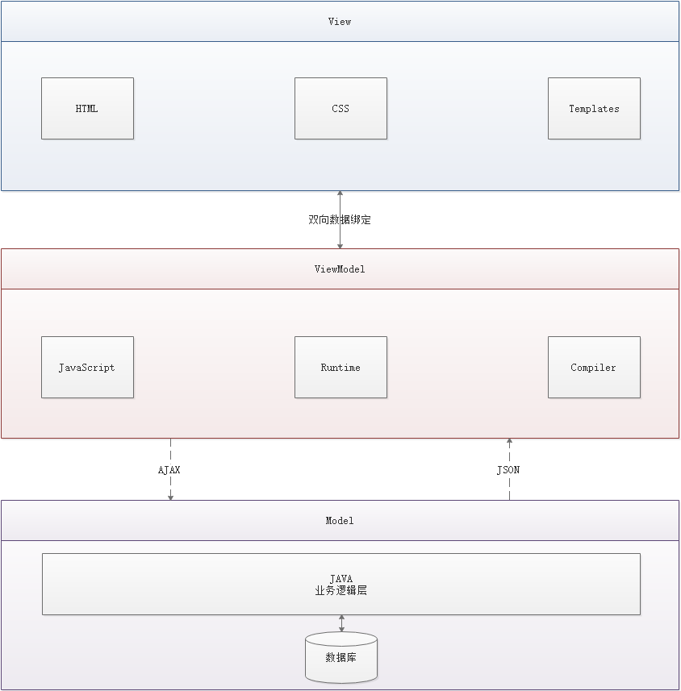

[toc]

## 一、了解前端

### 1.1 前端三要素

- HTML（结构）：超文本标记语言（Hyper Text Markup Language），决定网页的结构和内容；
- CSS（表现）：层叠样式表（Cascading Style Sheets），设定网页的表现样式；
- JavaScript（行为）：是一种弱类型的脚本语言，其源代码不需要经过编译，而是由浏览器解释执行，用于控制网页的行为；

### 1.2 结构层

（略）

### 1.3 表现层

CSS 层叠样式表是一门标记语言，并不是编程语言，因此不可以自定义变量，不可以引用等。换句话说，就是不具备任何语法支持，他的主要缺陷如下：

1. 语法不够强大，比如无法嵌套书写，这样就导致了模块化开发中需要书写很多重复的选择器（违反了面向对象设计原则中）；
2. 没有变量和合理的样式复用机制，使得逻辑上相关的属性值必须以字面量的形式重复输出，导致难以维护；

这就导致了我们在工作中无端端增加了需要工作量。为了解决这个问题，前端开发人员会使用一种被称之为『CSS 预处理器』的工具，提供 CSS 却是的样式层复用机制、减少冗余代码，提高样式代码的可维护性。大大提高了前端在样式上的开发效率。

#### 1.3.1 什么事 CSS 预处理器

CSS 预处理器定义了一种新的语言，其基本思想是，用一种专门的编程语言，为 CSS 增加了一些编程的特性，将 CSS 作为目标生成文件，然后开发者就只需要使用这种语言进行 CSS 的编码工作。通俗来说，就是“用一种专门的编程语言，进行 Web 页面样式设计，再通过编译器转换为正常的 CSS 文件，以供项目使用”。

#### 1.3.2 常用的 CSS 预处理器有哪些

- SASS ：基于 Ruby，通过服务端处理，功能强大，解析效率高，需要学习 Ruby 语言，上手难度高于 LESS；
- LESS ： 基于 NodeJS，通过客户端处理，使用简单。功能比 SASS 简单，解析效率也低于 SASS，但在实际开发中已经足够了。

> 在进行界面设计的时候，往往会使用『系列色』：系列色一般会有三种主色调：
>
> 1. 主题色：logo 是什么颜色，主题色就是什么颜色
> 2. 主字体颜色
> 3. 辅字体颜色

### 1.4 行为层JavaScript 

JavaScript 一门弱类型脚本语言，其源代码在发往客户端运行之前不需经过编译，而是将文本格式的字符代码发送给浏览器由浏览器解释运行。

#### 1.4.1 Native 原生 JS 开发

原生 JS 开发，也就是让我们按照 **【ECMAScript】** 标准的开发方式，简称是 ES，特点是所有浏览器都支持。截止到当前博客发布时间（2018 年 12 月 04 日），ES 标准已发布如下版本：

- ES3
- ES4（内部，未正式发布）
- ES5（全浏览器支持）
- ES6（常用，当前主流版本）
- ES7
- ES8
- ES9（草案阶段）

区别就是逐步增加新特。

#### 1.4.2 TypeScript 微软的标准

ypeScript 是一种由微软开发的自由和开源的编程语言。它是 JavaScript 的一个超集，而且本质上向这个语言添加了可选的静态类型和基于类的面向对象编程。由安德斯·海尔斯伯格（C#、Delphi、TypeScript 之父；.NET 创立者）主导。

该语言的特点就是除了具备 ES 的特性之外还纳入了许多不在标准范围内的新特性，所以会导致很多浏览器不能直接支持 TypeScript 语法，需要编译后（编译成 JS）才能被浏览器正确执行。

#### 1.4.3 JavaScript 框架

- jQuery：大家熟知的 JavaScript 框架，优点是简化了 DOM 操作，缺点是 DOM 操作太频繁，影响前端性能；在前端眼里使用它仅仅是为了兼容 IE6、7、8；
- Angular：Google 收购的前端框架，由一群 Java 程序员开发，其特点是将后台的 MVC 模式搬到了前端并增加了模块化开发的理念，与微软合作，采用 TypeScript 语法开发；对后台程序员友好，对前端程序员不太友好；最大的缺点是版本迭代不合理（如：1代 -> 2代，除了名字，基本就是两个东西；截止发表博客时已推出了 Angular6）
- React：Facebook 出品，一款高性能的 JS 前端框架；特点是提出了新概念 **【虚拟 DOM】** 用于减少真实 DOM 操作，在内存中模拟 DOM 操作，有效的提升了前端渲染效率；缺点是使用复杂，因为需要额外学习一门 **【JSX】** 语言；
- `Vue`：一款渐进式 JavaScript 框架，所谓渐进式就是逐步实现新特性的意思，如实现模块化开发、路由、状态管理等新特性。其特点是综合了 Angular（模块化） 和 React（虚拟 DOM） 的优点；
- `Axios`：前端通信框架；因为 `Vue` 的边界很明确，就是为了处理 DOM，所以并不具备通信能力，此时就需要额外使用一个通信框架与服务器交互；当然也可以直接选择使用 jQuery 提供的 AJAX 通信功能；

> 另：Vue 在设计之初，还遵循了另外一个原则：关注度分离原则（SoC）

#### 1.4.4 UI 框架

- Ant-Design：阿里巴巴出品，基于 React 的 UI 框架
- ElementUI：饿了么出品，基于 Vue 的 UI 框架
- Bootstrap：Twitter 推出的一个用于前端开发的开源工具包
- AmazeUI：又叫“妹子 UI”，一款 HTML5 跨屏前端框架

#### 1.4.5 JavaScript 构建工具

- Babel：JS 编译工具，主要用于浏览器不支持的 ES 新特性，比如用于编译 TypeScript
- WebPack：模块打包器，主要作用是打包、压缩、合并及按序加载；

> 上面就是所有前端开发所需要具备的知识点。

### 1.5 三端统一

#### 1.5.1 混合开发（Hybrid App）

主要目的是实现一淘代码三端统一（PC、Android、iOS）并能够调用到设备底层硬件，，打包方式主要有以下的两种：

- 云打包：HBuild -> HbuildX，DCloud 出品
- 本地打包：Cordova

图示如下所示：

#### 1.5.2 微信小程序

### 1.6 后端技术

前端人员为了方便开发也需要掌握一定的后端技术，但我们 Java 后台人员知道后台知识体系极其庞大复杂，所以为了方便前端人员开发后台应用，就出现了 NodeJS 这样的技术。

NodeJS 的作者已经声称放弃 NodeJS（说是架构做的不好再加上笨重的 node_modules，可能让作者不爽了吧），开始开发全新架构的 Deno

既然是后台技术，那肯定也需要框架和项目管理工具，NodeJS 框架及项目管理工具如下：

- Express：NodeJS 框架
- Koa：Express 简化版
- NPM：项目综合管理工具，类似于 Maven
- YARN：NPM 的替代方案，类似于 Maven 和 Gradle 的关系；

> NodeJS 相当于 MVC模式；Express 相当于 Spring 框架；而 Koa 则相当于 Springboot :laughing:

附：：[当前主流前端框架](https://funtl.com/zh/vue-prepare/#%E9%99%84%EF%BC%9A%E5%BD%93%E5%89%8D%E4%B8%BB%E6%B5%81%E5%89%8D%E7%AB%AF%E6%A1%86%E6%9E%B6)。

## 二、了解前后分离演变史

参考[了解前后分离的演变史](https://funtl.com/zh/vue-prepare/%E4%BA%86%E8%A7%A3%E5%89%8D%E5%90%8E%E5%88%86%E7%A6%BB%E7%9A%84%E6%BC%94%E5%8F%98%E5%8F%B2.html#%E4%BA%86%E8%A7%A3%E5%89%8D%E5%90%8E%E5%88%86%E7%A6%BB%E7%9A%84%E6%BC%94%E5%8F%98%E5%8F%B2)。

## 三、了解前端 MVVM 模式

### 3.1 什么事 MVVM 模式

MVVM（Model-View-ViewModel）是一种软件架构设计模式，由微软 WPF（用于替代 WinForm，以前就是用这个技术开发桌面应用程序的）和 Silverlight（类似于 Java Applet，简单点说就是在浏览器上运行的 WPF） 的架构师 Ken Cooper 和 Ted Peters 开发，是一种简化用户界面的**`事件驱动编程方式`**。由 John Gossman（同样也是 WPF 和 Silverlight 的架构师）于 2005 年在他的博客上发表。

MVVM 源自于经典的 MVC（Model-View-Controller）模式（期间还演化出了 MVP（Model-View-Presenter） 模式）。**`MVVM 的核心是 ViewModel 层`**，负责转换 Model 中的数据对象来让数据变得更容易管理和使用，其作用如下：

-  该层向上与视图层进行双向数据绑定
- 向下与 Model 层通过接口请求进行数据交互

MVVM 已经相当成熟了，主要运用但不仅仅在网络应用程序开发中。当下流行的 MVVM 框架有 `Vue.js`，`AngularJS` 等。

> MVVM 实现无刷新而更新页面的数据，而『数据双向绑定』包含了这个技术。

### 3.2 为什么需要 MVVM

MVVM 模式和 MVC 模式一样，主要目的是分离视图（View）和模型（Model），有几大好处

- **低耦合：** 视图（View）可以独立于 Model 变化和修改，一个 ViewModel 可以绑定到不同的 View 上，当 View 变化的时候 Model 可以不变，当 Model 变化的时候 View 也可以不变。
- **可复用：** 你可以把一些视图逻辑放在一个 ViewModel 里面，让很多 View 重用这段视图逻辑。
- **独立开发：** 开发人员可以专注于业务逻辑和数据的开发（ViewModel），设计人员可以专注于页面设计。
- **可测试：** 界面素来是比较难于测试的，而现在测试可以针对 ViewModel 来写；

### 3.3 MVVM 的组成部分

> Vue 在实际应用起来的时候，和模板引擎差不多。下面类比：
>
> 1. {name} : 这是 EL 表达式；
> 2. `<c:if> ` JSP 页面，实质上就是 HTML；
> 3. `<th:if>`：模板引擎，也是 HTML；
>
> 上面三个都是 MVC 服务端中的语法。而到了 Vue 中，则是使用 `<v-if>` 语法。

#### [#](https://funtl.com/zh/vue-prepare/了解前端-MVVM-模式.html#view)View

View 是视图层，也就是用户界面。前端主要由 HTML 和 CSS 来构建，为了更方便地展现 ViewModel 或者 Model 层的数据，已经产生了各种各样的前后端模板语言，比如 `FreeMarker`、`Thymeleaf` 等等，各大 MVVM 框架如 `Vue.js`，`AngularJS`，`EJS` 等也都有自己用来构建用户界面的内置模板语言。

#### [#](https://funtl.com/zh/vue-prepare/了解前端-MVVM-模式.html#model)Model

Model 是指数据模型，泛指后端进行的各种业务逻辑处理和数据操控，主要围绕数据库系统展开。这里的难点主要在于需要和前端约定统一的 **`接口规则`**

#### [#](https://funtl.com/zh/vue-prepare/了解前端-MVVM-模式.html#viewmodel)ViewModel

ViewModel 是由前端开发人员组织生成和维护的视图数据层。在这一层，前端开发者对从后端获取的 Model 数据进行转换处理，做二次封装，以生成符合 View 层使用预期的视图数据模型。

**需要注意的是 ViewModel 所封装出来的数据模型包括视图的状态和行为两部分，而 Model 层的数据模型是只包含状态的**

- 比如页面的这一块展示什么，那一块展示什么这些都属于视图状态（展示）
- 页面加载进来时发生什么，点击这一块发生什么，这一块滚动时发生什么这些都属于视图行为（交互）

视图状态和行为都封装在了 ViewModel 里。这样的封装使得 ViewModel 可以完整地去描述 View 层`。由于实现了双向绑定，ViewModel 的内容会实时展现在 View 层，这是激动人心的，因为前端开发者再也不必低效又麻烦地通过操纵 DOM 去更新视图。

MVVM 框架已经把最脏最累的一块做好了，我们开发者只需要处理和维护 ViewModel，更新数据视图就会自动得到相应更新，真正实现 `事件驱动编程`。

View 层展现的不是 `Model` 层的数据，而是 `ViewModel` 的数据，由 `ViewModel` 负责与 `Model` 层交互，`这就完全解耦了 View 层和 Model 层，这个解耦是至关重要的，它是前后端分离方案实施的重要一环`。

