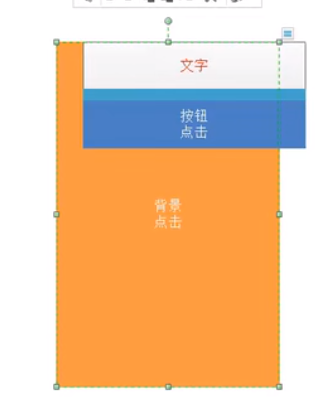
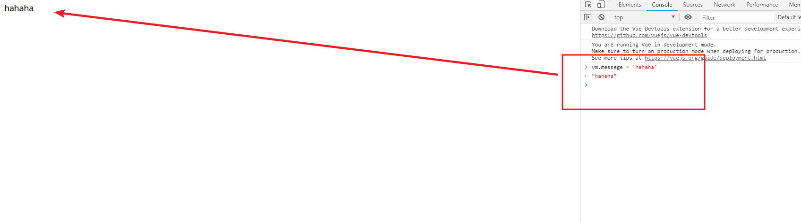

[toc]

## 一、Vue 的简介

什么是 Vue？

Vue 就是 MVVM 模式的实现者，而 MVVM 模式中最重要的就是 ViewModel，是为了实现数据的双向绑定，而实现数据双向绑定，必须实现『观察者模式』。最终实现解耦。

> 事件分发机制：
>
> 
>
> 
>
> 当元素出现层叠的时候（例如“背景”和“按钮”两个元素），点击重叠的部分，其实两个元素都被点击到了，但通过『事件分发机制』，可以阻断被覆盖（也就是“背景”）的元素的事件。
>
> 『事件分发机制』的方向是由下往上的，点击先经过“背景”，然后在逐层分发到“按钮”。

### 1.2 MVVM 的实现者

- Model：模型层，在这里表示 JavaScript 对象
- View：视图层，在这里表示 DOM（HTML 操作的元素）
- ViewModel：连接视图和数据的中间件，**Vue.js 就是 MVVM 中的 ViewModel 层的实现者**


在 MVVM 架构中，是不允许 **数据** 和 **视图** 直接通信的，只能通过 `ViewModel` 来通信，而 ViewModel 就是定义了一个 `Observer` 观察者

- ViewModel 能够观察到数据的变化，并对视图对应的内容进行更新
- ViewModel 能够监听到视图的变化，并能够通知数据发生改变

至此，我们就明白了，Vue.js 就是一个 MVVM 的实现者，他的核心就是实现了 `DOM 监听` 与 `数据绑定`。

> 其他的 MVVM 模式的实现者：
>
> 1. AngularJS
> 2. ReactJS
> 3. 微信小程序

### 1.3 为什么使用 Vue.js

- 轻量级，体积小是一个重要指标。Vue.js 压缩后有只有 20多kb （Angular 压缩后 56kb+，React 压缩后 44kb+）
- 移动优先。更适合移动端，比如移动端的 Touch 事件
- 易上手，学习曲线平稳，文档齐全
- 吸取了 Angular（模块化）和 React（虚拟 DOM）的长处，并拥有自己独特的功能，如：计算属性
- 开源，社区活跃度高

### 1.4 Vue.js 的两大核心要素

#### 1.4.1 数据驱动


当你把一个普通的 JavaScript 对象传给 Vue 实例的 `data` 选项，Vue 将遍历此对象所有的属性，并使用 `Object.defineProperty` 把这些属性全部转为 `getter/setter`。**Object.defineProperty 是 ES5 中一个无法 shim 的特性，这也就是为什么 Vue 不支持 IE8 以及更低版本浏览器**。

这些 getter/setter 对用户来说是不可见的，但是在内部它们让 Vue 追踪依赖，在属性被访问和修改时通知变化。这里需要注意的问题是浏览器控制台在打印数据对象时 getter/setter 的格式化并不同，所以你可能需要安装 `vue-devtools` 来获取更加友好的检查接口。

每个组件实例都有相应的 **watcher** 实例对象，它会在组件渲染的过程中把属性记录为依赖，之后当依赖项的 `setter` 被调用时，会通知 `watcher` 重新计算，从而致使它关联的组件得以更新

#### 1.4.2 组件化

- 页面上每个独立的可交互的区域视为一个组件
- 每个组件对应一个工程目录，组件所需的各种资源在这个目录下就近维护
- 页面不过是组件的容器，组件可以嵌套自由组合（复用）形成完整的页面

## 二、第一个 Vue.js 程序

根据 MVVM 的开发模式，我们可以知道 Vue 需要开发以下几个组件：

- 首先需要一个 HTML 页面，以及在这个 HTML 页面中定义一个视图
- 定义一个 ViewModel，通过这个组件，来实现『数据的双向绑定』；
- 定义 Model 数据；；

### 2.1 定义一个 HTML 页面以及视图

新建 *first.html* 文件，并在文件中添加以下内容：

```html
<!DOCTYPE html>
<html lang="en">
<head>
    <meta charset="UTF-8">
    <meta name="viewport" content="width=device-width, initial-scale=1.0">
    <title>第一个 Vue 应用</title>
</head>
<body>
    <div id="vue">
    </div>
</body>
</html>
```

上面 id = vue 的组件就是一个视图。

> - 开发版本
>   - 包含完整的警告和调试模式：https://vuejs.org/js/vue.js
>   - 删除了警告，30.96KB min + gzip：https://vuejs.org/js/vue.min.js
> - CDN
>   - `<script src="https://cdn.jsdelivr.net/npm/vue@2.5.21/dist/vue.js"></script>`
>   - `<script src="https://cdn.jsdelivr.net/npm/vue@2.5.21/dist/vue.min.js"></script>`

### 2.2 定义 ViewModel

我们使用了 Vue.js 框架中实现的 ViewModel ，因此，在定义以前，需要引入 Vue 相关的依赖：

```html
<script src="https://cdn.jsdelivr.net/npm/vue@2.5.21/dist/vue.js"></script>
```

然后创建一个 Vue 的实例：

```html
<script type="text/javascript">
    var vm = new Vue({
        el: '#vue', 
        data: {
            message: 'Hello Vue'
        }
    });
</script>
```

上面定义了一个名为 `vm` 的实例，并且定义了Model 中的数据为` 'Hello Vue'`

### 2.3 实现数据的单向绑定

本次例子我们只实现了数据的单向绑定：将 ViewModel 中的数据绑定到 View 中。

我们要想实现绑定，只需要将 id 为 vue 的代码改写成以下：

```html
<div id="vue">
    {{message}}
</div>
```

`{{message}} `就是从 ViewModel 中获取数据，从而实现数据的绑定。

### 2.4 变动测试

在浏览器中打开该页面，可以看到以下的界面：


我们接着打开浏览器的控制台，然后在控制台中输入： `vm.message = ‘hahaha’`，可以发现页面的数据动态改变了：



从这个例子中也可以看出：Vue 实现了观察者模式，并将数据绑定到了 Model 中。


