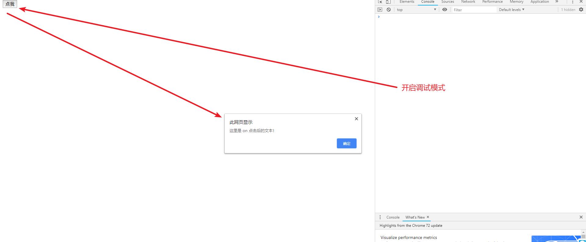
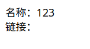
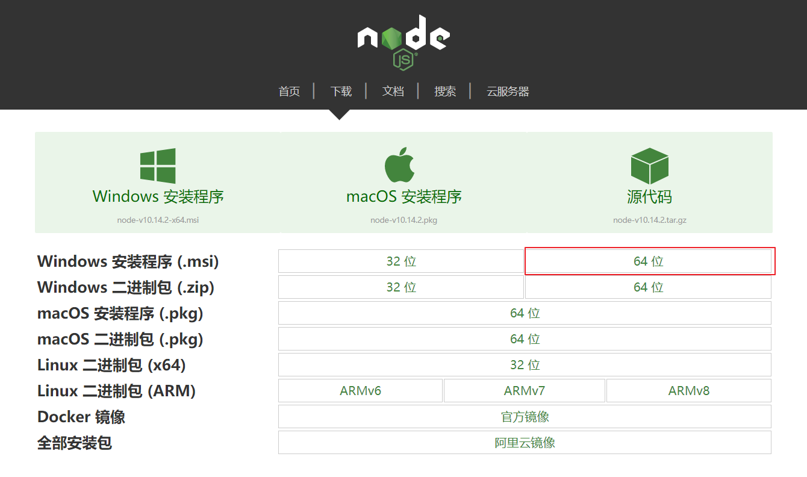

[toc]

## 一、Vue 的简介

什么是 Vue？

Vue 就是 MVVM 模式的实现者，而 MVVM 模式中最重要的就是 ViewModel，是为了实现数据的双向绑定，而实现数据双向绑定，必须实现『观察者模式』。最终实现解耦。

> 事件分发机制：
>
> 
>
> 
>
> 当元素出现层叠的时候（例如“背景”和“按钮”两个元素），点击重叠的部分，其实两个元素都被点击到了，但通过『事件分发机制』，可以阻断被覆盖（也就是“背景”）的元素的事件。
>
> 『事件分发机制』的方向是由下往上的，点击先经过“背景”，然后在逐层分发到“按钮”。

### 1.2 MVVM 的实现者

- Model：模型层，在这里表示 JavaScript 对象
- View：视图层，在这里表示 DOM（HTML 操作的元素）
- ViewModel：连接视图和数据的中间件，**Vue.js 就是 MVVM 中的 ViewModel 层的实现者**


在 MVVM 架构中，是不允许 **数据** 和 **视图** 直接通信的，只能通过 `ViewModel` 来通信，而 ViewModel 就是定义了一个 `Observer` 观察者

- ViewModel 能够观察到数据的变化，并对视图对应的内容进行更新
- ViewModel 能够监听到视图的变化，并能够通知数据发生改变

至此，我们就明白了，Vue.js 就是一个 MVVM 的实现者，他的核心就是实现了 `DOM 监听` 与 `数据绑定`。

> 其他的 MVVM 模式的实现者：
>
> 1. AngularJS
> 2. ReactJS
> 3. 微信小程序

### 1.3 为什么使用 Vue.js

- 轻量级，体积小是一个重要指标。Vue.js 压缩后有只有 20多kb （Angular 压缩后 56kb+，React 压缩后 44kb+）
- 移动优先。更适合移动端，比如移动端的 Touch 事件
- 易上手，学习曲线平稳，文档齐全
- 吸取了 Angular（模块化）和 React（虚拟 DOM）的长处，并拥有自己独特的功能，如：计算属性
- 开源，社区活跃度高

### 1.4 Vue.js 的两大核心要素

#### 1.4.1 数据驱动


当你把一个普通的 JavaScript 对象传给 Vue 实例的 `data` 选项，Vue 将遍历此对象所有的属性，并使用 `Object.defineProperty` 把这些属性全部转为 `getter/setter`。**Object.defineProperty 是 ES5 中一个无法 shim 的特性，这也就是为什么 Vue 不支持 IE8 以及更低版本浏览器**。

这些 getter/setter 对用户来说是不可见的，但是在内部它们让 Vue 追踪依赖，在属性被访问和修改时通知变化。这里需要注意的问题是浏览器控制台在打印数据对象时 getter/setter 的格式化并不同，所以你可能需要安装 `vue-devtools` 来获取更加友好的检查接口。

每个组件实例都有相应的 **watcher** 实例对象，它会在组件渲染的过程中把属性记录为依赖，之后当依赖项的 `setter` 被调用时，会通知 `watcher` 重新计算，从而致使它关联的组件得以更新

#### 1.4.2 组件化

- 页面上每个独立的可交互的区域视为一个组件
- 每个组件对应一个工程目录，组件所需的各种资源在这个目录下就近维护
- 页面不过是组件的容器，组件可以嵌套自由组合（复用）形成完整的页面

## 二、第一个 Vue.js 程序

根据 MVVM 的开发模式，我们可以知道 Vue 需要开发以下几个组件：

- 首先需要一个 HTML 页面，以及在这个 HTML 页面中定义一个视图
- 定义一个 ViewModel，通过这个组件，来实现『数据的双向绑定』；
- 定义 Model 数据；；

### 2.1 定义一个 HTML 页面以及视图

新建 *first.html* 文件，并在文件中添加以下内容：

```html
<!DOCTYPE html>
<html lang="en">
<head>
    <meta charset="UTF-8">
    <meta name="viewport" content="width=device-width, initial-scale=1.0">
    <title>第一个 Vue 应用</title>
</head>
<body>
    <div id="vue">
    </div>
</body>
</html>
```

上面 id = vue 的组件就是一个视图。

> - 开发版本
>   - 包含完整的警告和调试模式：https://vuejs.org/js/vue.js
>   - 删除了警告，30.96KB min + gzip：https://vuejs.org/js/vue.min.js
> - CDN
>   - `<script src="https://cdn.jsdelivr.net/npm/vue@2.5.21/dist/vue.js"></script>`
>   - `<script src="https://cdn.jsdelivr.net/npm/vue@2.5.21/dist/vue.min.js"></script>`

### 2.2 定义 ViewModel

我们使用了 Vue.js 框架中实现的 ViewModel ，因此，在定义以前，需要引入 Vue 相关的依赖：

```html
<script src="https://cdn.jsdelivr.net/npm/vue@2.5.21/dist/vue.js"></script>
```

然后创建一个 Vue 的实例：

```html
<script type="text/javascript">
    var vm = new Vue({
        el: '#vue', 
        data: {
            message: 'Hello Vue'
        }
    });
</script>
```

上面定义了一个名为 `vm` 的实例，并且定义了Model 中的数据为` 'Hello Vue'`

### 2.3 实现数据的单向绑定

本次例子我们只实现了数据的单向绑定：将 ViewModel 中的数据绑定到 View 中。

我们要想实现绑定，只需要将 id 为 vue 的代码改写成以下：

```html
<div id="vue">
    {{message}}
</div>
```

`{{message}} `就是从 ViewModel 中获取数据，从而实现数据的绑定。

### 2.4 变动测试

在浏览器中打开该页面，可以看到以下的界面：


我们接着打开浏览器的控制台，然后在控制台中输入： `vm.message = ‘hahaha’`，可以发现页面的数据动态改变了：


从这个例子中也可以看出：Vue 实现了观察者模式，并将数据绑定到了 Model 中。

## 三、Vue 的生命周期

### 3.1 概述

Vue 实例有一个完整的生命周期，也就是**从开始创建、初始化数据、编译模板、挂载 DOM、渲染→更新→渲染 、卸载** 等一系列过程，我们称之为 Vue 的生命周期。通俗来说就是 Vue 实例从创建到销毁的过程。

在 Vue 的整个生命周期中，它提供了一系列的事件，可以让我们在事件触发时注册 JS 方法，可以让我们用自己注册的 JS 方法控制整个大局，在这些事件响应方法中的 `this` 直接指向的是 Vue 的实例。

> 通过 AOP 思想来了解生命周期

> 注意查看 web_hook 的介绍（02:55~06:47）
>
> A 系统中需要调用别的系统的接口，同时接收被调用者返回的数据。此时，A 系统在设计的时候就会设计一个『钩子函数』，按照用户的配置调用指定的接口，并接收返回的数据。在这个过程中，『钩子函数』的作用和『回调函数』相似，而 A 系统在这个过程中则可以看做是一个“网关”的作用。


### 3.2 钩子函数出发时机

#### [#](https://funtl.com/zh/vue/附：Vue-实例的生命周期.html#beforecreate)beforeCreate

在实例初始化之后，数据观测(data observer) 和 event/watcher 事件配置之前被调用。

#### [#](https://funtl.com/zh/vue/附：Vue-实例的生命周期.html#created)created

实例已经创建完成之后被调用。在这一步，实例已完成以下的配置：数据观测(data observer)，属性和方法的运算， watch/event 事件回调。然而，挂载阶段还没开始，$el 属性目前不可见。

#### [#](https://funtl.com/zh/vue/附：Vue-实例的生命周期.html#beforemount)beforeMount

在挂载开始之前被调用：相关的 render 函数首次被调用。

#### [#](https://funtl.com/zh/vue/附：Vue-实例的生命周期.html#mounted)mounted

el 被新创建的 vm.$el 替换，并挂载到实例上去之后调用该钩子。

#### [#](https://funtl.com/zh/vue/附：Vue-实例的生命周期.html#beforeupdate)beforeUpdate

数据更新时调用，发生在虚拟 DOM 重新渲染和打补丁之前。 你可以在这个钩子中进一步地更改状态，这不会触发附加的重渲染过程。

#### [#](https://funtl.com/zh/vue/附：Vue-实例的生命周期.html#updated)updated

由于数据更改导致的虚拟 DOM 重新渲染和打补丁，在这之后会调用该钩子。

当这个钩子被调用时，组件 DOM 已经更新，所以你现在可以执行依赖于 DOM 的操作。然而在大多数情况下，你应该避免在此期间更改状态，因为这可能会导致更新无限循环。该钩子在服务器端渲染期间不被调用。

#### [#](https://funtl.com/zh/vue/附：Vue-实例的生命周期.html#beforedestroy)beforeDestroy

实例销毁之前调用。在这一步，实例仍然完全可用。

#### [#](https://funtl.com/zh/vue/附：Vue-实例的生命周期.html#destroyed)destroyed

Vue 实例销毁后调用。调用后，Vue 实例指示的所有东西都会解绑定，所有的事件监听器会被移除，所有的子实例也会被销毁。该钩子在服务器端渲染期间不被调用。

## 四、Vue 基本语法

这里介绍三个基本语法：

简单条件判断、多重条件判断、循环。

### 4.1 简单条件判断 v-if

例子：

```html
<!DOCTYPE html>
<html lang="en">
<head>
    <meta charset="UTF-8">
    <meta name="viewport" content="width=device-width, initial-scale=1.0">
    <title>v-if 条件</title>
    <script src="https://cdn.jsdelivr.net/npm/vue@2.5.21/dist/vue.js"></script>

</head>
<body>
    <div id="a0">
        <!-- v-if 里面填写的是判断内容，一般填写变量名 -->
        <h2 v-if="isOk">现在是 OK</h2>
        <h1 v-else>现在是 NO</h1>
    </div>

    <script type="text/javascript">
        var vm = new Vue({
            el: "#a0", 
            data: {
                isOk : true
            }
        })
    </script>
</body>
</html>
```


### 4.2 多重条件判断 v-if

```html
<!DOCTYPE html>
<html lang="en">
<head>
    <meta charset="UTF-8">
    <meta name="viewport" content="width=device-width, initial-scale=1.0">
    <title>v-if-else-if 练习</title>
</head>
<body>
    <div id="a0">
        <h1 v-if="type === 'A'">这是 A</h1>
        <h1 v-else-if="type === 'B'">这是 B</h1>
        <h1 v-else>其他</h1>
    </div>

    <script src="https://cdn.jsdelivr.net/npm/vue"></script>
    <script type="text/javascript">
        var vm = new Vue({
            el: "#a0", 
            data: {
                // 注意这里不能写成 type = "A" _(:з」∠)_
                // 其实就是 json 的语法啦
                type: "A"
            }
        })
    </script>
</body>
</html>
```


### 4.3 循环 v-for

```html
<!DOCTYPE html>
<html lang="en">
<head>
    <meta charset="UTF-8">
    <meta name="viewport" content="width=device-width, initial-scale=1.0">
    <title>v-for 语法</title>
</head>
<body>
    <div id="a0">
        <ul>
            <li v-for="item in items">{{item.message}}</li>
        </ul>
    </div>

    <script src="https://cdn.jsdelivr.net/npm/vue"></script>
    <script>
        var vm = new Vue({
            el: "#a0", 
            data: {
                items:[
                    {message: "陈奕迅"},
                    {message: "梁静茹"},
                    {message: "邓紫棋"},
                ]
            }
        })
    </script>
</body>
</html>
```

### 4.4 点击事件 v-on

```html
<!DOCTYPE html>
<html lang="en">
<head>
    <meta charset="UTF-8">
    <meta name="viewport" content="width=device-width, initial-scale=1.0">
    <title>点击事件语法</title>
</head>
<body>
    <div id="a0">
        <!-- ① -->
        <button v-on:click="sayHi();">点我</button>
    </div>

    <script src="https://cdn.jsdelivr.net/npm/vue"></script>
    <script>
        var vm = new Vue({
            el: "#a0",
            data: {
                message: "这里是 on 点击后的文本！"
            }, 
            // ② 这里声明方法列表
            methods: {
                // ③ 方法的声明语法：方法名:function 关键字
                sayHi: function() {
                    alert(this.message);
                }
            }
        })
    </script>
</body>
</html>
```

注意：

1. 本次例子中的 button 控件，绑定了其中一个方法；注意语法！！

用浏览器打开网页，然后点击按钮，发现没有反应。只有当开启了调试模式的时候才能看到效果：



> 这是因为现在很多浏览器都已经屏蔽了 alert 方法。

## 五、使用 Axios 实现异步通信

### 5.1 什么是 Axios

Axios 是一个开源的、可以在浏览器和 NodeJS 的异步通信框架，她的主要作用实现 AJAX 一步通信，其主要特点如下：

1. 从浏览器中创建 `XMLHttpRequest`（ajax 通信）
2. 从 `node.js` 创建 `http` 请求；
3. 支持 `Promise API `（链式编程）；
4. 拦截请求和响应；
5. 转换请求数据和响应数据；
6. 取消请求；
7. 自动转换 JSON 数据；
8. 客户端支持防御 `XSRF` （跨站请求伪造）；

[Github 地址](https://github.com/axios/axios)

### 5.2 为什么使用 Axios 

由于 Vue.js 是一个**视图层框架**，并且作者严格遵守 `SoC`（关注度分离原则），所以 Vue.js 并不包含 AJAX 的通信功能。为了解决通信问题，作者单独开发了一个名为 `vue-resource` 的插件，不过进入 2.0 版本以后就停止了对该插件的维护并推荐了 Axios 框架。

### 5.3 第一个 Axios 程序

#### 5.3.1 准备工作

我们首先创建一个 HTML，然后引入 Vue 框架：

```html
<!DOCTYPE html>
<html lang="en">
<head>
    <meta charset="UTF-8">
    <meta name="viewport" content="width=device-width, initial-scale=1.0">
    <title>第一个 Axios 应用程序</title>
</head>
<body>
    <div id="d0">
        <div>名称：{{info.name}}</div>
        <div>链接：{{info.url}}</div>
    </div>

    <script src="https://cdn.jsdelivr.net/npm/vue"></script>
    <script>
        var vm = new Vue({
            el: "#d0", 
            // 函数对象，括号代表函数，大括号代表对象；注意：没有冒号
            data() {
                // 函数对象必须有 return 关键字
                return {
                    info : {
                        name : 123, 
                        url : null
                    }
                }
            }

        })
    </script>
</body>
</html>
```

上面的 Vue 实例中的 `data` 变成了函数对象 `data(){}`。在函数对象中返回了一个『数据承载模型』。

我们运行页面，页面正常显示：



#### 5.3.2 


## 十、Vue-cli


### 10.1 什么是 vue-cli

vue-cli 是 Vue 官方提供的一个脚手架（预先定义好的目录结构以及基础代码，类似于maven 中的 webapp 骨架），用于快速生成一个 vue 的项目模板。

- 统一的目录结构
- 本地调试；
- 热部署；
- 单元测试；
- 集成打包上线；

### 10.2 安装

#### 10.2.1 安装 node.js

去到 node 官网下载，然后安装即可



安装成功以后，打开命令行界面

```bash
node -v
# 会出现以下输出：
v12.16.2
```

一般来说，安装 node 的同时会安装 npm：

```bash
λ npm -v
6.14.4
```

安装淘宝镜像（类似于 maven 的仓库地址）

```bash
λ npm install --registry=https://registry.npm.taobao.org
npm WARN saveError ENOENT: no such file or directory, open 'C:\Users\kfchen\package.json'
npm notice created a lockfile as package-lock.json. You should commit this file.
npm WARN enoent ENOENT: no such file or directory, open 'C:\Users\kfchen\package.json'
npm WARN kfchen No description
npm WARN kfchen No repository field.
npm WARN kfchen No README data
npm WARN kfchen No license field.
```


#### 10.2.2 安装 vue-cli

输入命令：

```bash
λ cnpm install vue-cli -g
Downloading vue-cli to C:\Users\kfchen\AppData\Roaming\npm\node_modules\vue-cli_tmp
Copying C:\Users\kfchen\AppData\Roaming\npm\node_modules\vue-cli_tmp\_vue-cli@2.9.6@vue-cli to C:\Users\kfchen\AppData\Roaming\npm\node_modules\vue-cli
Installing vue-cli's dependencies to C:\Users\kfchen\AppData\Roaming\npm\node_modules\vue-cli/node_modules
[1/20] minimatch@^3.0.0 installed at node_modules\_minimatch@3.0.4@minimatch
[2/20] commander@^2.9.0 installed at node_modules\_commander@2.20.3@commander
[3/20] consolidate@^0.14.0 installed at node_modules\_consolidate@0.14.5@consolidate
...
```

测试是否安装成功：

```bash
λ vue list

  Available official templates:

  ★  browserify - A full-featured Browserify + vueify setup with hot-reload, linting & unit testing.
  ★  browserify-simple - A simple Browserify + vueify setup for quick prototyping.
  ★  pwa - PWA template for vue-cli based on the webpack template
  ★  simple - The simplest possible Vue setup in a single HTML file
  ★  webpack - A full-featured Webpack + vue-loader setup with hot reload, linting, testing & css extraction.
  ★  webpack-simple - A simple Webpack + vue-loader setup for quick prototyping.

```

#### 10.2.3 创建第一个 vue-cli 应用程序

我们使用 webpack 模板来创建 vue 应用程序

```bash
# 这里使用了 vue init 命令，基于 webpack 模板创建应用程序，最后的 vue01 是项目名称，
λ vue init webpack vue01
```

- `Project name`：项目名称，默认 `回车` 即可
- `Project description`：项目描述，默认 `回车` 即可
- `Author`：项目作者，默认 `回车` 即可
- `Install vue-router`：是否安装 `vue-router`，选择 `n` 不安装（后期需要再手动添加）
- `Use ESLint to lint your code`：是否使用 `ESLint` 做代码检查，选择 `n` 不安装（后期需要再手动添加）
- `Set up unit tests`：单元测试相关，选择 `n` 不安装（后期需要再手动添加）
- `Setup e2e tests with Nightwatch`：单元测试相关，选择 `n` 不安装（后期需要再手动添加）
- `Should we run npm install for you after the project has been created`：创建完成后直接初始化，选择 `n`，我们手动执行

接着安装依赖：

```bash
cnpm install 
```

最后启动项目：

```bash
λ npm run dev

> vue01@1.0.0 dev E:\ProgramFiles\JetBrains\Idea_workplace\千锋教育\01 前锋教育——李卫民\02 Java全栈\03
Java微服务框架\07-Vue\02 vue-cli\vue01
> webpack-dev-server --inline --progress --config build/webpack.dev.conf.js

         12% building modules 24/29 modules 5 active ...架\07-Vue\02 vue-cli\vue01\src\App.vue{ parser: " babylon" } is deprec   95% emitting

 DONE  Compiled successfully in 5142ms                                                           14:59:31

 I  Your application is running here: http://localhost:8080
```

打开浏览器，输入地址 http://localhost:8080 即可访问到以下界面：


多看看（09:47 ~ 最后）的视频，介绍了骨架的配置文件以及对应的用途。