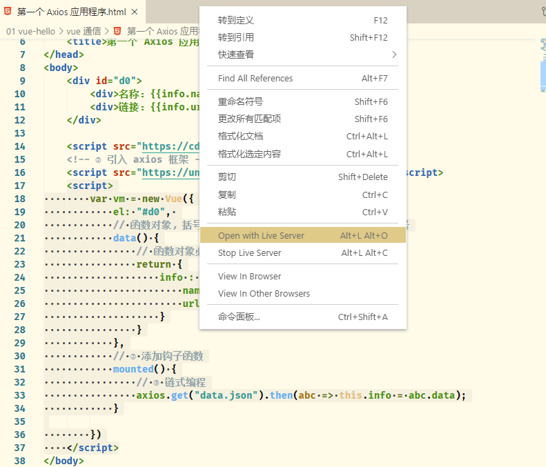
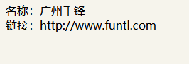
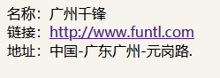

[toc]

## 一、Vue 的简介

什么是 Vue？

Vue 就是 MVVM 模式的实现者，而 MVVM 模式中最重要的就是 ViewModel，是为了实现数据的双向绑定，而实现数据双向绑定，必须实现『观察者模式』。最终实现解耦。

> 事件分发机制：
>
> 
>
> 
>
> 当元素出现层叠的时候（例如“背景”和“按钮”两个元素），点击重叠的部分，其实两个元素都被点击到了，但通过『事件分发机制』，可以阻断被覆盖（也就是“背景”）的元素的事件。
>
> 『事件分发机制』的方向是由下往上的，点击先经过“背景”，然后在逐层分发到“按钮”。

### 1.2 MVVM 的实现者

- Model：模型层，在这里表示 JavaScript 对象
- View：视图层，在这里表示 DOM（HTML 操作的元素）
- ViewModel：连接视图和数据的中间件，**Vue.js 就是 MVVM 中的 ViewModel 层的实现者**


在 MVVM 架构中，是不允许 **数据** 和 **视图** 直接通信的，只能通过 `ViewModel` 来通信，而 ViewModel 就是定义了一个 `Observer` 观察者

- ViewModel 能够观察到数据的变化，并对视图对应的内容进行更新
- ViewModel 能够监听到视图的变化，并能够通知数据发生改变

至此，我们就明白了，Vue.js 就是一个 MVVM 的实现者，他的核心就是实现了 `DOM 监听` 与 `数据绑定`。

> 其他的 MVVM 模式的实现者：
>
> 1. AngularJS
> 2. ReactJS
> 3. 微信小程序

### 1.3 为什么使用 Vue.js

- 轻量级，体积小是一个重要指标。Vue.js 压缩后有只有 20多kb （Angular 压缩后 56kb+，React 压缩后 44kb+）
- 移动优先。更适合移动端，比如移动端的 Touch 事件
- 易上手，学习曲线平稳，文档齐全
- 吸取了 Angular（模块化）和 React（虚拟 DOM）的长处，并拥有自己独特的功能，如：计算属性
- 开源，社区活跃度高

### 1.4 Vue.js 的两大核心要素

#### 1.4.1 数据驱动


当你把一个普通的 JavaScript 对象传给 Vue 实例的 `data` 选项，Vue 将遍历此对象所有的属性，并使用 `Object.defineProperty` 把这些属性全部转为 `getter/setter`。**Object.defineProperty 是 ES5 中一个无法 shim 的特性，这也就是为什么 Vue 不支持 IE8 以及更低版本浏览器**。

这些 getter/setter 对用户来说是不可见的，但是在内部它们让 Vue 追踪依赖，在属性被访问和修改时通知变化。这里需要注意的问题是浏览器控制台在打印数据对象时 getter/setter 的格式化并不同，所以你可能需要安装 `vue-devtools` 来获取更加友好的检查接口。

每个组件实例都有相应的 **watcher** 实例对象，它会在组件渲染的过程中把属性记录为依赖，之后当依赖项的 `setter` 被调用时，会通知 `watcher` 重新计算，从而致使它关联的组件得以更新

#### 1.4.2 组件化

- 页面上每个独立的可交互的区域视为一个组件
- 每个组件对应一个工程目录，组件所需的各种资源在这个目录下就近维护
- 页面不过是组件的容器，组件可以嵌套自由组合（复用）形成完整的页面

## 二、第一个 Vue.js 程序

根据 MVVM 的开发模式，我们可以知道 Vue 需要开发以下几个组件：

- 首先需要一个 HTML 页面，以及在这个 HTML 页面中定义一个视图
- 定义一个 ViewModel，通过这个组件，来实现『数据的双向绑定』；
- 定义 Model 数据；；

### 2.1 定义一个 HTML 页面以及视图

新建 *first.html* 文件，并在文件中添加以下内容：

```html
<!DOCTYPE html>
<html lang="en">
<head>
    <meta charset="UTF-8">
    <meta name="viewport" content="width=device-width, initial-scale=1.0">
    <title>第一个 Vue 应用</title>
</head>
<body>
    <div id="vue">
    </div>
</body>
</html>
```

上面 id = vue 的组件就是一个视图。

> - 开发版本
>   - 包含完整的警告和调试模式：https://vuejs.org/js/vue.js
>   - 删除了警告，30.96KB min + gzip：https://vuejs.org/js/vue.min.js
> - CDN
>   - `<script src="https://cdn.jsdelivr.net/npm/vue@2.5.21/dist/vue.js"></script>`
>   - `<script src="https://cdn.jsdelivr.net/npm/vue@2.5.21/dist/vue.min.js"></script>`

### 2.2 定义 ViewModel

我们使用了 Vue.js 框架中实现的 ViewModel ，因此，在定义以前，需要引入 Vue 相关的依赖：

```html
<script src="https://cdn.jsdelivr.net/npm/vue@2.5.21/dist/vue.js"></script>
```

然后创建一个 Vue 的实例：

```html
<script type="text/javascript">
    var vm = new Vue({
        el: '#vue', 
        data: {
            message: 'Hello Vue'
        }
    });
</script>
```

上面定义了一个名为 `vm` 的实例，并且定义了Model 中的数据为` 'Hello Vue'`

### 2.3 实现数据的单向绑定

本次例子我们只实现了数据的单向绑定：将 ViewModel 中的数据绑定到 View 中。

我们要想实现绑定，只需要将 id 为 vue 的代码改写成以下：

```html
<div id="vue">
    {{message}}
</div>
```

`{{message}} `就是从 ViewModel 中获取数据，从而实现数据的绑定。

### 2.4 变动测试

在浏览器中打开该页面，可以看到以下的界面：


我们接着打开浏览器的控制台，然后在控制台中输入： `vm.message = ‘hahaha’`，可以发现页面的数据动态改变了：


从这个例子中也可以看出：Vue 实现了观察者模式，并将数据绑定到了 Model 中。

## 三、Vue 的生命周期

### 3.1 概述

Vue 实例有一个完整的生命周期，也就是**从开始创建、初始化数据、编译模板、挂载 DOM、渲染→更新→渲染 、卸载** 等一系列过程，我们称之为 Vue 的生命周期。通俗来说就是 Vue 实例从创建到销毁的过程。

在 Vue 的整个生命周期中，它提供了一系列的事件，可以让我们在事件触发时注册 JS 方法，可以让我们用自己注册的 JS 方法控制整个大局，在这些事件响应方法中的 `this` 直接指向的是 Vue 的实例。

> 通过 AOP 思想来了解生命周期

> 注意查看 web_hook 的介绍（02:55~06:47）
>
> A 系统中需要调用别的系统的接口，同时接收被调用者返回的数据。此时，A 系统在设计的时候就会设计一个『钩子函数』，按照用户的配置调用指定的接口，并接收返回的数据。在这个过程中，『钩子函数』的作用和『回调函数』相似，而 A 系统在这个过程中则可以看做是一个“网关”的作用。


### 3.2 钩子函数出发时机

#### [#](https://funtl.com/zh/vue/附：Vue-实例的生命周期.html#beforecreate)beforeCreate

在实例初始化之后，数据观测(data observer) 和 event/watcher 事件配置之前被调用。

#### [#](https://funtl.com/zh/vue/附：Vue-实例的生命周期.html#created)created

实例已经创建完成之后被调用。在这一步，实例已完成以下的配置：数据观测(data observer)，属性和方法的运算， watch/event 事件回调。然而，挂载阶段还没开始，$el 属性目前不可见。

#### [#](https://funtl.com/zh/vue/附：Vue-实例的生命周期.html#beforemount)beforeMount

在挂载开始之前被调用：相关的 render 函数首次被调用。

#### [#](https://funtl.com/zh/vue/附：Vue-实例的生命周期.html#mounted)mounted

el 被新创建的 vm.$el 替换，并挂载到实例上去之后调用该钩子。

#### [#](https://funtl.com/zh/vue/附：Vue-实例的生命周期.html#beforeupdate)beforeUpdate

数据更新时调用，发生在虚拟 DOM 重新渲染和打补丁之前。 你可以在这个钩子中进一步地更改状态，这不会触发附加的重渲染过程。

#### [#](https://funtl.com/zh/vue/附：Vue-实例的生命周期.html#updated)updated

由于数据更改导致的虚拟 DOM 重新渲染和打补丁，在这之后会调用该钩子。

当这个钩子被调用时，组件 DOM 已经更新，所以你现在可以执行依赖于 DOM 的操作。然而在大多数情况下，你应该避免在此期间更改状态，因为这可能会导致更新无限循环。该钩子在服务器端渲染期间不被调用。

#### [#](https://funtl.com/zh/vue/附：Vue-实例的生命周期.html#beforedestroy)beforeDestroy

实例销毁之前调用。在这一步，实例仍然完全可用。

#### [#](https://funtl.com/zh/vue/附：Vue-实例的生命周期.html#destroyed)destroyed

Vue 实例销毁后调用。调用后，Vue 实例指示的所有东西都会解绑定，所有的事件监听器会被移除，所有的子实例也会被销毁。该钩子在服务器端渲染期间不被调用。

## 四、Vue 基本语法

这里介绍三个基本语法：

简单条件判断、多重条件判断、循环。

### 4.1 简单条件判断 v-if

例子：

```html
<!DOCTYPE html>
<html lang="en">
<head>
    <meta charset="UTF-8">
    <meta name="viewport" content="width=device-width, initial-scale=1.0">
    <title>v-if 条件</title>
    <script src="https://cdn.jsdelivr.net/npm/vue@2.5.21/dist/vue.js"></script>

</head>
<body>
    <div id="a0">
        <!-- v-if 里面填写的是判断内容，一般填写变量名 -->
        <h2 v-if="isOk">现在是 OK</h2>
        <h1 v-else>现在是 NO</h1>
    </div>

    <script type="text/javascript">
        var vm = new Vue({
            el: "#a0", 
            data: {
                isOk : true
            }
        })
    </script>
</body>
</html>
```


### 4.2 多重条件判断 v-if

```html
<!DOCTYPE html>
<html lang="en">
<head>
    <meta charset="UTF-8">
    <meta name="viewport" content="width=device-width, initial-scale=1.0">
    <title>v-if-else-if 练习</title>
</head>
<body>
    <div id="a0">
        <h1 v-if="type === 'A'">这是 A</h1>
        <h1 v-else-if="type === 'B'">这是 B</h1>
        <h1 v-else>其他</h1>
    </div>

    <script src="https://cdn.jsdelivr.net/npm/vue"></script>
    <script type="text/javascript">
        var vm = new Vue({
            el: "#a0", 
            data: {
                // 注意这里不能写成 type = "A" _(:з」∠)_
                // 其实就是 json 的语法啦
                type: "A"
            }
        })
    </script>
</body>
</html>
```


### 4.3 循环 v-for

```html
<!DOCTYPE html>
<html lang="en">
<head>
    <meta charset="UTF-8">
    <meta name="viewport" content="width=device-width, initial-scale=1.0">
    <title>v-for 语法</title>
</head>
<body>
    <div id="a0">
        <ul>
            <li v-for="item in items">{{item.message}}</li>
        </ul>
    </div>

    <script src="https://cdn.jsdelivr.net/npm/vue"></script>
    <script>
        var vm = new Vue({
            el: "#a0", 
            data: {
                items:[
                    {message: "陈奕迅"},
                    {message: "梁静茹"},
                    {message: "邓紫棋"},
                ]
            }
        })
    </script>
</body>
</html>
```

### 4.4 点击事件 v-on

```html
<!DOCTYPE html>
<html lang="en">
<head>
    <meta charset="UTF-8">
    <meta name="viewport" content="width=device-width, initial-scale=1.0">
    <title>点击事件语法</title>
</head>
<body>
    <div id="a0">
        <!-- ① -->
        <button v-on:click="sayHi();">点我</button>
    </div>

    <script src="https://cdn.jsdelivr.net/npm/vue"></script>
    <script>
        var vm = new Vue({
            el: "#a0",
            data: {
                message: "这里是 on 点击后的文本！"
            }, 
            // ② 这里声明方法列表
            methods: {
                // ③ 方法的声明语法：方法名:function 关键字
                sayHi: function() {
                    alert(this.message);
                }
            }
        })
    </script>
</body>
</html>
```

注意：

1. 本次例子中的 button 控件，绑定了其中一个方法；注意语法！！

用浏览器打开网页，然后点击按钮，发现没有反应。只有当开启了调试模式的时候才能看到效果：


> 这是因为现在很多浏览器都已经屏蔽了 alert 方法。

## 五、使用 Axios 实现异步通信

### 5.1 什么是 Axios

Axios 是一个开源的、可以在浏览器和 NodeJS 的异步通信框架，她的主要作用实现 AJAX 一步通信，其主要特点如下：

1. 从浏览器中创建 `XMLHttpRequest`（ajax 通信）
2. 从 `node.js` 创建 `http` 请求；
3. 支持 `Promise API `（链式编程）；
4. 拦截请求和响应；
5. 转换请求数据和响应数据；
6. 取消请求；
7. 自动转换 JSON 数据；
8. 客户端支持防御 `XSRF` （跨站请求伪造）；

[Github 地址](https://github.com/axios/axios)

### 5.2 为什么使用 Axios 

由于 Vue.js 是一个**视图层框架**，并且作者严格遵守 `SoC`（关注度分离原则），所以 Vue.js 并不包含 AJAX 的通信功能。为了解决通信问题，作者单独开发了一个名为 `vue-resource` 的插件，不过进入 2.0 版本以后就停止了对该插件的维护并推荐了 Axios 框架。

### 5.3 第一个 Axios 程序

#### 5.3.1 准备工作

我们首先创建一个 HTML，然后引入 Vue 框架：

```html
<!DOCTYPE html>
<html lang="en">
<head>
    <meta charset="UTF-8">
    <meta name="viewport" content="width=device-width, initial-scale=1.0">
    <title>第一个 Axios 应用程序</title>
</head>
<body>
    <div id="d0">
        <div>名称：{{info.name}}</div>
        <div>链接：{{info.url}}</div>
    </div>

    <script src="https://cdn.jsdelivr.net/npm/vue"></script>
    <script>
        var vm = new Vue({
            el: "#d0", 
            // 函数对象，括号代表函数，大括号代表对象；注意：没有冒号
            data() {
                // 函数对象必须有 return 关键字
                return {
                    info : {
                        name : 123, 
                        url : null
                    }
                }
            }

        })
    </script>
</body>
</html>
```

上面的 Vue 实例中的 `data` 变成了函数对象 `data(){}`。在函数对象中返回了一个『数据承载模型』。

我们运行页面，页面正常显示：


#### 5.3.2 引入 axios

我们我们首先在 HTML 代码中加入以下“依赖”：

```html
<!-- ② 引入 axios 框架 -->
<script src="https://unpkg.com/axios/dist/axios.min.js"></script>
```

然后把 Vue 对象改写成以下形式：

```html
<script>
    var vm = new Vue({
        el: "#d0", 
        // 函数对象，括号代表函数，大括号代表对象；注意：没有冒号
        data() {
            // 函数对象必须有 return 关键字
            return {
                info : {
                    name : 123, 
                    url : null
                }
            }
        },
        // ② 添加钩子函数
        mounted() {
            // ③ 链式编程
            axios.get("data.json").then(abc => this.info = abc.data);
        }

    })
</script>
```

可以发现：Vue 对象中加入了『钩子函数 `mounted`』以及在该钩子函数中通过 axios 请求了当前文件夹下的` data.json` 文件中的数据，请求到数据以后，保存在变量 `abc` 中，然后再把 `abc `中的 `data` 属性赋值给了当前 Vue 实例的 `info `属性。

此时，我们通过 VSCode 中的插件 Live Server 打开这个 HTML 文件



可以发现以下输出：



这说明：json 文件中的数据，已经绑定到了 div 中。

#### 5.3.3 润色

我们继续在原来得劲基础上添加新的属性：

首先在 Vue 实例中继续定义新的属性：

```html
<script>
    var vm = new Vue({
        el: "#d0", 
        // 函数对象，括号代表函数，大括号代表对象；注意：没有冒号
        data() {
            // 函数对象必须有 return 关键字
            return {
                info : {
                    name : 123, 
                    url : null,
                    address: {
                        country: null, 
                        city: null, 
                        street: null
                    } 
                }
            }
        },
        // ② 添加钩子函数
        mounted() {
            // ③ 链式编程
            axios.get("data.json").then(abc => this.info = abc.data);
        }

    })
</script>
```

然后在 div 中添加新的元素：

```html
<div id="d0">
    <div>名称：{{info.name}}</div>
    <div>链接：<a v-bind:href="info.url" target="_blank">{{info.url}}</a></div>
    <div>地址：{{info.address.country}}-{{info.address.city}}-{{info.address.street}}</div>
</div>
```

1. 这里我们使用了 v-bind 标签替换了 HTML 中的 a 标签。

此时再浏览器中可以看到：



> 附：完整的 HTML 代码：
>
> ```html
> <!DOCTYPE html>
> <html lang="en">
> <head>
>     <meta charset="UTF-8">
>     <meta name="viewport" content="width=device-width, initial-scale=1.0">
>     <title>第一个 Axios 应用程序</title>
> </head>
> <body>
>     <div id="d0">
>         <div>名称：{{info.name}}</div>
>         <div>链接：<a v-bind:href="info.url" target="_blank">{{info.url}}</a></div>
>         <div>地址：{{info.address.country}}-{{info.address.city}}-{{info.address.street}}</div>
>     </div>
> 
>     <script src="https://cdn.jsdelivr.net/npm/vue"></script>
>     <!-- ② 引入 axios 框架 -->
>     <script src="https://unpkg.com/axios/dist/axios.min.js"></script>
>     <script>
>         var vm = new Vue({
>             el: "#d0", 
>             // 函数对象，括号代表函数，大括号代表对象；注意：没有冒号
>             data() {
>                 // 函数对象必须有 return 关键字
>                 return {
>                     info : {
>                         name : 123, 
>                         url : null,
>                         address: {
>                             country: null, 
>                             city: null, 
>                             street: null
>                         } 
>                     }
>                 }
>             },
>             // ② 添加钩子函数
>             mounted() {
>                 // ③ 链式编程
>                 axios.get("data.json").then(abc => this.info = abc.data);
>             }
> 
>         })
>     </script>
> </body>
> </html>
> ```
>
> 

#### 5.3.4 总结

上面的案例，可以发现：

1. Vue 实例中的 data 变成了函数对象；
2. 使用 axios 的时候需要启动一个服务器，axios 可以在这个服务器的基础上，读取本地文件。而『读取』这个操作，实质上就是模拟请求后台的操作；
3. axios 可以进行自动装箱，将读取到的数据绑定到 data 函数对象中；绑定的方法是：通过『钩子函数 mounted』，这个函数是在 Vue实例初始化的时候被调用的；


这个案例并没有按照文档中的教程一步一步地走，而是作了调整。调整的依据是：按照自己上一步所能掌握的知识，然后在这个基础上进行叠加。因此，以后学习可以按照这个方式来：先根据自己所掌握的，再在这个基础上一步一步添加新的知识，螺旋式上升。


