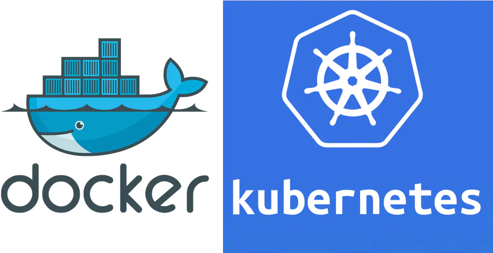
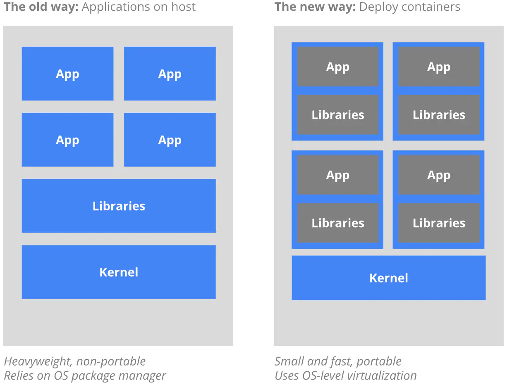

[toc]

## 一、Kubernetes 简介

### 1.1 什么是 Kubernetes

Kubernetes 是 Google 2014 年创建管理的，是 Google 10 多年大规模容器管理技术 Borg 的开源版本。

Kubernetes 是容器集群管理系统，是一个开源平台，可以实现容器集群的自动化部署、自动扩缩容、维护等功能。使用 Kubernetes 我们可以：

- 快速部署应用；
- 快速扩展应用；
- 无缝对接新的应用功能；
- 节省资源，优化硬件资源的使用；

Kubernetes 的模板是促进完善组件和工具的生态系统，以减轻应用程序在公有云或私有云中运行的负担。

> 目前，我们所学到的知识，只能解决三大指标（高可用、高性能、高并发）中的“高性能”和“高并发”：
>
> - 高性能：
>   - RPC 通信；
>   - Kyro 高速序列化；
>   - HikariCP 连接池；
>   - SQL 优化；
>   - Redis 缓存；
>   - JVM 优化；
>   - GC 优化；
> - 高并发：
>   - 垂直扩展 + 水平扩展；
>   - 负载均衡；
>   - 集群；

### 1.2 特点

- 可移植：支持公有云、私有云、混合云、多重云（多个公共云）；
- 可扩展：模块化，插件化，可挂载，可组合；
- 自动化：自动部署，自动重启，自动复制，自动伸缩/扩展；

### 1.3 传统部署方式与容器话部署方式的对比

#### 1.3.1 传统部署方式

传统的应用部署方式是通过插件或脚本来安装应用。这样做的缺点是应用的运行、配置、管理、所有生命周期都将与当前操作系统绑定，这样做不利于应用的省级更新/回滚等操作。（当然也可以通过创建虚拟机的方式来实现某些功能，但是虚拟机非常重，并不利于可移植性）

#### 1.3.2 容器化部署的优势

- 快速创建/部署应用：与虚拟机相比，容器镜像的创建更加容易；
- 持续开发、继承和部署：提供可靠且频繁的容器镜像构建/部署，并使用快速和简单的回滚（由于镜像的不可变性）；
- 开发和运行相分离：在 build 或者 release 阶段创建容器镜像，使得应用和基础设施解耦；
- 开发、测试和生产环境的一致性：在本地或外网（生产环境）运行的一致性；
- 云平台或其他操作系统：可以在 Ubuntu 等多种环境中运行；
- 分布式，弹性、微服务化：应用程序分为更小的、独立的部件，可以动态部署和管理；
- 资源隔离；
- 资源利用更高效；

### 1.4 为什么需要 Kubernetes

可以在物理或虚拟机的 Kubernetes 集群上运行容器话应用（Kubernetes 是建立在『容器话引擎』（不一定是 Docker）之上的），Kubernetes 能够提供一个以“容器为中心的基础架构”，满足在生产环境中运行应用的一些常见需求，如：

- 多个进程协同工作；
- 存储系统挂载（微服务中的『资源共享』）；
- 应用健康检查；
- 应用实例的复制；
- 自动伸缩/扩展；
- 注册与发现；
- 负载均衡；
- 滚动更新；
- 资源监控；
- 日志访问；
- 调试应用程序；
- 提供认证和授权；

