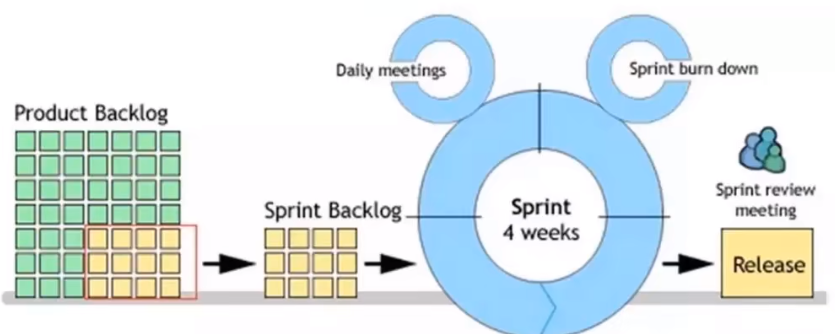

[toc]

## 一、敏捷宣言

### 1.1 敏捷软件开发宣言

我们一直在实践中探寻更好的软件开发方法，身体力行的同时也帮助他人。由此，我们建立了如下价值观：

- 个体和互动 高于 流程和工具；
- 工作的软件 高于 详尽的文档；
- 客户可作 高于 合同谈判；
- 响应变化高于 遵循计划；

也就是说，尽管右项有其价值，但是我们更加重视左项的价值。

### 1.2 敏捷软件的十二条原则

我们遵循以下原则：

1. 我们最重要的目标：是通过持续不断地及早交付有价值的软件，使客户满意；
2. 欣然面对需求变化，即使在开发后期也是一样。为了客户的竞争优势，敏捷过程掌控变化；
3. 经常地交付可工作的软件，相隔几星期或一两个月，倾向于采取较短的周期；
4. 业务人员和开发人员必须相互合作，项目中的每一天都不例外；
5. 激发个体的斗志，以他们为核心搭建项目。提供所需的环境和支援，辅以新任，从而大乘目标；
6. 不论团队内外，传递信息效果最好、效率也是最高的方式是面对面交谈；
7. 可工作的软件是进度的首要度量标准；
8. 敏捷过程倡导可持续开发。责任人、开发人员和用户要能够共同维持其步调稳定延续；
9. 坚持不懈地追求技术卓越和良好设计，敏捷能力由此增强；
10. 以简洁为本，它是极力减少不必要工作量的艺术；
11. 最好的架构、需求和设计出自组织团队；
12. 团队定期地反省如何能提高成效，并依此调整自身的举止表现；

> 你所处的组织架构，决定了你的产品架构。

## 二、什么是敏捷开发

### 2.1 什么是敏捷开发

敏捷开发（Agile）是一种以人为核心、迭代、循序渐进的开发方法。

在敏捷开发中，软件项目的构建被切分成多个子项目，各个子项目的成果都经过测试，具备集成和可运行的特征。

简单来说，敏捷开发不追求前期完美的设计、完美编码，而是力求在很短的周期内开发出产品的核心功能，尽早发布出可用版本。然后在后续的生产周期内，按照新需求不断迭代升级、完善产品。

### 2.2 敏捷开发模式的分类

敏捷开发的实现主要包括 SCRUM、XP（极限编程）、Crystal Methods、FDD（特性驱动开发）等等。其中，SCRUM 与 XP 最为流行。

同样是敏捷开发，XP 极限编程更侧重于实践，并力求把实践做到极致。这一实践可以是测试先行，也可以是结对编程等，关键要看具体的应用场景。

SCRUM 则是一种开发流程的框架，也可以说是一种套路。SCRUM 框架中包含了三个角色，三个弓箭，四个会议，听起来很复杂，其目的是为了有效完成每一次迭代周期的工作。在这里我们重点讨论的是 SCRUM。

学习 SCRUM 之前，我们先要了解几个基本术语：

- Sprint：冲刺周期，通俗地讲就是实现一个“小目标”的周期。一般需要 2-6 周的时间；
- User story：用户的外在业务需求。拿银行系统举例来说，一个 Story 可以是用户的存款行为，或者是查询余额等等。也就是所谓的小目标本身。
- Task：由 User Stroy 拆分成的具体开发任务；
- Backlog：需求列表，可以看成是小目标的清单。分为 Sprint Backlog 和 Product Backlog；
- Daily meeting：每日站会，用于监控项目进度。有些公司直接称其为 Scrum；
- Sprint Review meeting：冲刺评审会议，让团队成员们展示成果；
- Sprint burn down：冲刺燃尽图，说白了就是记录当前周期的需求完成情况；
- Release：开发周期完成，项目发布新的可用版本；

如上图所示，在项目启动之前，会由团队的产品负责人（Product owner）按照需求优先级来明确一份 Product Backlog，为项目做出整体排期。

随后，在每一个小的迭代周期里，团队会根据计划（Sprint Plan Meeting）确定本周期的 Sprint Backlog，再细化分成一个个 Task，分配给团队成员，进行具体开发工作。每一天，团队成员都会进行 Daily meeting，根据情况更新自己的 Task 状态，整个团队更新 Sprint burn down chart。

当这一周期的 Sprint backlog 全部完成，团队会进行 Sprint Review meeting，也就是评审会议。一切顺利的话，会发布出这一版本的 Release，并且进行 Sprint 回顾会议（Sprint Retrospective Meeting）。

> 总的来说，『敏捷开发』的特点就是：**小步快跑，快速迭代，持续集成**。

### 2.3 敏捷开发与 DevOps

DevOps 是 Development 和 Operations 的合成词，其目标是加强开发人员、测试人员、运维人员之间的沟通协调。如何实现这一目标呢》需要我们的项目做到持续集成、持续交付、持续部署。

时下流行的 Jenkins、Bamboo，就是两款优秀的持续集成工具。而 Docker 容器则成为 DevOps 提供了强大而有效的同一环境。

