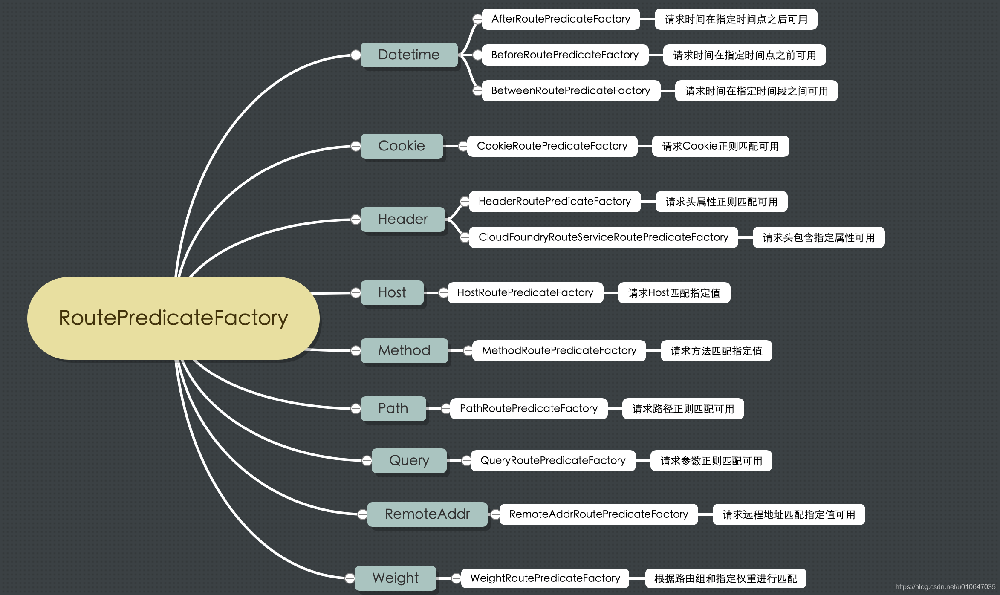
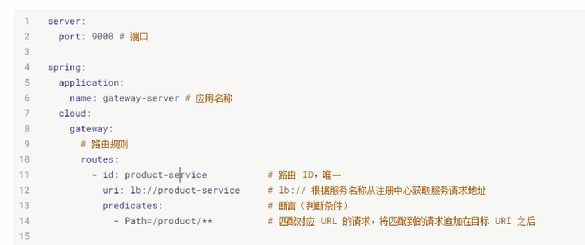
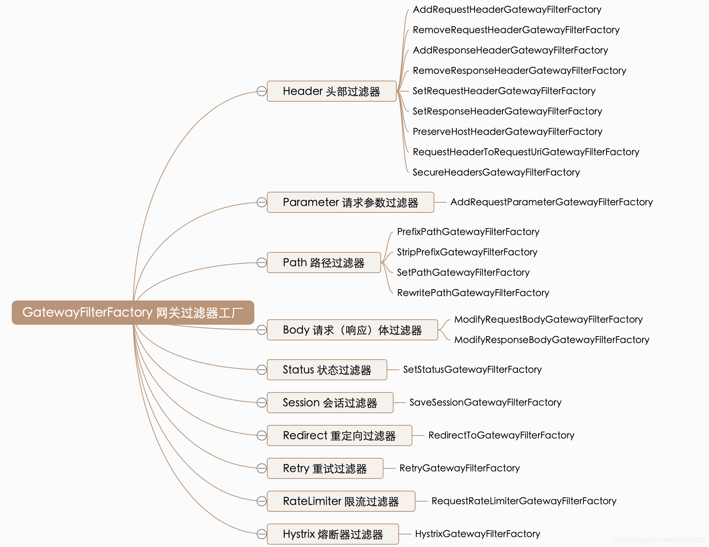
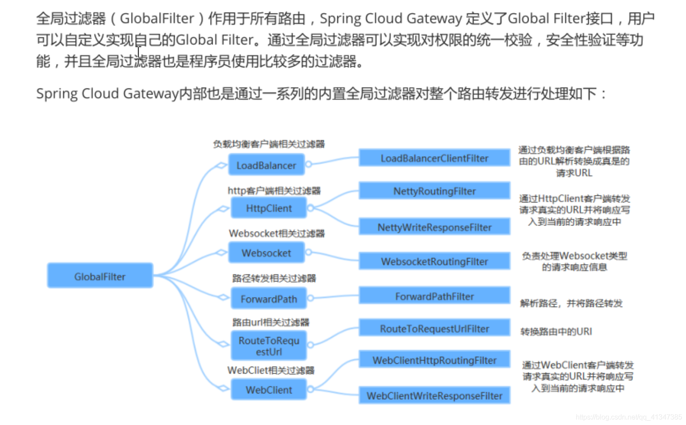

[toc]

## 〇、介绍

该笔记主要记录了 SpringCloudGateway 的常用配置。

视频在线观看地址为：https://www.bilibili.com/video/BV1QZ4y1V7X3?t=57&p=2

## 一、什么是 Spring Cloud Gateway

Spring Cloud Gateway 作为 Spring Cloud 生态系统中的网关，目标是替代 Netflix Zuul。其不仅提供了统一的路由方式，并且还基于 Filter 链方式提供了网关基本的功能。

## 二、常用网关解决方案

### 2.1 Nginx + Lua

Nginx 是由 IgorSysoev 为俄罗斯访问量第二的 Rambler.ru 站点开发的、一个高性能的 HTTP 和方向代理服务器。Nginx 一方面可以做反向代理，另一刚面可以做静态资源服务器。

> - Nginx 适合做门户网关，是作为整个全局的网关，对外的处于最外层的；而 Gateway 属于业务网关，主要用来对应不同的客户端提供服务，用于聚合业务。各个微服务独立部署，职责单一，对外提供服务的时候，需要有一个东西把业务聚合；
> - Gateway 可以实现熔断、重试等功能，而 Nginx 不具备；

### 2.2 Kong

Kong 是 Mashape 提供的一款 API 管理软件，它本身是基于 Nginx + Lua 的，但比 Nginx 提供了更简单的配置方式，数据采用了 ApacheCassandra/PostgreSQL 存储，并且提供了一些优秀的插件，比如验证、日志、调用频次限制等。Kong 非常有人的地方就是提供了大量的插件来扩展应用没通过设置不同的插件可以为服务器提供各种增强的功能。

> 有点：由于基于 Nginx ，所以在性能上和稳定性上表现非常优秀。Kong 作为一款商业软件，在 Nginx 上做了很多扩展工作，而且还有很多付费的商业插件。Kong 本身也有付费的企业版，其中包括了技术支持、使用培训服务以及 API 分析插件。
>
> 缺点：Kong 如何结合目前已有的 Spring Cloud 服务治理体系？

### 2.3 Traefik

Traefik 是一个开源的 GO 语言开发的、为了让微服务部署更加便捷而诞生的现代 HTTP 反向代理、负载均衡的工具。它支持多种后台（Docker、Swarm、Kubernetes、Marathon、Mesos、Consul、Etcd、Zookeeper 等）来自动化、动态地应用它的配置文件。Traefik 拥有一个基于 AngularJS 编写的简单网站界面，支持 RESTFul API、配置文件热更新，无需重启进程。

> 相比 Spring Cloud Gateway 而言，Traefik 更适合 Kubernetes。

## 三、Gateway 核心概念

官方地址：https://docs.spring.io/spring-cloud-gateway/docs/2.2.5.RELEASE/reference/html/

### 3.1 核心概念

**路由：**路由是网关最基础的部分，路由信息由 ID、目标 URI、一组断言和一组过滤器组成。如果断言路由为真，则说明请求的 URI 和配置匹配；

**断言：**Java 8 中的断言函数，Spring Cloud Gateway 中的断言函数输入类型是 Spring 5.0 框架中的 ServerWebExchange。Spring Cloud Gateway 中的断言函数允许开发者去定义来自 HTTP Request 中的任何信息，比如请求头和参数等；

**过滤器：**一个标准的 Spring Web Filter。Spring Cloud Gateway 中的 Filter 分为两种类型，分别是 Gateway Filter 和 Global Filter。过滤器将会对请求和响应进行处理。

### 3.2 Gateway 工作原理


如上图所示，客户端向 `Spring Cloud Gateway` 发出请求，再由网关处理程序 `Gateway Handler Mapping` 映射确定与请求相匹配的路由；接着将请求发送到的网关 Web 处理程序 `Gateway Web Handler`。该处理程序通过指定的过滤器链将请求发送到我们实际的服务执行业务逻辑，最后返回。过滤器由虚线分割的原因是，过滤器可以在发送代理请求之前和之后进行逻辑。所有 `pre `过滤器逻辑均被执行。然后发出代理请求。发出代理请求以后，将运行 `post `过滤器逻辑。

## 四、简单案例

## 五、路由规则

Spring Cloud Gateway 创建 Route 对象时，使用 RoutePredicateFactory 创建 Predicate 对象，Predicate 对象可以赋值给 Route

- Spring Cloud Gateway 包含许多内置的 Route Predicate Factories；
- 所有这些断言都匹配 HTTp 请求的不同属性；
- 多个 Route Predicate Factories 可以通过逻辑与结合起来一起使用；

路由断言工厂 RoutePredicateFactory 包含的主要实现类如图所示，包括 Datetime、请求的远程地址、路由权重、请求头、Host地址、请求方法请求路径和请求参数等类型的路由断言；



### 5.1 Path

### 5.2 Query

只路由 带有 『Query 后面的参数』的请求。

```yaml
spring:
  cloud:
    gateway:
      routes:
      - id: query_route
        uri: https://example.org
        predicates:
        - Query=green
```


### 5.3 Method 

只路由指定 Method 后面的值的请求方式。

```yaml
spring:
  cloud:
    gateway:
      routes:
      - id: method_route
        uri: https://example.org
        predicates:
        - Method=GET,POST
```


### 5.4 After

匹配时间之后的请求（如果当前时间没到，那么不会路由）

```yaml
spring:
  cloud:
    gateway:
      routes:
      - id: after_route
        uri: https://example.org
        predicates:
        - After=2017-01-20T17:42:47.789-07:00[America/Denver]
```

### 5.5 RemoteAddr

只路由请求地址为 $RemoteAddr$ 的请求地址：

```yaml
spring:
  cloud:
    gateway:
      routes:
      - id: remoteaddr_route
        uri: https://example.org
        predicates:
        - RemoteAddr=192.168.1.1/24
```


### 5.6 Header

只路由带有请求头 $Header$ 的请求：

```yaml
spring:
  cloud:
    gateway:
      routes:
      - id: header_route
        uri: https://example.org
        predicates:
        - Header=X-Request-Id, \d+
```


## 六、动态路由

动态路由其实就是面向服务的路由，Spring Cloud Gateway 支持 Eureka 整合开发，根据 serviceId 自动从注册中心获取服务地址并转发请求。这样做的好处是：不仅可以通过单个断点来访问应用的所有服务，而且在添加/移除服务实例时不用修改 Gateway 的路由配置。

> 使用『动态路由』的以前，需要往项目中添加依赖，该依赖的作用就是将 Gateway 注册到注册中心中去。


### 6.1 动态获取 URI

我们可以通过以下方式配置路由规则：



这时候，product-service 就会被转发到 /product/ 地址。同时，如果有新的 product-service 注册到 eureka 上时，也能够动态路由到新的服务实例中去，实现负载均衡。


### 6.2 根据服务名称转发

经过上面的[6.1 动态获取 URI](#6.1 动态获取 URI) ，可以解决一个服务的多实例转发问题。但是在实际应用中，我们并不只有一个名称的服务，而是由多个不同名称的服务。如果按照上面的方式配置，那么配置文件就会冗余。Spring Cloud Gateway 提供了『根据服务名称转发』的配置规则，可以实现所有被注册中心托管的服务都能够被网关转发到（实际上利用了“约定优于配置”的方式）。

```yaml
server:
  port: 9000


spring:
  application:
    name: gateway-server
  cloud:
    gateway:
      discovery:
        locator:
          enabled: true
          lower-case-service-id: true
```


## 七、过滤器

Spring Cloud Gateway 根据作用范围划分为 `GatewayFilter `和 `GlobaFilter`，两者区别是：

- `GatewayFilter`：网关过滤器，需要通过 `spring.cloud.routes.filters` 配置在具体路由下，只作用在当前路由上或通过 `spring.cloud.default.filters` 配置在全局，作用在所有路由上；
- ``GlobalFilter`：全局过滤器，不需要在配置文件中配置，作用在所有路由上，最终通过 `GatewayFilterAdapter `包装成 `GatewayFilterChain `可识别的过滤器；它为请求业务以及路由的 uri 转换为真实业务服务请求地址的核心过滤器，不需要配置系统初始化时加载，并作用在每个路由上。`

### 7.1 网关过滤器 GatewayFilter

网关过滤器用于拦截并链式处理 web 请求，可以实现横切与应用无关的需求，比如：安全、访问超时设置等等。修改传入的 HTTP 请求或传出 HTTP 响应。Spring Cloud Gateway 包含许多内置的网关过滤器工厂，一共 22 个，包括：头部过滤器、路径类过滤器、Hystrix 过滤器和重写请求 URL 的过滤器、参数和状态码等其他类型的过滤器。根据过滤器工厂的用途来划分，可以分为以下几种：Header、Parameter、Path、Body、Status、Session、Rediect、Retry、RateLimiter 和 Hystrix。



过滤器的配置方式，可以参考 Spring Cloud Gateway 官方文档，并且根据上图的思维导图来主管寻找对应的配置。


### 7.2 全局过滤器 `GlobalFilter`

全局过滤器不需要在配置文件中配置，作用在所有的路由上，最终通过 `GatewayFilterAdapter `包装 `GatewayFilterChain  `可识别的过滤器，它是请求业务以及路由 URI 转换成真实业务服务请求地址的核心过滤器，不需要配置系统初始化时加载，并作用在每个路由上。



### 7.3 自定义全局过滤器

自定义全局过滤器需要实现以下两个接口：`GlobalFilter`、`Ordered`。通过全局过滤器可以实现权限校验、安全性验证等功能。

下面我们通过一个简单的例子来创建全局过滤器：

```java

```

### 7.4 使用全局过滤器来实现认证


## 八、网关限流

### 8.1 什么是限流

现就，就是限制流量。通过限流，我们可以很好地控制1系统的 QPS，从而达到保护系统的目的。

### 8.2 为什么需要限流

我们提供的服务，有时候会遇到以下几种情况：

- 用户增长过快
- 某个热点事件（微博热搜）；
- 竞争对象爬虫；
- 恶意的请求；

这些情况往往都无法在发生以前预知的，当发生的时候，可能会以平常流量的 10 倍甚至 20 倍的流量访问。当遇到这种情况时，『扩容』措施根本来不及。


